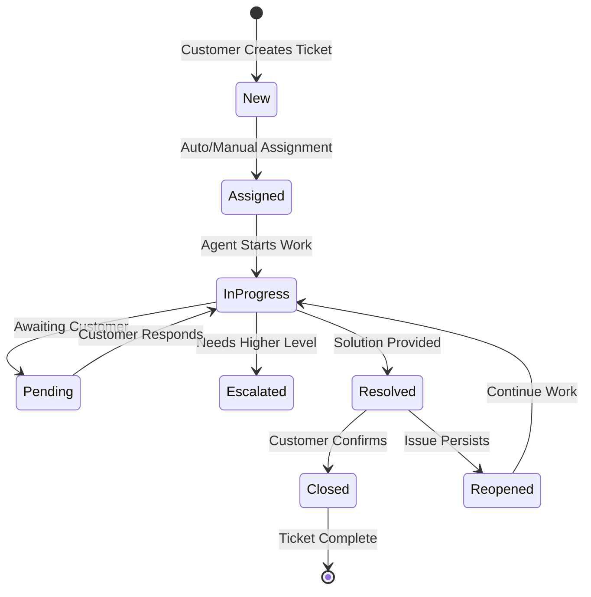
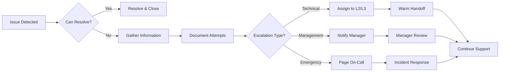

# NCQ Employee Support Workflows

## Document Information
- **Version**: 1.0
- **Date**: January 2025
- **Status**: Final
- **Document Type**: Operational Support Workflows
- **Scope**: All NCQ Support Operations

## Table of Contents
1. [Overview](#1-overview)
2. [Support Organization Structure](#2-support-organization-structure)
3. [Ticket Management Workflows](#3-ticket-management-workflows)
4. [Escalation Procedures](#4-escalation-procedures)
5. [Product-Specific Support Workflows](#5-product-specific-support-workflows)
6. [Knowledge Management](#6-knowledge-management)
7. [Customer Communication Workflows](#7-customer-communication-workflows)
8. [Performance & Quality Assurance](#8-performance--quality-assurance)
9. [Tools & Systems](#9-tools--systems)
10. [Training & Onboarding](#10-training--onboarding)

## 1. Overview

The NCQ Support Organization provides world-class technical and business support to all NCQ customers across our product portfolio. This document defines the workflows, procedures, and best practices for NCQ employees supporting our customers.

### 1.1 Support Principles
- **Customer First**: Every decision prioritizes customer success
- **Rapid Response**: Quick acknowledgment and resolution
- **Technical Excellence**: Deep product knowledge and expertise
- **Proactive Communication**: Keep customers informed
- **Continuous Improvement**: Learn from every interaction

### 1.2 Service Level Agreements (SLAs)

```yaml
Support Tiers:
  Enterprise:
    First Response: 30 minutes
    Resolution Target: 4 hours
    Availability: 24/7
    Channels: Phone, Email, Slack, Portal
    
  Business:
    First Response: 2 hours
    Resolution Target: 24 hours
    Availability: Business hours (extended)
    Channels: Email, Portal, Chat
    
  Professional:
    First Response: 4 hours
    Resolution Target: 48 hours
    Availability: Business hours
    Channels: Email, Portal
    
  Starter:
    First Response: 24 hours
    Resolution Target: Best effort
    Availability: Business hours
    Channels: Email, Community
```

## 2. Support Organization Structure

### 2.1 Support Team Hierarchy

```
┌─────────────────────────────────────────────┐
│          Head of Customer Success           │
└────────────────┬────────────────────────────┘
                 │
    ┌────────────┴────────────┬─────────────────┐
    ↓                         ↓                 ↓
┌─────────────────┐  ┌──────────────┐  ┌──────────────┐
│ Support Manager │  │ QA Manager   │  │ Training Mgr │
└────────┬────────┘  └──────┬───────┘  └──────┬───────┘
         │                   │                  │
    ┌────┴────┐         ┌────┴────┐      ┌────┴────┐
    ↓         ↓         ↓         ↓      ↓         ↓
┌────────┐ ┌────────┐ ┌────────┐ ┌─────┐ ┌────────┐
│ L1 Team│ │ L2 Team│ │ L3 Team│ │ QA  │ │Trainers│
└────────┘ └────────┘ └────────┘ └─────┘ └────────┘
```

### 2.2 Role Definitions

#### Level 1 (L1) Support - Customer Support Specialist
**Responsibilities**:
- First point of contact for customers
- Handle common issues and questions
- Basic troubleshooting
- Ticket routing and escalation
- Documentation of issues

**Required Skills**:
- Customer service excellence
- Basic technical knowledge
- All NCQ products familiarity
- Communication skills
- Arabic and English fluency

#### Level 2 (L2) Support - Technical Support Engineer
**Responsibilities**:
- Complex technical issues
- Configuration assistance
- Integration support
- Bug reproduction and reporting
- Customer training

**Required Skills**:
- Deep product knowledge
- Programming basics (JavaScript, Python)
- API troubleshooting
- Database queries
- System administration

#### Level 3 (L3) Support - Senior Solutions Engineer
**Responsibilities**:
- Critical issue resolution
- Code-level debugging
- Performance optimization
- Architecture consultation
- Product team liaison

**Required Skills**:
- Expert product knowledge
- Advanced programming
- System architecture
- Performance tuning
- Security expertise

### 2.3 Product Specialization Matrix

```yaml
Support Specializations:
  NCQ LLM:
    L1: Basic API usage, billing questions
    L2: Model selection, integration issues
    L3: Performance optimization, custom models
    
  Smart Building:
    L1: User access, booking issues
    L2: IoT connectivity, integrations
    L3: System architecture, custom solutions
    
  Hospital Management:
    L1: User training, basic workflow
    L2: Configuration, reporting issues
    L3: Data migration, customization
    
  Payment Gateway:
    L1: Transaction status, basic setup
    L2: Integration debugging, reconciliation
    L3: Security issues, performance tuning
```

## 3. Ticket Management Workflows

### 3.1 Ticket Lifecycle



### 3.2 Ticket Creation & Routing

```yaml
Ticket Creation Workflow:

1. Ticket Sources:
   - Customer Portal submission
   - Email to support@ncq.ai
   - Phone call (auto-transcribed)
   - Live chat conversation
   - Slack (Enterprise only)
   - API monitoring alerts

2. Auto-Classification:
   AI-Powered Categorization:
     - Product identification
     - Issue type detection
     - Severity assessment
     - Language detection
     - Sentiment analysis
     
3. Smart Routing:
   Rules Engine:
     IF enterprise_customer AND critical_severity:
       → Assign to available L2/L3
       → Alert support manager
       → Start SLA timer
       
     IF payment_gateway AND transaction_issue:
       → Assign to PGW specialist
       → Check system status
       → Notify finance team
       
     IF arabic_language:
       → Assign to Arabic speaker
       → Set RTL interface
       
4. Initial Response:
   Automated Acknowledgment:
     - Ticket number assigned
     - Expected response time
     - Self-service resources
     - Status page link
```

### 3.3 Ticket Handling Process

```python
class TicketHandler:
    def process_new_ticket(self, ticket: Ticket):
        # 1. Validate and enrich
        ticket = self.enrich_ticket_data(ticket)
        
        # 2. Check for known issues
        if solution := self.knowledge_base.find_solution(ticket):
            self.send_automated_solution(ticket, solution)
            ticket.status = "Pending Customer"
            return
        
        # 3. Assign to agent
        agent = self.find_best_agent(ticket)
        ticket.assign_to(agent)
        
        # 4. Set priority and SLA
        ticket.priority = self.calculate_priority(ticket)
        ticket.sla = self.set_sla_timer(ticket)
        
        # 5. Notify agent
        self.notify_agent(agent, ticket)
        
    def enrich_ticket_data(self, ticket: Ticket):
        # Add customer context
        ticket.customer = self.get_customer_data(ticket.customer_id)
        ticket.subscription = self.get_subscription_info(ticket.customer_id)
        ticket.usage_stats = self.get_recent_usage(ticket.customer_id)
        ticket.previous_tickets = self.get_ticket_history(ticket.customer_id)
        
        # Add system context
        if ticket.product == "NCQ LLM":
            ticket.api_logs = self.get_recent_api_calls(ticket.customer_id)
            ticket.error_logs = self.get_error_logs(ticket.customer_id)
            
        return ticket
```

### 3.4 Standard Operating Procedures

#### First Response Template
```markdown
Hi [Customer Name],

Thank you for contacting NCQ Support. I've received your request regarding [issue summary] and I'm here to help.

Ticket Number: #[TICKET_ID]
Priority: [PRIORITY]
Expected Resolution: [SLA_TIME]

I'm currently reviewing your issue and will:
1. [Specific action 1]
2. [Specific action 2]
3. [Specific action 3]

In the meantime, you might find these resources helpful:
- [Relevant documentation link]
- [Knowledge base article]

I'll update you within [timeframe] with my findings.

Best regards,
[Agent Name]
NCQ Support Team
```

#### Investigation Checklist
```yaml
Standard Investigation Steps:

1. Customer Verification:
   □ Verify customer identity
   □ Check subscription status
   □ Review account permissions

2. Issue Reproduction:
   □ Gather exact steps
   □ Request screenshots/logs
   □ Try to reproduce in test environment
   □ Check affected versions/browsers

3. System Checks:
   □ Service health status
   □ Recent deployments
   □ Similar tickets
   □ Known issues

4. Data Collection:
   □ API logs
   □ Error messages
   □ Browser console logs
   □ Network traces

5. Solution Attempt:
   □ Apply standard fixes
   □ Test in customer environment
   □ Document steps taken
   □ Verify resolution
```

## 4. Escalation Procedures

### 4.1 Escalation Matrix

```
Escalation Triggers:

Technical Escalation (L1 → L2):
  - Cannot reproduce issue
  - Requires code/API debugging
  - Integration problems
  - Performance issues
  - After 2 hours without progress

Technical Escalation (L2 → L3):
  - System-wide issues
  - Data corruption
  - Security incidents
  - Requires code changes
  - After 4 hours without progress

Management Escalation:
  - SLA breach imminent
  - Customer dissatisfaction
  - Revenue impact > $10,000
  - Legal/compliance issues
  - Media/social attention

Emergency Escalation:
  - Production down
  - Data loss
  - Security breach
  - Multiple customers affected
  → Page on-call engineer
  → Incident response team
```

### 4.2 Escalation Workflow



### 4.3 Escalation Communication

```yaml
Internal Escalation Note:
  Required Information:
    - Customer impact statement
    - Steps taken so far
    - Specific blockers
    - Relevant logs/data
    - Customer sentiment
    - Business context
    
  Format:
    Subject: "ESCALATION: [Customer] - [Issue Summary]"
    Priority: [P0/P1/P2]
    
    Customer Context:
    - Company: [Name]
    - Tier: [Enterprise/Business/etc]
    - MRR: $[Amount]
    - Sentiment: [Frustrated/Patient/etc]
    
    Issue Details:
    - Product: [Product Name]
    - Component: [Specific Feature]
    - Impact: [# Users affected]
    - Started: [Timestamp]
    
    Investigation Summary:
    - [What we know]
    - [What we tried]
    - [What blocked us]
    
    Next Steps Needed:
    - [Specific ask from L2/L3]
    - [Resources needed]
    - [Estimated time]
```

## 5. Product-Specific Support Workflows

### 5.1 NCQ LLM Support Workflow

```yaml
Common Issues & Resolution:

1. API Authentication Errors:
   Symptoms:
     - 401/403 errors
     - "Invalid API key"
   
   Resolution Steps:
     1. Verify API key in dashboard
     2. Check key permissions
     3. Confirm not expired/revoked
     4. Test with curl command
     5. Check IP restrictions
   
   Quick Fix:
     curl -H "Authorization: Bearer [KEY]" https://api.ncq.ai/v1/models

2. High Latency Issues:
   Symptoms:
     - Response time > 5 seconds
     - Timeouts
   
   Investigation:
     1. Check customer's region
     2. Review model selection
     3. Analyze request size
     4. Check concurrent requests
     5. Review routing rules
   
   Solutions:
     - Switch to closer region
     - Use lighter model
     - Implement streaming
     - Optimize prompts
     - Adjust timeout settings

3. Cost Overruns:
   Symptoms:
     - Unexpected charges
     - Budget alerts
   
   Analysis:
     1. Pull usage reports
     2. Identify spike periods
     3. Check for loops/retries
     4. Review model usage
     5. Analyze request patterns
   
   Recommendations:
     - Set hard limits
     - Use cheaper models
     - Implement caching
     - Batch requests
     - Optimize prompts
```

### 5.2 Smart Building Support Workflow

```python
# Smart Building Troubleshooting Script
class SmartBuildingSupport:
    def diagnose_iot_connection(self, building_id: str, device_id: str):
        """Standard IoT connectivity diagnosis"""
        
        checks = []
        
        # 1. Device Status
        device = self.get_device_status(device_id)
        checks.append({
            'check': 'Device Registration',
            'status': 'OK' if device.registered else 'FAIL',
            'details': device.registration_details
        })
        
        # 2. Network Connectivity
        last_ping = self.get_last_ping(device_id)
        checks.append({
            'check': 'Network Connectivity',
            'status': 'OK' if last_ping < 60 else 'FAIL',
            'details': f'Last seen: {last_ping}s ago'
        })
        
        # 3. Data Flow
        recent_data = self.get_recent_data(device_id)
        checks.append({
            'check': 'Data Flow',
            'status': 'OK' if recent_data else 'FAIL',
            'details': f'Last data: {recent_data.timestamp if recent_data else "None"}'
        })
        
        # 4. Building Configuration
        config = self.get_building_config(building_id)
        checks.append({
            'check': 'Building Config',
            'status': 'OK' if device_id in config.devices else 'FAIL',
            'details': 'Device properly configured' if device_id in config.devices else 'Device not in building config'
        })
        
        return self.generate_diagnosis_report(checks)
```

### 5.3 Hospital Management Support Workflow

```yaml
Critical Support Scenarios:

1. Patient Data Access Issues:
   Priority: P0 (Patient care impact)
   
   Immediate Actions:
     1. Verify system status
     2. Check user permissions
     3. Test with admin account
     4. Enable emergency access if needed
   
   Escalation: 
     - If not resolved in 15 minutes
     - Page on-call DBA
     - Notify hospital IT contact

2. Prescription System Errors:
   Priority: P0 (Patient safety)
   
   Response:
     1. Switch to backup prescription system
     2. Document all manual prescriptions
     3. Investigate root cause
     4. Coordinate with pharmacy
   
   Recovery:
     1. Fix underlying issue
     2. Sync manual prescriptions
     3. Verify data integrity
     4. Generate incident report

3. Integration Failures:
   Lab System:
     - Check HL7 interface
     - Verify message format
     - Review error queue
     - Test with sample message
   
   Insurance System:
     - Verify API credentials
     - Check connectivity
     - Review recent changes
     - Contact insurance IT
```

### 5.4 Payment Gateway Support Workflow

```
Payment Issue Resolution Tree:

Transaction Failed
       ↓
What type of failure?
  ↓         ↓           ↓
Card      Network    Validation
  ↓         ↓           ↓
Check:    Check:      Check:
- BIN     - Timeout   - Amount
- Limit   - DNS       - Currency
- 3DS     - Firewall  - Format
  ↓         ↓           ↓
Test:     Test:       Test:
Sandbox   Ping API    Validate
Card      Endpoint    Request
  ↓         ↓           ↓
Fix:      Fix:        Fix:
Update    Network     Correct
Config    Settings    Format

Common Quick Fixes:
1. Clear browser cache
2. Update API version
3. Check webhook URL
4. Verify SSL certificate
5. Test with different card
```

## 6. Knowledge Management

### 6.1 Knowledge Base Structure

```yaml
Knowledge Base Organization:

/Public Knowledge Base/
  ├── Getting Started/
  │   ├── Quick Start Guides
  │   ├── Video Tutorials
  │   └── FAQs
  ├── API Documentation/
  │   ├── Reference
  │   ├── SDKs
  │   └── Examples
  ├── Troubleshooting/
  │   ├── Common Issues
  │   ├── Error Codes
  │   └── Diagnostic Tools
  └── Best Practices/
      ├── Security
      ├── Performance
      └── Cost Optimization

/Internal Knowledge Base/
  ├── Runbooks/
  │   ├── Incident Response
  │   ├── System Recovery
  │   └── Data Restoration
  ├── Technical Deep Dives/
  │   ├── Architecture
  │   ├── Database Schemas
  │   └── API Internals
  ├── Customer Insights/
  │   ├── Success Stories
  │   ├── Common Patterns
  │   └── Feedback Analysis
  └── Tools & Scripts/
      ├── Diagnostic Scripts
      ├── Automation Tools
      └── Support Utilities
```

### 6.2 Knowledge Article Creation

```markdown
# Knowledge Article Template

## Title: [Clear, Searchable Title]

**Article ID**: KB-[NUMBER]  
**Products**: [NCQ LLM, Smart Building, etc.]  
**Last Updated**: [DATE]  
**Author**: [NAME]

## Problem Description
[Clear description of the issue, including symptoms and error messages]

## Environment
- Product Version: [Version numbers]
- Browser/OS: [If applicable]
- API Version: [If applicable]

## Root Cause
[Technical explanation of why this happens]

## Solution

### Quick Fix
[If available, provide immediate workaround]

### Permanent Solution
1. [Step-by-step instructions]
2. [Include screenshots where helpful]
3. [Provide code examples if needed]

### Verification Steps
1. [How to confirm the issue is resolved]
2. [What the expected behavior should be]

## Prevention
[How to avoid this issue in the future]

## Related Articles
- [Link to related KB articles]
- [Link to documentation]

## Tags
#[product] #[feature] #[error-type] #[solution-type]
```

### 6.3 Knowledge Base Maintenance

```python
class KnowledgeBaseManager:
    def monthly_review(self):
        """Monthly KB quality check"""
        
        for article in self.get_all_articles():
            # Check freshness
            if article.last_updated < datetime.now() - timedelta(days=180):
                self.flag_for_review(article, "Outdated content")
            
            # Check effectiveness
            metrics = self.get_article_metrics(article.id)
            if metrics.helpful_percentage < 0.7:
                self.flag_for_improvement(article, "Low helpfulness score")
            
            # Check accuracy
            if self.has_product_updates_since(article.last_updated):
                self.flag_for_review(article, "Product changes")
            
            # Check usage
            if metrics.views < 10 and article.age > 90:
                self.flag_for_archival(article, "Low usage")
    
    def create_from_ticket(self, ticket: Ticket):
        """Convert solved ticket to KB article"""
        
        if ticket.resolution_helpful and ticket.unique_issue:
            article = KBArticle(
                title=f"How to resolve: {ticket.summary}",
                problem=ticket.description,
                solution=ticket.resolution,
                products=[ticket.product],
                tags=ticket.tags
            )
            
            # Review and publish
            self.submit_for_review(article)
```

## 7. Customer Communication Workflows

### 7.1 Communication Standards

```yaml
Communication Principles:
  
  Tone & Voice:
    - Professional yet friendly
    - Empathetic and patient
    - Clear and concise
    - Solution-focused
    - Culturally aware
  
  Language Guidelines:
    - Use simple, clear language
    - Avoid technical jargon
    - Explain technical terms when necessary
    - Match customer's technical level
    - Offer Arabic support when preferred
  
  Response Structure:
    1. Acknowledge the issue
    2. Show understanding/empathy
    3. Provide clear next steps
    4. Set expectations
    5. Offer additional help
```

### 7.2 Communication Templates

#### Status Update Template
```markdown
Hi [Customer Name],

I wanted to give you a quick update on ticket #[TICKET_ID].

**Current Status**: [In Progress/Pending/Escalated]

**What we've done**:
- [Completed action 1]
- [Completed action 2]

**What we're doing now**:
- [Current action]
- [Expected completion time]

**Next steps**:
- [What happens next]
- [What we need from customer, if anything]

I expect to have another update for you by [time/date]. 

Is there anything else you need from me in the meantime?

Best regards,
[Agent Name]
```

#### Resolution Confirmation Template
```markdown
Hi [Customer Name],

Great news! I've resolved the issue you reported in ticket #[TICKET_ID].

**What was wrong**: [Brief explanation]

**What we did**: [Solution summary]

**What you should see now**: [Expected behavior]

Could you please confirm that everything is working as expected? 

To prevent this in the future, I recommend:
- [Preventive measure 1]
- [Preventive measure 2]

Here are some resources you might find helpful:
- [Relevant documentation]
- [Knowledge base article]

If you have any other questions or if the issue persists, please let me know and I'll be happy to help.

Best regards,
[Agent Name]
```

### 7.3 Difficult Situation Handling

```yaml
Upset Customer Workflow:

1. Acknowledge Emotions:
   "I understand this is frustrating..."
   "I can see why this would be upsetting..."
   
2. Apologize (when appropriate):
   "I'm sorry you're experiencing this..."
   "I apologize for the inconvenience..."
   
3. Take Ownership:
   "Let me personally handle this..."
   "I'll make sure we resolve this..."
   
4. Provide Immediate Action:
   "Here's what I'm doing right now..."
   "I've already started..."
   
5. Escalate if Needed:
   "I'm bringing in our senior team..."
   "I've notified my manager..."
   
6. Follow Through:
   "I'll call you back in 1 hour..."
   "I'll stay on this until resolved..."

De-escalation Phrases:
  - "I hear you and I'm here to help"
  - "Let's work together to fix this"
  - "I'm committed to resolving this for you"
  - "Your business is important to us"
  - "I appreciate your patience"
```

## 8. Performance & Quality Assurance

### 8.1 Key Performance Indicators (KPIs)

```python
class SupportMetrics:
    def calculate_agent_kpis(self, agent_id: str, period: str):
        return {
            # Response Metrics
            'first_response_time': self.avg_first_response(agent_id, period),
            'resolution_time': self.avg_resolution_time(agent_id, period),
            'sla_adherence': self.sla_compliance_rate(agent_id, period),
            
            # Quality Metrics
            'customer_satisfaction': self.csat_score(agent_id, period),
            'quality_score': self.qa_average(agent_id, period),
            'escalation_rate': self.escalation_percentage(agent_id, period),
            
            # Productivity Metrics
            'tickets_resolved': self.ticket_count(agent_id, period),
            'first_contact_resolution': self.fcr_rate(agent_id, period),
            'reopen_rate': self.reopen_percentage(agent_id, period),
            
            # Knowledge Metrics
            'kb_contributions': self.kb_articles_created(agent_id, period),
            'training_completed': self.training_hours(agent_id, period)
        }
    
    def team_dashboard(self):
        return {
            'current_queue': self.open_tickets_count(),
            'sla_at_risk': self.sla_warning_count(),
            'avg_wait_time': self.current_wait_time(),
            'agent_availability': self.available_agents(),
            'trending_issues': self.top_issues_today()
        }
```

### 8.2 Quality Assurance Process

```yaml
QA Review Process:

1. Ticket Selection:
   Random Sampling:
     - 10% of all closed tickets
     - 100% of escalated tickets
     - 100% of low CSAT tickets
     - All first tickets from new agents
     
2. Review Criteria:
   Technical Accuracy:
     □ Correct solution provided
     □ Root cause identified
     □ Proper troubleshooting steps
     
   Communication Quality:
     □ Professional tone
     □ Clear explanations
     □ Proper grammar/spelling
     □ Followed templates
     
   Process Adherence:
     □ SLA compliance
     □ Proper categorization
     □ Documentation complete
     □ Knowledge base checked
     
   Customer Focus:
     □ Addressed all concerns
     □ Set proper expectations
     □ Showed empathy
     □ Offered additional help

3. Scoring:
   Each criterion: 0-5 points
   Total possible: 100 points
   
   Ratings:
   - 90-100: Excellent
   - 80-89: Good
   - 70-79: Needs Improvement
   - <70: Coaching Required

4. Feedback Delivery:
   Weekly 1:1 Sessions:
     - Review QA scores
     - Discuss specific tickets
     - Identify improvement areas
     - Set goals
     - Recognize achievements
```

### 8.3 Customer Satisfaction Measurement

```markdown
## CSAT Survey Workflow

### Survey Trigger
- Sent 24 hours after ticket closure
- Not sent if customer reopened
- Maximum 1 survey per week per customer

### Survey Questions
1. "How satisfied are you with the resolution?" (1-5 stars)
2. "How easy was it to get help?" (1-5 scale)
3. "Would you recommend NCQ to others?" (0-10 NPS)
4. "Any additional feedback?" (Open text)

### Response Handling
- 4-5 stars: Thank you message
- 1-3 stars: Manager follow-up within 24 hours
- Negative feedback: Immediate escalation

### Analysis & Action
- Weekly CSAT reports
- Trend analysis by product/agent
- Root cause analysis for low scores
- Success story sharing for high scores
```

## 9. Tools & Systems

### 9.1 Support Technology Stack

```yaml
Primary Systems:

Ticketing System:
  Platform: Zendesk
  Integrations:
    - NCQ Auth (SSO)
    - Slack notifications
    - JIRA for bugs
    - GitHub for code issues
    
Knowledge Base:
  Public: Zendesk Guide
  Internal: Confluence
  Search: Algolia
  
Communication:
  Email: Zendesk
  Chat: Intercom
  Phone: Twilio Flex
  Video: Zoom
  Internal: Slack
  
Monitoring:
  Status Page: Statuspage.io
  APM: Datadog
  Logs: ELK Stack
  Alerts: PagerDuty
  
Analytics:
  Dashboards: Tableau
  Metrics: Prometheus/Grafana
  Reports: Custom Python scripts
```

### 9.2 Support Automation Tools

```python
# Automated Support Assistant
class SupportAutomation:
    def __init__(self):
        self.rules_engine = RulesEngine()
        self.ai_classifier = TicketClassifier()
        self.macro_library = MacroLibrary()
        
    def process_new_ticket(self, ticket):
        # Auto-classify
        classification = self.ai_classifier.classify(ticket)
        ticket.category = classification.category
        ticket.product = classification.product
        ticket.priority = classification.priority
        
        # Check for automation opportunities
        if automation := self.rules_engine.find_automation(ticket):
            return self.execute_automation(automation, ticket)
        
        # Apply macros for common issues
        if macro := self.macro_library.find_macro(ticket):
            return self.apply_macro(macro, ticket)
        
        # Smart assignment
        return self.smart_assign(ticket)
    
    def execute_automation(self, automation, ticket):
        """Fully automated resolution"""
        
        if automation.type == "password_reset":
            self.send_password_reset_link(ticket.customer)
            self.close_ticket_with_message(ticket, "Password reset sent")
            
        elif automation.type == "quota_increase":
            self.process_quota_increase(ticket.customer)
            self.close_ticket_with_message(ticket, "Quota increased")
            
        elif automation.type == "billing_inquiry":
            invoice = self.get_latest_invoice(ticket.customer)
            self.send_invoice_copy(ticket.customer, invoice)
            self.close_ticket_with_message(ticket, "Invoice sent")
```

### 9.3 Internal Support Tools

```yaml
Custom Support Utilities:

1. Customer Context Tool:
   URL: internal.ncq.ai/support/context/{customer_id}
   Shows:
     - Subscription details
     - Usage statistics
     - Recent API calls
     - Error logs
     - Previous tickets
     - Payment history
     
2. Debug Console:
   URL: internal.ncq.ai/support/debug
   Features:
     - API request replay
     - Log analysis
     - Database queries
     - Service health check
     - Network diagnostics
     
3. Quick Actions Panel:
   Common Tasks:
     - Reset API key
     - Extend trial
     - Clear cache
     - Update quotas
     - Generate reports
     - Create test account
     
4. Support Handbook:
   URL: handbook.ncq.ai
   Contents:
     - Runbooks
     - Scripts
     - Escalation contacts
     - Architecture diagrams
     - Emergency procedures
```

## 10. Training & Onboarding

### 10.1 New Support Agent Onboarding

```yaml
Week 1 - Foundation:
  Day 1:
    - Welcome & team introductions
    - NCQ culture & values
    - Support principles
    - Tools access setup
    
  Day 2-3:
    - Product overview training
    - Basic troubleshooting
    - Ticket system training
    - Communication standards
    
  Day 4-5:
    - Shadow experienced agents
    - Practice with test tickets
    - Knowledge base familiarization
    - First supervised tickets

Week 2 - Product Deep Dive:
  NCQ LLM:
    - Architecture overview
    - Common issues & solutions
    - API troubleshooting
    - Hands-on exercises
    
  Smart Building:
    - System components
    - IoT basics
    - User workflows
    - Practice scenarios
    
  Other Products:
    - Feature walkthroughs
    - Integration points
    - Common questions
    - Lab exercises

Week 3 - Advanced Skills:
  - Complex troubleshooting
  - Escalation procedures
  - Customer de-escalation
  - Quality standards
  - Tool mastery

Week 4 - Independent Practice:
  - Handle real tickets (supervised)
  - Daily check-ins
  - Feedback sessions
  - Certification prep
  
Certification:
  - Written exam (80% pass)
  - Practical assessment
  - Customer interaction review
  - Buddy sign-off
```

### 10.2 Continuous Learning Program

```python
class TrainingProgram:
    def monthly_training_plan(self):
        return {
            'technical_skills': [
                {
                    'topic': 'New Feature Training',
                    'frequency': 'Monthly',
                    'duration': '2 hours',
                    'format': 'Hands-on workshop'
                },
                {
                    'topic': 'Deep Dive Sessions',
                    'frequency': 'Bi-weekly',
                    'duration': '1 hour',
                    'format': 'Engineering presentation'
                }
            ],
            
            'soft_skills': [
                {
                    'topic': 'Communication Excellence',
                    'frequency': 'Quarterly',
                    'duration': '4 hours',
                    'format': 'Interactive workshop'
                },
                {
                    'topic': 'Cultural Awareness',
                    'frequency': 'Bi-annual',
                    'duration': '2 hours',
                    'format': 'Guest speaker'
                }
            ],
            
            'product_updates': [
                {
                    'topic': 'Release Notes Review',
                    'frequency': 'Per release',
                    'duration': '30 minutes',
                    'format': 'Team meeting'
                },
                {
                    'topic': 'Beta Feature Preview',
                    'frequency': 'Monthly',
                    'duration': '1 hour',
                    'format': 'Product demo'
                }
            ]
        }
```

### 10.3 Career Development Path

```yaml
Support Career Progression:

Level 1 Support (0-1 year):
  Focus: Basic troubleshooting, customer service
  Skills: Product knowledge, communication
  Certification: NCQ Support Specialist
  
Level 2 Support (1-3 years):
  Focus: Technical troubleshooting, mentoring
  Skills: Advanced product, basic coding
  Certification: NCQ Technical Specialist
  
Level 3 Support (3-5 years):
  Focus: Architecture, optimization, leadership
  Skills: Expert product, system design
  Certification: NCQ Solutions Architect
  
Career Paths:
  Technical Track:
    L3 Support → Solutions Architect → Principal Engineer
    
  Management Track:
    L2 Support → Team Lead → Support Manager → Director
    
  Product Track:
    L2 Support → Product Specialist → Product Manager
    
  Customer Success Track:
    L2 Support → Success Manager → Strategic Accounts
```

## Appendices

### A. Quick Reference Guide

```yaml
Emergency Contacts:
  System Down: page-oncall@ncq.ai
  Security Issue: security@ncq.ai
  Executive Escalation: support-manager@ncq.ai
  
Useful Commands:
  Check API Status: curl https://status.ncq.ai/api
  Customer Lookup: nctl customer get {id}
  Reset API Key: nctl apikey rotate {key}
  
Common Solutions:
  429 Error: Rate limit - Check quotas
  503 Error: Service unavailable - Check status page
  401 Error: Auth failed - Verify API key
  CORS Error: Whitelist domain in dashboard
```

### B. Escalation Contact List

```yaml
Technical Escalation:
  NCQ LLM:
    L2: llm-support@ncq.ai
    L3: llm-engineering@ncq.ai
    Oncall: +966-50-XXX-XXXX
    
  Smart Building:
    L2: building-support@ncq.ai
    L3: iot-engineering@ncq.ai
    Oncall: +966-50-XXX-XXXX
    
Management Escalation:
  Support Manager:
    Name: Ahmad Al-Rashid
    Email: ahmad@ncq.ai
    Phone: +966-50-XXX-XXXX
    
  Director of Support:
    Name: Sarah Johnson
    Email: sarah@ncq.ai
    Phone: +966-50-XXX-XXXX
```

## Conclusion

This comprehensive support workflow documentation ensures that NCQ support agents can deliver exceptional customer service across all products and scenarios. Regular updates to these workflows based on customer feedback and operational insights will maintain service excellence as NCQ continues to grow.

Key success factors:
1. **Consistent application** of these workflows
2. **Continuous training** and skill development
3. **Regular review** and optimization
4. **Customer-focused** mindset
5. **Team collaboration** and knowledge sharing

By following these workflows, NCQ Support will maintain its position as a competitive advantage and key differentiator in the market.