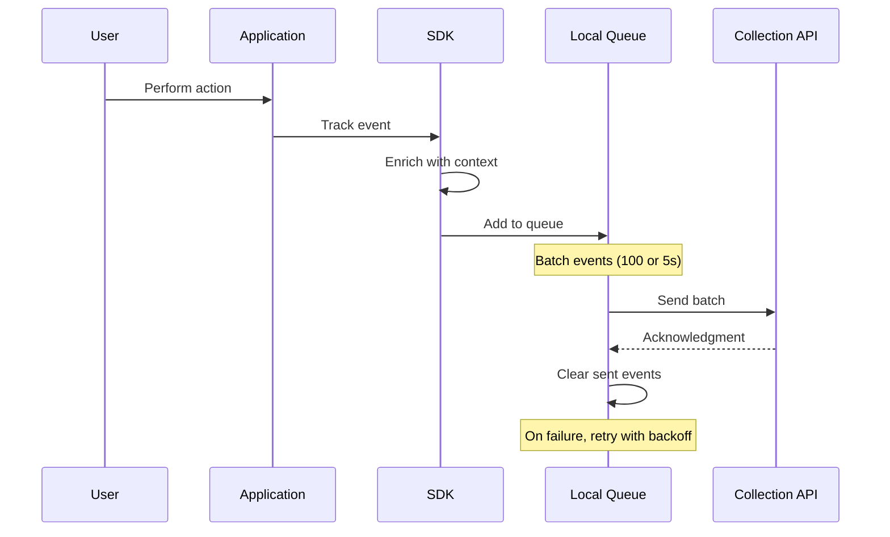
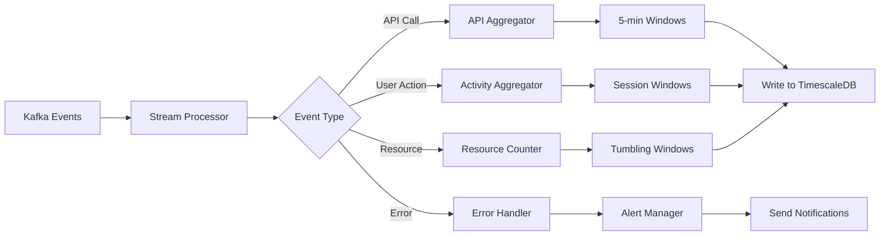
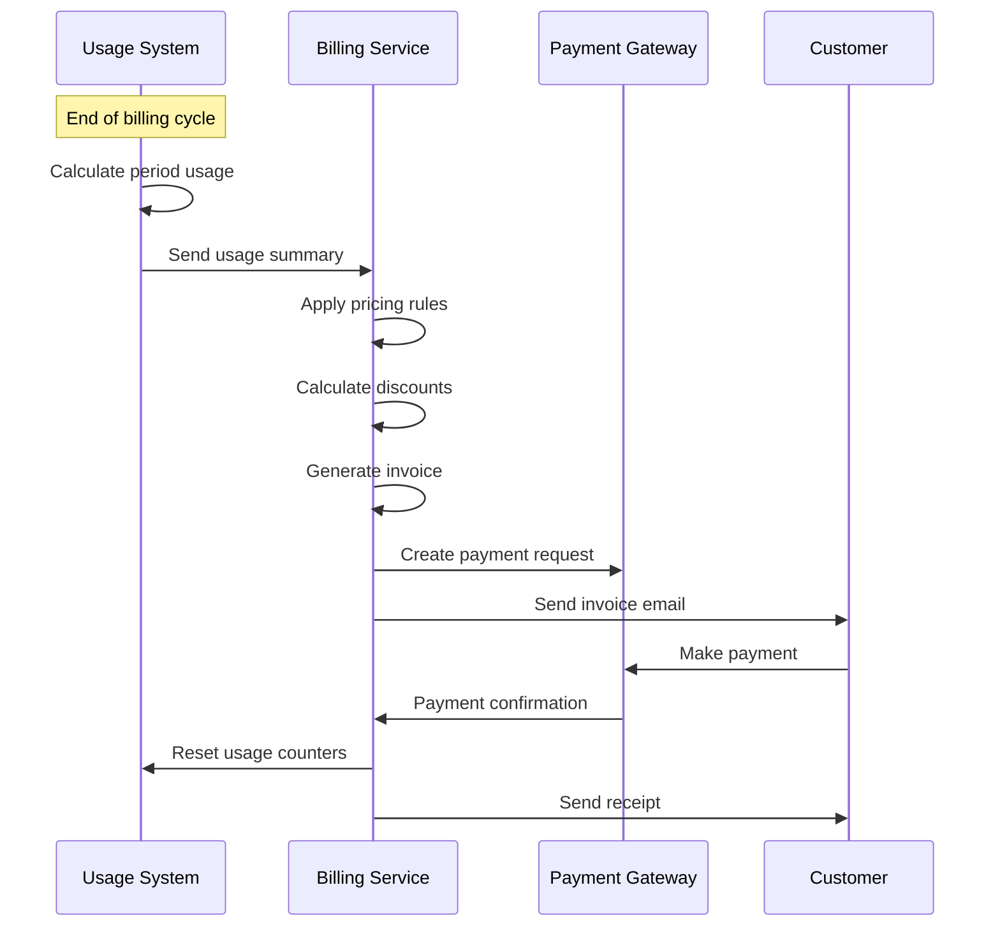

# NCQ Platform - Usage Tracking Workflows

## Document Information
- **Version**: 1.0
- **Date**: January 2025
- **Status**: Final
- **Document Type**: Technical Workflow Documentation
- **Scope**: Platform-wide Usage Tracking System

## Table of Contents
1. [Overview](#1-overview)
2. [Architecture Overview](#2-architecture-overview)
3. [Event Collection Workflows](#3-event-collection-workflows)
4. [Data Processing Pipelines](#4-data-processing-pipelines)
5. [Aggregation Workflows](#5-aggregation-workflows)
6. [Billing Integration Workflows](#6-billing-integration-workflows)
7. [Analytics & Reporting Workflows](#7-analytics--reporting-workflows)
8. [Real-time Monitoring Workflows](#8-real-time-monitoring-workflows)
9. [Data Retention & Archival](#9-data-retention--archival)
10. [Privacy & Compliance Workflows](#10-privacy--compliance-workflows)

## 1. Overview

The NCQ Usage Tracking System provides comprehensive monitoring, measurement, and billing capabilities across all NCQ products. This document details the workflows for collecting, processing, and utilizing usage data throughout the platform.

### 1.1 Key Objectives
- **Accurate Billing**: Track usage for precise billing calculations
- **Resource Optimization**: Monitor and optimize resource utilization
- **User Insights**: Understand user behavior and patterns
- **Compliance**: Maintain audit trails and regulatory compliance
- **Performance**: Real-time monitoring and alerting

### 1.2 Tracked Metrics by Product

```yaml
NCQ LLM:
  - API calls (count, latency)
  - Tokens processed (input/output)
  - Model usage by type
  - RAG storage and queries
  - Agent executions

Smart Building:
  - Active users
  - Space bookings
  - IoT data points
  - Energy consumption
  - System interactions

Hospital Management:
  - Patient records accessed
  - Appointments scheduled
  - Prescriptions generated
  - Lab tests ordered
  - Reports generated

Payment Gateway:
  - Transactions processed
  - Transaction volume (SAR)
  - Payment methods used
  - Settlement amounts
  - Refunds/disputes

Mobile Apps:
  - Daily active users
  - Session duration
  - Feature usage
  - API calls
  - Data synchronized
```

## 2. Architecture Overview

### 2.1 High-Level Architecture

```
┌─────────────────────────────────────────────────────────────┐
│                     User Applications                        │
│  (Web Apps, Mobile Apps, APIs, IoT Devices)                │
└────────────────────────┬────────────────────────────────────┘
                         │ Events
                         ↓
┌─────────────────────────────────────────────────────────────┐
│                   Event Collection Layer                     │
│  ┌─────────────┐  ┌──────────────┐  ┌──────────────────┐  │
│  │ SDK Agents  │  │ API Gateway  │  │ Service Sidecars │  │
│  └─────┬───────┘  └──────┬───────┘  └────────┬─────────┘  │
└────────┼──────────────────┼──────────────────┼─────────────┘
         │                  │                  │
         └──────────────────┴──────────────────┘
                            │
                            ↓
┌─────────────────────────────────────────────────────────────┐
│                    Message Queue (Kafka)                     │
│  ┌─────────────┐  ┌──────────────┐  ┌──────────────────┐  │
│  │ Usage Topic │  │ Events Topic │  │ Metrics Topic    │  │
│  └─────────────┘  └──────────────┘  └──────────────────┘  │
└────────────────────────┬────────────────────────────────────┘
                         │
         ┌───────────────┼───────────────┐
         ↓               ↓               ↓
┌─────────────┐ ┌────────────────┐ ┌──────────────┐
│  Stream     │ │ Batch          │ │ Real-time    │
│  Processing │ │ Processing     │ │ Monitoring   │
│  (Flink)    │ │ (Spark)        │ │ (Prometheus) │
└──────┬──────┘ └───────┬────────┘ └──────┬───────┘
       │                │                  │
       ↓                ↓                  ↓
┌─────────────────────────────────────────────────────────────┐
│                      Storage Layer                          │
│  ┌─────────────┐  ┌──────────────┐  ┌──────────────────┐  │
│  │ TimescaleDB │  │ ClickHouse   │  │ PostgreSQL       │  │
│  │ (Time-series│  │ (Analytics)  │  │ (Transactions)   │  │
│  └─────────────┘  └──────────────┘  └──────────────────┘  │
└─────────────────────────────────────────────────────────────┘
```

### 2.2 Component Responsibilities

```yaml
Event Collectors:
  SDK Agents:
    - Client-side event capture
    - Batching and compression
    - Offline queue management
    
  API Gateway:
    - Request/response logging
    - Latency measurement
    - Error tracking
    
  Service Sidecars:
    - Service mesh integration
    - Automatic instrumentation
    - Distributed tracing

Processing Layer:
  Stream Processing:
    - Real-time aggregation
    - Anomaly detection
    - Usage alerts
    
  Batch Processing:
    - Daily/monthly rollups
    - Complex analytics
    - Report generation
    
  Monitoring:
    - Metrics collection
    - Alert evaluation
    - Dashboard updates

Storage Layer:
  TimescaleDB:
    - High-frequency metrics
    - Real-time queries
    - Automatic retention
    
  ClickHouse:
    - Large-scale analytics
    - Historical analysis
    - Cost optimization
    
  PostgreSQL:
    - Billing records
    - User quotas
    - Audit logs
```

## 3. Event Collection Workflows

### 3.1 Client-Side Event Collection



**Implementation Details**:

```typescript
// SDK Event Structure
interface UsageEvent {
  eventId: string;          // UUID
  timestamp: number;        // Unix timestamp
  tenantId: string;         
  userId: string;
  productId: string;        // 'ncq-llm', 'smart-building', etc.
  eventType: string;        // 'api_call', 'feature_use', etc.
  eventName: string;        // Specific action
  properties: {
    // Product-specific properties
    duration?: number;
    status?: 'success' | 'failure';
    errorCode?: string;
    resourceId?: string;
    quantity?: number;
    cost?: number;
  };
  context: {
    sessionId: string;
    deviceId: string;
    appVersion: string;
    platform: string;
    location?: string;
  };
}

// Collection Workflow
class UsageCollector {
  private queue: UsageEvent[] = [];
  private timer: NodeJS.Timer;
  
  track(event: UsageEvent): void {
    // Validate event
    this.validateEvent(event);
    
    // Enrich with defaults
    event.timestamp = event.timestamp || Date.now();
    event.eventId = event.eventId || generateUUID();
    
    // Add to queue
    this.queue.push(event);
    
    // Trigger flush if needed
    if (this.queue.length >= 100) {
      this.flush();
    } else if (!this.timer) {
      this.timer = setTimeout(() => this.flush(), 5000);
    }
  }
  
  private async flush(): Promise<void> {
    if (this.queue.length === 0) return;
    
    const events = [...this.queue];
    this.queue = [];
    
    try {
      await this.sendEvents(events);
    } catch (error) {
      // Return to queue for retry
      this.queue.unshift(...events);
      this.scheduleRetry();
    }
  }
}
```

### 3.2 Server-Side Event Collection

```yaml
API Gateway Collection Flow:

1. Request Interception:
   Middleware Pipeline:
     - Authentication check
     - Request parsing
     - Start timer
     
2. Request Processing:
   - Route to service
   - Execute business logic
   - Generate response
   
3. Response Interception:
   Usage Event Generation:
     - Stop timer
     - Calculate metrics
     - Extract usage data
     
4. Event Publishing:
   Async Publishing:
     - Create event object
     - Add to Kafka topic
     - Don't block response
     
Example Event:
  eventType: "api_call"
  eventName: "llm.completion"
  properties:
    model: "gpt-4"
    promptTokens: 150
    completionTokens: 250
    totalTokens: 400
    latencyMs: 1250
    statusCode: 200
```

### 3.3 IoT Device Event Collection

```
IoT Collection Workflow:

┌────────────────┐
│  IoT Sensors   │
└───────┬────────┘
        │ MQTT
        ↓
┌────────────────┐
│  MQTT Broker   │
└───────┬────────┘
        │
┌───────┴────────┐
│ Protocol Bridge│
│  - Parse data  │
│  - Validate    │
│  - Transform   │
└───────┬────────┘
        │
┌───────┴────────┐
│ Event Stream   │
│  - Deduplicate │
│  - Aggregate   │
│  - Route       │
└───────┬────────┘
        │
    Kafka Topics
```

## 4. Data Processing Pipelines

### 4.1 Stream Processing Pipeline



**Stream Processing Implementation**:

```python
# Apache Flink Job
class UsageAggregator(ProcessFunction):
    def process_element(self, event: Dict, ctx: Context) -> None:
        # Route by event type
        if event['eventType'] == 'api_call':
            self.process_api_call(event, ctx)
        elif event['eventType'] == 'resource_usage':
            self.process_resource_usage(event, ctx)
            
    def process_api_call(self, event: Dict, ctx: Context) -> None:
        # Extract key metrics
        tenant_id = event['tenantId']
        model = event['properties']['model']
        tokens = event['properties']['totalTokens']
        
        # Update running totals
        state = ctx.get_state('api_metrics')
        state['call_count'] += 1
        state['token_count'] += tokens
        state['model_usage'][model] += 1
        
        # Check thresholds
        if state['token_count'] > self.get_quota(tenant_id):
            self.emit_quota_alert(tenant_id)

# Window Aggregations
class FiveMinuteAggregation:
    window = TumblingWindow(minutes=5)
    
    def aggregate(self, events: List[Event]) -> AggregateResult:
        return {
            'timestamp': self.window.start,
            'tenant_id': events[0].tenant_id,
            'metrics': {
                'api_calls': len(events),
                'total_tokens': sum(e.tokens for e in events),
                'avg_latency': avg(e.latency for e in events),
                'error_rate': sum(1 for e in events if e.error) / len(events)
            }
        }
```

### 4.2 Batch Processing Pipeline

```yaml
Daily Batch Processing Workflow:

Trigger: Daily at 02:00 UTC

Steps:
  1. Extract Raw Events:
     Source: Kafka topics (last 24 hours)
     Filter: Successful events only
     Output: Parquet files in S3
     
  2. Transform & Aggregate:
     Group By:
       - Tenant ID
       - Product ID
       - Resource Type
       - Hour
     
     Calculations:
       - Count distinct users
       - Sum resource usage
       - Calculate percentiles
       - Detect anomalies
       
  3. Load Results:
     Targets:
       - ClickHouse: Analytics tables
       - PostgreSQL: Billing summaries
       - S3: Archive storage
       
  4. Generate Reports:
     Types:
       - Daily usage summary
       - Cost breakdown
       - Trend analysis
       - Anomaly reports
       
  5. Update Dashboards:
     - Refresh materialized views
     - Update cache layers
     - Trigger email reports
```

### 4.3 Machine Learning Pipeline

```python
# Anomaly Detection Pipeline
class UsageAnomalyDetector:
    def __init__(self):
        self.model = IsolationForest(contamination=0.01)
        self.scaler = StandardScaler()
        
    def train_on_historical(self, days=30):
        # Load historical data
        data = self.load_usage_data(days)
        
        # Feature engineering
        features = self.extract_features(data)
        
        # Train model
        scaled_features = self.scaler.fit_transform(features)
        self.model.fit(scaled_features)
        
    def detect_anomalies(self, current_usage):
        features = self.extract_features(current_usage)
        scaled = self.scaler.transform(features)
        
        # Predict anomalies
        predictions = self.model.predict(scaled)
        
        # Alert on anomalies
        for idx, pred in enumerate(predictions):
            if pred == -1:  # Anomaly
                self.send_anomaly_alert(current_usage[idx])
                
    def extract_features(self, data):
        return [
            data['api_calls_per_minute'],
            data['tokens_per_request'],
            data['unique_users'],
            data['error_rate'],
            data['cost_per_hour']
        ]
```

## 5. Aggregation Workflows

### 5.1 Real-time Aggregations

```
Real-time Aggregation Flow:

Event Stream
     ↓
┌────────────────────────┐
│ 1-Minute Aggregations  │
│ - Request count        │
│ - Error count          │
│ - Avg latency          │
└───────────┬────────────┘
            ↓
┌────────────────────────┐
│ 5-Minute Aggregations  │
│ - Unique users         │
│ - Resource usage       │
│ - Cost accumulation    │
└───────────┬────────────┘
            ↓
┌────────────────────────┐
│ 15-Minute Aggregations │
│ - Trend detection      │
│ - Anomaly scoring      │
│ - Forecast updates     │
└───────────┬────────────┘
            ↓
      Dashboard Updates
```

### 5.2 Hierarchical Aggregations

```yaml
Aggregation Hierarchy:

Raw Events (1 second)
    ↓
Minute Level:
  - Group by: tenant, product, resource
  - Metrics: count, sum, min, max, avg
  - Retention: 7 days
    ↓
Hourly Level:
  - Additional: percentiles, distinct counts
  - Compression: 10:1 ratio
  - Retention: 90 days
    ↓
Daily Level:
  - Additional: trends, patterns
  - Compression: 24:1 ratio
  - Retention: 2 years
    ↓
Monthly Level:
  - Summary statistics only
  - Compression: 30:1 ratio
  - Retention: 7 years
```

### 5.3 Multi-dimensional Aggregations

```sql
-- ClickHouse Materialized View for Multi-dimensional Analysis
CREATE MATERIALIZED VIEW usage_cube_mv
ENGINE = AggregatingMergeTree()
PARTITION BY toYYYYMM(timestamp)
ORDER BY (tenant_id, product_id, date, hour)
AS SELECT
    toDate(timestamp) as date,
    toHour(timestamp) as hour,
    tenant_id,
    product_id,
    user_id,
    event_type,
    countState() as event_count,
    sumState(tokens) as total_tokens,
    avgState(latency) as avg_latency,
    uniqState(user_id) as unique_users,
    sumState(cost) as total_cost
FROM events
GROUP BY date, hour, tenant_id, product_id, user_id, event_type;

-- Query Examples
-- Get hourly usage for a tenant
SELECT 
    hour,
    countMerge(event_count) as events,
    sumMerge(total_tokens) as tokens,
    avgMerge(avg_latency) as latency
FROM usage_cube_mv
WHERE tenant_id = 'tenant123' 
  AND date = today()
GROUP BY hour
ORDER BY hour;
```

## 6. Billing Integration Workflows

### 6.1 Usage to Billing Pipeline



### 6.2 Billing Calculation Workflow

```python
class BillingCalculator:
    def calculate_monthly_bill(self, tenant_id: str, month: str) -> Invoice:
        # 1. Fetch usage data
        usage = self.fetch_usage_summary(tenant_id, month)
        
        # 2. Get pricing plan
        plan = self.get_tenant_plan(tenant_id)
        
        # 3. Calculate base charges
        charges = []
        
        # NCQ LLM charges
        if usage.llm_tokens > plan.llm_included_tokens:
            overage = usage.llm_tokens - plan.llm_included_tokens
            charges.append({
                'item': 'LLM Token Overage',
                'quantity': overage,
                'unit_price': 0.000002,  # $2 per million
                'total': overage * 0.000002
            })
        
        # Smart Building charges
        if usage.active_users > plan.included_users:
            extra_users = usage.active_users - plan.included_users
            charges.append({
                'item': 'Additional Users',
                'quantity': extra_users,
                'unit_price': 10,  # $10 per user
                'total': extra_users * 10
            })
        
        # 4. Apply discounts
        subtotal = sum(c['total'] for c in charges) + plan.base_price
        discount = self.calculate_discount(tenant_id, subtotal)
        
        # 5. Generate invoice
        return Invoice(
            tenant_id=tenant_id,
            period=month,
            line_items=charges,
            subtotal=subtotal,
            discount=discount,
            total=subtotal - discount,
            due_date=self.calculate_due_date()
        )
```

### 6.3 Quota Management Workflow

```yaml
Quota Enforcement Flow:

1. Request Arrives:
   API Gateway receives request
        ↓
2. Check Quota:
   Query: Current usage vs limits
   Cache: Redis with 1-min TTL
        ↓
3. Decision:
   Under Quota:
     - Process request
     - Increment counter
     - Update cache
   
   Over Quota:
     Soft Limit:
       - Process with warning
       - Send alert email
       - Log overage
     
     Hard Limit:
       - Reject request
       - Return 429 error
       - Suggest upgrade
        ↓
4. Update Records:
   - Async write to database
   - Update dashboards
   - Trigger notifications
```

## 7. Analytics & Reporting Workflows

### 7.1 Real-time Analytics Dashboard

```
Dashboard Update Flow:

WebSocket Connection Established
            ↓
Subscribe to Metrics:
  - /metrics/tenant/{id}/realtime
  - /metrics/product/{id}/realtime
            ↓
Server Push Updates (1-second intervals):
  {
    "timestamp": 1704067200,
    "metrics": {
      "activeUsers": 1234,
      "requestsPerSecond": 567,
      "avgLatency": 89,
      "errorRate": 0.002,
      "currentCost": 1234.56
    }
  }
            ↓
Client Updates UI:
  - Animate counters
  - Update graphs
  - Flash alerts
```

### 7.2 Scheduled Report Generation

```python
class ReportGenerator:
    @schedule(cron="0 6 * * *")  # Daily at 6 AM
    def generate_daily_reports(self):
        tenants = self.get_active_tenants()
        
        for tenant in tenants:
            # Generate report data
            data = {
                'usage_summary': self.get_usage_summary(tenant.id),
                'cost_breakdown': self.get_cost_breakdown(tenant.id),
                'top_users': self.get_top_users(tenant.id),
                'trends': self.calculate_trends(tenant.id),
                'recommendations': self.generate_recommendations(tenant.id)
            }
            
            # Create PDF report
            pdf = self.render_pdf_report(data)
            
            # Send via email
            self.email_service.send(
                to=tenant.email,
                subject=f"Daily Usage Report - {date.today()}",
                template='daily_report',
                attachments=[pdf],
                data=data
            )
    
    def generate_recommendations(self, tenant_id):
        usage = self.get_usage_patterns(tenant_id)
        
        recommendations = []
        
        # Cost optimization
        if usage.peak_hours_usage > 0.8 * usage.total_usage:
            recommendations.append({
                'type': 'cost_optimization',
                'message': 'Consider batch processing during off-peak hours',
                'potential_savings': usage.peak_cost * 0.3
            })
        
        # Model selection
        if usage.simple_queries > 0.7 * usage.total_queries:
            recommendations.append({
                'type': 'model_optimization',
                'message': 'Use lighter models for simple queries',
                'potential_savings': usage.model_cost * 0.5
            })
        
        return recommendations
```

### 7.3 Custom Analytics Queries

```sql
-- Top 10 Power Users by Product
WITH user_stats AS (
    SELECT 
        user_id,
        product_id,
        COUNT(*) as action_count,
        SUM(CASE WHEN error = 1 THEN 1 ELSE 0 END) as error_count,
        AVG(latency) as avg_latency,
        SUM(cost) as total_cost
    FROM events
    WHERE timestamp >= now() - INTERVAL 30 DAY
      AND tenant_id = %(tenant_id)s
    GROUP BY user_id, product_id
)
SELECT 
    u.user_id,
    u.product_id,
    u.action_count,
    u.error_count,
    u.avg_latency,
    u.total_cost,
    usr.name as user_name,
    usr.department
FROM user_stats u
JOIN users usr ON u.user_id = usr.id
ORDER BY u.action_count DESC
LIMIT 10;

-- Cost Trends by Department
SELECT 
    DATE_TRUNC('day', timestamp) as date,
    usr.department,
    SUM(e.cost) as daily_cost,
    COUNT(DISTINCT e.user_id) as active_users,
    AVG(e.cost) as cost_per_user
FROM events e
JOIN users usr ON e.user_id = usr.id
WHERE e.tenant_id = %(tenant_id)s
  AND e.timestamp >= now() - INTERVAL 90 DAY
GROUP BY date, usr.department
ORDER BY date DESC, daily_cost DESC;
```

## 8. Real-time Monitoring Workflows

### 8.1 Threshold-based Alerting

```yaml
Alert Configuration:
  
  Cost Alerts:
    - name: "Daily Budget Exceeded"
      condition: daily_cost > budget_limit
      severity: warning
      notification:
        - email: finance@company.com
        - slack: #alerts-finance
    
    - name: "Unusual Spending Spike"
      condition: hourly_cost > 3 * avg_hourly_cost
      severity: critical
      notification:
        - email: cto@company.com
        - sms: +966501234567
        - pagerduty: true
  
  Performance Alerts:
    - name: "High Error Rate"
      condition: error_rate > 0.05  # 5%
      window: 5 minutes
      severity: critical
      notification:
        - slack: #eng-oncall
        - pagerduty: true
    
    - name: "Latency Degradation"
      condition: p99_latency > 2000  # 2 seconds
      window: 10 minutes
      severity: warning
      notification:
        - email: devops@company.com
  
  Security Alerts:
    - name: "Unusual Access Pattern"
      condition: |
        unique_ips > 10 AND 
        time_window = '1 hour' AND
        user_type = 'api_key'
      severity: critical
      notification:
        - email: security@company.com
        - slack: #security-alerts
```

### 8.2 Anomaly Detection Workflow

```python
class AnomalyDetectionService:
    def __init__(self):
        self.models = {
            'usage': UsageAnomalyModel(),
            'cost': CostAnomalyModel(),
            'security': SecurityAnomalyModel()
        }
        
    async def process_metrics(self, metrics: Dict):
        # Check each model
        for model_name, model in self.models.items():
            anomaly_score = model.score(metrics)
            
            if anomaly_score > model.threshold:
                await self.handle_anomaly(
                    model_name=model_name,
                    score=anomaly_score,
                    metrics=metrics,
                    details=model.explain(metrics)
                )
    
    async def handle_anomaly(self, **kwargs):
        # Create alert
        alert = Alert(
            type=f"anomaly_{kwargs['model_name']}",
            severity=self.calculate_severity(kwargs['score']),
            tenant_id=kwargs['metrics']['tenant_id'],
            details=kwargs['details'],
            timestamp=datetime.utcnow()
        )
        
        # Store in database
        await self.db.alerts.insert(alert)
        
        # Send notifications
        await self.notifier.send(alert)
        
        # Update dashboard
        await self.dashboard.publish_alert(alert)
```

### 8.3 SLA Monitoring

```yaml
SLA Tracking Workflow:

Service Level Objectives:
  API Availability:
    target: 99.9%
    measurement: uptime_percentage
    window: rolling_30_days
    
  Response Time:
    target: 
      p50: 100ms
      p95: 500ms
      p99: 2000ms
    measurement: latency_percentiles
    window: rolling_24_hours
    
  Error Rate:
    target: < 0.1%
    measurement: error_percentage
    window: rolling_1_hour

Monitoring Process:
  1. Continuous Measurement:
     - Collect metrics every second
     - Calculate rolling windows
     - Update SLA dashboards
     
  2. Breach Detection:
     - Compare against targets
     - Track breach duration
     - Calculate error budget
     
  3. Incident Creation:
     - Auto-create incident ticket
     - Page on-call engineer
     - Start incident timer
     
  4. Recovery Tracking:
     - Monitor return to normal
     - Calculate total downtime
     - Update SLA reports
```

## 9. Data Retention & Archival

### 9.1 Tiered Storage Strategy

```
Data Lifecycle Management:

Hot Storage (0-7 days):
  Location: SSD-backed TimescaleDB
  Access: < 10ms query time
  Use: Real-time dashboards, alerts
  
Warm Storage (7-90 days):
  Location: ClickHouse cluster
  Access: < 100ms query time
  Use: Analytics, reporting
  Compression: 10:1 ratio
  
Cold Storage (90 days - 2 years):
  Location: S3-compatible storage
  Format: Parquet files
  Access: Minutes to hours
  Use: Compliance, historical analysis
  Compression: 50:1 ratio
  
Archive (2+ years):
  Location: Glacier/Deep Archive
  Access: Hours to days
  Use: Legal/compliance only
  Compression: 100:1 ratio
  Encryption: AES-256
```

### 9.2 Data Archival Workflow

```python
class DataArchivalService:
    @schedule(cron="0 3 * * *")  # Daily at 3 AM
    def archive_old_data(self):
        # Define cutoff dates
        warm_cutoff = datetime.now() - timedelta(days=7)
        cold_cutoff = datetime.now() - timedelta(days=90)
        archive_cutoff = datetime.now() - timedelta(days=730)
        
        # Move hot to warm
        self.move_to_clickhouse(
            source='timescaledb',
            query=f"SELECT * FROM events WHERE timestamp < '{warm_cutoff}'",
            delete_source=True
        )
        
        # Move warm to cold
        self.export_to_parquet(
            source='clickhouse',
            query=f"SELECT * FROM events WHERE timestamp < '{cold_cutoff}'",
            destination='s3://ncq-cold-storage/events/',
            partition_by=['year', 'month', 'tenant_id']
        )
        
        # Move cold to archive
        self.move_to_glacier(
            source='s3://ncq-cold-storage/events/',
            filter=f"year < {archive_cutoff.year}",
            tier='DEEP_ARCHIVE'
        )
        
    def export_to_parquet(self, **kwargs):
        # Stream data in chunks
        for chunk in self.stream_query(kwargs['source'], kwargs['query']):
            # Convert to Parquet
            df = pd.DataFrame(chunk)
            
            # Partition data
            for partition, group in df.groupby(kwargs['partition_by']):
                path = self.build_path(kwargs['destination'], partition)
                group.to_parquet(path, compression='snappy')
```

### 9.3 Data Restoration Workflow

```yaml
Restoration Process:

1. Request Initiation:
   User Request:
     - Date range needed
     - Products/tenants
     - Urgency level
     
2. Data Location:
   Determine Storage Tier:
     - Check warm storage first
     - Then cold storage
     - Finally archives
     
3. Restoration:
   From Warm (ClickHouse):
     - Direct query execution
     - Results in minutes
     
   From Cold (S3):
     - Download Parquet files
     - Load to temp ClickHouse table
     - Query and export results
     - Time: 1-2 hours
     
   From Archive (Glacier):
     - Initiate retrieval request
     - Wait for availability (12-48 hours)
     - Download and process
     - Time: 1-3 days
     
4. Delivery:
   - Upload to secure location
   - Send download link
   - Notify requester
   - Log access for audit
```

## 10. Privacy & Compliance Workflows

### 10.1 Data Privacy Controls

```python
class PrivacyService:
    def anonymize_event(self, event: Dict) -> Dict:
        """Remove or hash PII from events"""
        
        # Define PII fields
        pii_fields = ['email', 'phone', 'ip_address', 'user_name']
        
        # Copy event
        anonymized = event.copy()
        
        # Handle each PII field
        for field in pii_fields:
            if field in anonymized:
                if field == 'ip_address':
                    # Keep subnet for geo-location
                    anonymized[field] = self.mask_ip(event[field])
                else:
                    # One-way hash
                    anonymized[field] = self.hash_pii(event[field])
        
        # Generalize precise data
        if 'location' in anonymized:
            anonymized['location'] = self.generalize_location(
                event['location'], 
                precision='city'
            )
        
        return anonymized
    
    def handle_deletion_request(self, user_id: str):
        """GDPR right to deletion"""
        
        # 1. Stop collecting new data
        self.blacklist_user(user_id)
        
        # 2. Delete from hot storage
        self.delete_from_timescale(user_id)
        
        # 3. Delete from warm storage
        self.delete_from_clickhouse(user_id)
        
        # 4. Mark for deletion in cold storage
        self.schedule_cold_deletion(user_id)
        
        # 5. Audit log
        self.audit_log.record({
            'action': 'user_deletion',
            'user_id': user_id,
            'timestamp': datetime.utcnow(),
            'completed_by': 'privacy_service'
        })
```

### 10.2 Compliance Reporting

```yaml
Compliance Reports:

GDPR Compliance:
  Data Processing Report:
    - Purpose of processing
    - Legal basis
    - Data categories
    - Retention periods
    - Third-party sharing
    
  Data Subject Requests:
    - Access requests handled
    - Deletion requests
    - Portability requests
    - Response times
    
SAMA Compliance (Saudi):
  Transaction Monitoring:
    - Daily transaction volumes
    - Cross-border transactions
    - Suspicious activity flags
    - KYC/AML checks
    
  Data Residency:
    - Data location audit
    - Cross-border transfers
    - Encryption status
    - Access controls

SOC 2 Type II:
  Security Controls:
    - Access logs
    - Change management
    - Incident response
    - Vulnerability scans
    
  Availability Metrics:
    - Uptime statistics
    - Incident reports
    - Recovery times
    - Backup success rates
```

### 10.3 Audit Trail Workflow

```
Audit Event Flow:

User Action
     ↓
Capture Context:
  - User ID
  - Session ID
  - IP Address
  - User Agent
  - Action Type
  - Resource ID
  - Timestamp
     ↓
Enrich Event:
  - Tenant info
  - User role
  - Geo-location
  - Risk score
     ↓
Sign Event:
  - HMAC signature
  - Timestamp
  - Sequence number
     ↓
Immutable Storage:
  - Write-once store
  - Cryptographic proof
  - Chain integrity
     ↓
Compliance Archive:
  - 7-year retention
  - Tamper-proof
  - Court-admissible
```

## Implementation Guidelines

### Best Practices

1. **Event Design**
   - Use consistent schema across products
   - Include correlation IDs for tracing
   - Minimize payload size
   - Version your event schemas

2. **Performance Optimization**
   - Batch events client-side
   - Use compression for large payloads
   - Implement circuit breakers
   - Cache frequently accessed data

3. **Security Considerations**
   - Encrypt sensitive data in transit and at rest
   - Implement field-level encryption for PII
   - Use API keys with limited scope
   - Regular security audits

4. **Monitoring the Monitors**
   - Track event delivery success rate
   - Monitor pipeline latency
   - Alert on data quality issues
   - Regular reconciliation checks

### Troubleshooting Guide

```yaml
Common Issues:

Missing Events:
  Symptoms:
    - Gaps in dashboards
    - Billing discrepancies
  
  Diagnosis:
    - Check client SDK errors
    - Verify network connectivity
    - Review Kafka lag metrics
    - Check processing errors
  
  Resolution:
    - Replay from Kafka
    - Restore from backups
    - Reconcile with source systems

High Latency:
  Symptoms:
    - Delayed dashboard updates
    - Slow report generation
  
  Diagnosis:
    - Monitor pipeline stages
    - Check resource utilization
    - Review query performance
  
  Resolution:
    - Scale processing nodes
    - Optimize queries
    - Add caching layers
    - Partition data better

Data Quality Issues:
  Symptoms:
    - Inconsistent metrics
    - Invalid calculations
  
  Diagnosis:
    - Validate event schemas
    - Check transformation logic
    - Review aggregation rules
  
  Resolution:
    - Fix validation rules
    - Reprocess affected data
    - Update documentation
```

## Conclusion

The NCQ Usage Tracking System provides comprehensive visibility into platform usage while maintaining performance, accuracy, and compliance. By following these workflows, the platform can:

1. **Accurately bill customers** based on actual usage
2. **Optimize resource allocation** through insights
3. **Maintain compliance** with regulations
4. **Provide real-time visibility** to stakeholders
5. **Scale efficiently** with growing usage

Regular review and optimization of these workflows ensures the system continues to meet evolving business needs while maintaining high performance and reliability.