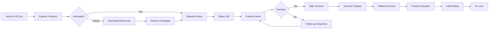
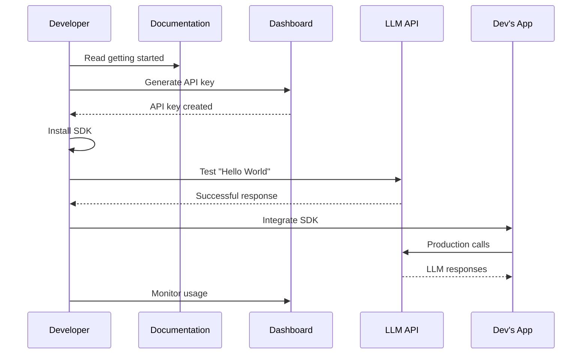
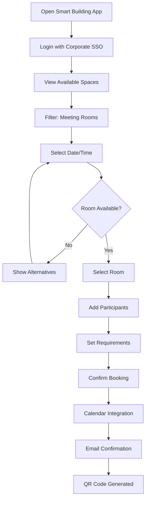
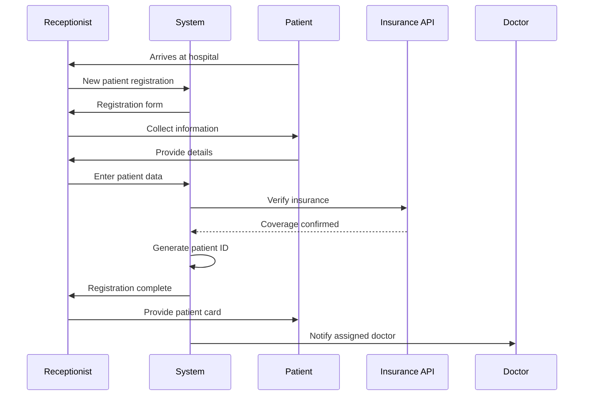
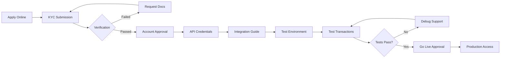
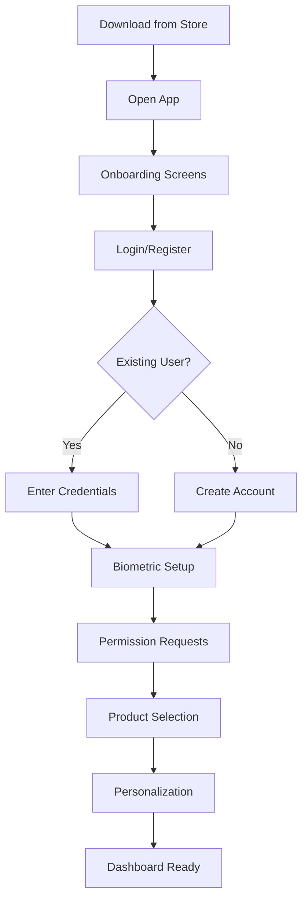
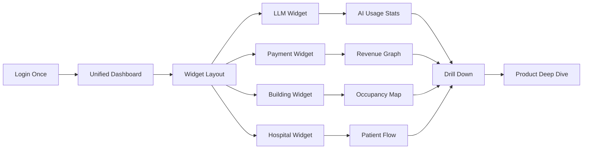
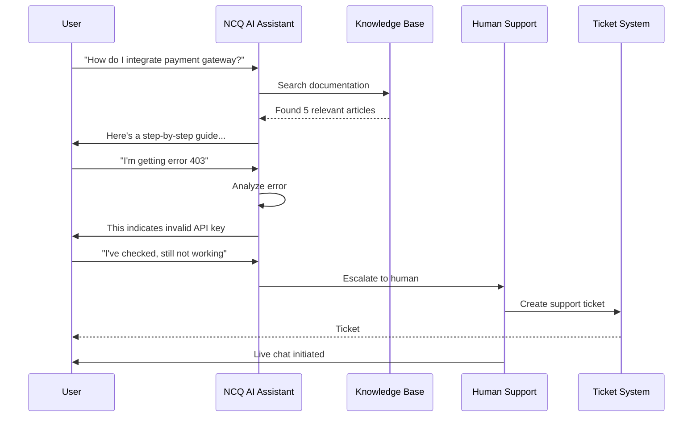

# NCQ Ecosystem - User Journey Workflows

## Document Information
- **Version**: 1.0
- **Date**: January 2025
- **Status**: Final
- **Document Type**: User Journey Workflows
- **Scope**: All NCQ Products and Services

## Table of Contents
1. [Overview](#1-overview)
2. [Platform-Wide User Journeys](#2-platform-wide-user-journeys)
3. [NCQ LLM User Journeys](#3-ncq-llm-user-journeys)
4. [Smart Building User Journeys](#4-smart-building-user-journeys)
5. [Hospital Management User Journeys](#5-hospital-management-user-journeys)
6. [Payment Gateway User Journeys](#6-payment-gateway-user-journeys)
7. [Mobile App User Journeys](#7-mobile-app-user-journeys)
8. [Cross-Product User Journeys](#8-cross-product-user-journeys)

## 1. Overview

This document defines comprehensive user journey workflows across all NCQ products and services. Each workflow includes:
- User personas and goals
- Step-by-step journey maps
- System interactions
- Decision points
- Success metrics
- Integration touchpoints

### 1.1 Journey Notation
```
[User Action] → {System Process} → <Decision Point> → |Integration| → ✓ Success
                                         ↓
                                    × Failure/Retry
```

### 1.2 Common User Personas
- **Business Owner**: Decision maker seeking ROI
- **Developer**: Technical implementer
- **End User**: Daily product user
- **Administrator**: System manager
- **Support Agent**: NCQ employee helping customers

## 2. Platform-Wide User Journeys

### 2.1 New Customer Onboarding Journey

**Persona**: Business Owner / CTO  
**Goal**: Evaluate and adopt NCQ platform



**Detailed Steps**:

1. **Discovery Phase**
   - User lands on ncq.ai from search/referral
   - Views product overview page
   - Watches demo videos
   - Reads case studies

2. **Evaluation Phase**
   - Fills demo request form
   - Receives automated email confirmation
   - Sales team schedules call within 24 hours
   - Custom demo prepared based on industry

3. **Decision Phase**
   - Pricing proposal sent
   - Technical evaluation period (14 days)
   - Security/compliance review
   - Contract negotiation

4. **Onboarding Phase**
   - Welcome email with credentials
   - Dedicated onboarding specialist assigned
   - Initial platform walkthrough (1 hour)
   - Product selection and configuration

5. **Activation Phase**
   - Technical integration support
   - User training sessions
   - Go-live checklist
   - Success metrics defined

### 2.2 User Registration & First Login

**Persona**: Any New User  
**Goal**: Access NCQ platform successfully

```yaml
Journey Steps:
  1. Registration:
    - Input: Email, Password, Company Info
    - Validation: Email verification
    - System: Create tenant, assign default role
    - Output: Verification email sent
    
  2. Email Verification:
    - User: Clicks verification link
    - System: Validates token, activates account
    - Redirect: First-time login page
    
  3. First Login:
    - Input: Credentials
    - System: JWT token generation
    - MFA: Optional setup prompt
    - Output: Dashboard access
    
  4. Initial Setup:
    - Profile completion
    - Team invitation (optional)
    - Product selection
    - Billing setup
```

### 2.3 Subscription Management Journey

**Persona**: Account Administrator  
**Goal**: Manage subscription and billing

```
User Journey Map:

START → Login → Navigate to Billing
         ↓
    View Current Plan
         ↓
    <Upgrade Needed?>
      ↙        ↘
    No          Yes
     ↓           ↓
  View Usage   Select New Plan
     ↓           ↓
    END      Review Changes
                 ↓
            Confirm Upgrade
                 ↓
            |Payment Gateway|
                 ↓
            <Payment Success?>
              ↙        ↘
            No          Yes
             ↓           ↓
        Error Handle   Plan Updated
             ↓           ↓
          Retry        Email Confirmation
                         ↓
                        END
```

## 3. NCQ LLM User Journeys

### 3.1 Developer API Integration Journey

**Persona**: Backend Developer  
**Goal**: Integrate LLM API into application



**Detailed Workflow**:

1. **Discovery & Learning** (15 minutes)
   ```
   → Visit docs.ncq.ai/llm
   → Read quickstart guide
   → Choose programming language
   → Review code examples
   ```

2. **Account Setup** (5 minutes)
   ```
   → Login to dashboard
   → Navigate to API Keys
   → Generate new key
   → Copy key securely
   → Set key permissions
   ```

3. **Local Development** (30 minutes)
   ```
   → Install SDK: npm install @ncq/llm-sdk
   → Configure environment variables
   → Write test code
   → Execute first API call
   → Verify response format
   ```

4. **Integration Development** (2-4 hours)
   ```
   → Design integration architecture
   → Implement error handling
   → Add retry logic
   → Configure streaming (if needed)
   → Write unit tests
   ```

5. **Production Deployment** (1 hour)
   ```
   → Set production API key
   → Configure rate limits
   → Enable monitoring
   → Deploy application
   → Verify production calls
   ```

### 3.2 Business User Workflow Creation Journey

**Persona**: Product Manager  
**Goal**: Create customer support chatbot without coding

```
Visual Workflow Builder Journey:

1. Template Selection
   ┌─────────────────┐
   │ Browse Templates│ → Filter: "Customer Support"
   └────────┬────────┘
            ↓
   ┌─────────────────┐
   │ Select Template │ → "E-commerce Support Bot"
   └────────┬────────┘
            ↓
2. Customization
   ┌─────────────────┐
   │ Edit Greeting   │ → "Hello! How can I help you today?"
   └────────┬────────┘
            ↓
   ┌─────────────────┐
   │ Add FAQ Nodes   │ → Connect to knowledge base
   └────────┬────────┘
            ↓
   ┌─────────────────┐
   │Configure Actions│ → Set escalation rules
   └────────┬────────┘
            ↓
3. Testing
   ┌─────────────────┐
   │ Test Workflow   │ → Simulate conversations
   └────────┬────────┘
            ↓
   <All Tests Pass?>
     ↙          ↘
   No            Yes
    ↓             ↓
  Refine      Deploy
    ↑             ↓
    └─────────────┘
            ↓
4. Monitoring
   ┌─────────────────┐
   │ View Analytics  │ → Track performance
   └─────────────────┘
```

### 3.3 RAG Implementation Journey

**Persona**: AI Engineer  
**Goal**: Build knowledge-based Q&A system

```yaml
RAG Setup Workflow:
  1. Knowledge Base Creation:
    Actions:
      - Create new knowledge base
      - Set access permissions
      - Configure chunking strategy
    System:
      - Assigns KB ID
      - Initializes vector store
      
  2. Document Upload:
    Actions:
      - Select documents (PDF, DOCX, TXT)
      - Upload via UI or API
      - Set metadata tags
    System:
      - Document parsing
      - Text extraction
      - Chunking process
      - Embedding generation
      - Vector indexing
    Notifications:
      - Processing started
      - Progress updates
      - Completion status
      
  3. Query Testing:
    Actions:
      - Enter test questions
      - Review retrieved chunks
      - Verify accuracy
    System:
      - Semantic search
      - Chunk retrieval
      - Re-ranking
      - Response generation
      
  4. Production Integration:
    Actions:
      - Generate API endpoint
      - Configure parameters
      - Set rate limits
    System:
      - Endpoint provisioning
      - Load balancer config
      - Monitoring setup
```

## 4. Smart Building User Journeys

### 4.1 Tenant Space Booking Journey

**Persona**: Office Employee  
**Goal**: Book meeting room for team



**Detailed Steps**:

1. **Access & Authentication**
   ```
   Mobile App Launch → Biometric/PIN → Dashboard Display
   Time: 3 seconds
   ```

2. **Space Discovery**
   ```
   → Tap "Book Space"
   → View floor map
   → Filter options:
     - Room type
     - Capacity
     - Equipment
     - Floor
   → Real-time availability
   ```

3. **Booking Process**
   ```
   → Select room on map
   → Choose time slot
   → Add meeting details:
     - Title
     - Participants (optional)
     - Catering needs
     - Equipment needs
   → Review summary
   → Confirm booking
   ```

4. **Post-Booking**
   ```
   → Receive confirmation
   → Calendar sync
   → Get access QR code
   → Participant notifications
   → Reminder 15 min before
   ```

### 4.2 Building Manager Dashboard Journey

**Persona**: Facility Manager  
**Goal**: Monitor building performance and occupancy

```yaml
Manager Daily Workflow:
  
  Morning Check (8:00 AM):
    1. Login to Dashboard:
       - Face ID authentication
       - Role: Building Manager
       
    2. Overview Dashboard:
       - Current occupancy: 67%
       - Active alerts: 2
       - Energy usage: Normal
       - Temperature: All zones OK
       
    3. Alert Investigation:
       Alert 1:
         - Type: HVAC malfunction
         - Location: Floor 5, Zone A
         - Action: Dispatch maintenance
         - Status: Assigned to Tech #3
       
       Alert 2:
         - Type: Elevator maintenance due
         - Action: Schedule for weekend
         - Status: Scheduled
         
    4. Occupancy Analysis:
       - View heatmap
       - Peak hours: 9-11 AM, 2-4 PM
       - Underutilized: Floor 3 East
       - Action: Suggest consolidation
       
  Midday Tasks (12:00 PM):
    1. Energy Optimization:
       - Review consumption graph
       - Identify spike at 10 AM
       - Investigate: Large meeting
       - Adjust HVAC scheduling
       
    2. Space Utilization Report:
       - Generate weekly report
       - Meeting room usage: 78%
       - Desk usage: 82%
       - Parking usage: 91%
       
  End of Day (5:00 PM):
    1. Security Check:
       - Review access logs
       - After-hours bookings: 3
       - Security rounds scheduled
       
    2. Next Day Preparation:
       - Check tomorrow's events
       - Verify maintenance schedule
       - Review weather forecast
       - Adjust building systems
```

### 4.3 IoT Sensor Integration Journey

**Persona**: Building Systems Engineer  
**Goal**: Add new IoT sensors to monitoring system

```
Sensor Integration Workflow:

1. Device Registration
   ┌────────────────┐
   │ Add New Device │ 
   └───────┬────────┘
           ↓
   ┌────────────────┐
   │ Scan QR Code   │ → Device ID captured
   └───────┬────────┘
           ↓
   ┌────────────────┐
   │ Select Type    │ → Temperature/Motion/Air Quality
   └───────┬────────┘
           ↓
   ┌────────────────┐
   │ Set Location   │ → Floor/Zone/Room
   └───────┬────────┘
           
2. Configuration
   ┌────────────────┐
   │ Network Setup  │ → Connect to Building WiFi
   └───────┬────────┘
           ↓
   ┌────────────────┐
   │ Set Parameters │ → Polling interval, thresholds
   └───────┬────────┘
           ↓
   ┌────────────────┐
   │ Test Connection│ → Verify data flow
   └───────┬────────┘
           
3. Integration
   ┌────────────────┐
   │ Map to System  │ → Link to floor plan
   └───────┬────────┘
           ↓
   ┌────────────────┐
   │ Set Alerts     │ → Configure thresholds
   └───────┬────────┘
           ↓
   ┌────────────────┐
   │ Go Live        │ → Start monitoring
   └────────────────┘
```

## 5. Hospital Management User Journeys

### 5.1 Patient Registration Journey

**Persona**: Hospital Receptionist  
**Goal**: Register new patient efficiently



**Detailed Workflow**:

1. **Initial Contact** (2 minutes)
   ```
   Patient Arrival → Greet Patient → Select "New Registration"
   ```

2. **Data Collection** (5 minutes)
   ```
   Personal Information:
   - Full name, DOB, Gender
   - National ID/Iqama
   - Contact details
   - Emergency contact
   
   Medical History:
   - Allergies
   - Current medications
   - Previous conditions
   - Family history
   ```

3. **Insurance Verification** (3 minutes)
   ```
   → Enter insurance ID
   → System calls insurance API
   → Verify coverage
   → Check co-pay requirements
   → Generate approval code
   ```

4. **Patient Creation** (1 minute)
   ```
   → System generates unique ID
   → Create medical record number
   → Print patient card
   → Create patient folder
   → Assign to department
   ```

### 5.2 Doctor Consultation Journey

**Persona**: General Practitioner  
**Goal**: Conduct patient consultation efficiently

```yaml
Consultation Workflow:

1. Pre-Consultation:
   Morning Login:
     - Biometric authentication
     - View today's appointments
     - Review patient queue
     
   Patient Preparation:
     - Click patient name
     - Load medical history
     - View recent visits
     - Check test results
     - Review medications

2. During Consultation:
   Patient Arrival:
     - Nurse updates status
     - Doctor receives notification
     - Patient enters room
     
   Examination Process:
     - Record vital signs
     - Document symptoms
     - Physical examination notes
     - Voice-to-text capability
     
   Diagnosis Entry:
     - Search ICD-10 codes
     - Select conditions
     - Add clinical notes
     - Set severity level

3. Treatment Planning:
   Prescription:
     - Search medications
     - Check interactions
     - Set dosage/duration
     - Add instructions
     - E-prescribe to pharmacy
     
   Lab Orders:
     - Select required tests
     - Set priority level
     - Add clinical notes
     - Send to lab system
     
   Follow-up:
     - Schedule next visit
     - Set reminder
     - Patient education
     - Referral if needed

4. Post-Consultation:
   Documentation:
     - Finalize notes
     - Sign electronically
     - Generate summary
     - Update patient record
     
   Billing:
     - Auto-generate charges
     - Apply insurance
     - Patient co-pay
     - Send to billing
```

### 5.3 Emergency Department Journey

**Persona**: ER Nurse  
**Goal**: Rapid patient triage and care

```
Emergency Workflow:

PATIENT ARRIVAL
      ↓
┌─────────────┐
│   TRIAGE    │ → Severity Assessment
└──────┬──────┘
       ↓
  <Severity?>
   ↙   ↓   ↘
Red  Yellow Green
 ↓     ↓     ↓
Immediate  Urgent  Can Wait
 ↓     ↓     ↓
┌─────┴─────┴─────┐
│ Registration Fast│ → Minimal info
└────────┬─────────┘
         ↓
┌──────────────────┐
│ Assign Treatment │ → Bed/Doctor
└────────┬─────────┘
         ↓
┌──────────────────┐
│ Begin Treatment  │ → Orders/Meds
└────────┬─────────┘
         ↓
┌──────────────────┐
│ Monitor Progress │ → Real-time
└────────┬─────────┘
         ↓
    <Discharge?>
    ↙        ↘
  Yes         No
   ↓          ↓
Discharge   Admit
Process    Process
```

## 6. Payment Gateway User Journeys

### 6.1 Merchant Onboarding Journey

**Persona**: E-commerce Business Owner  
**Goal**: Integrate NCQ payment gateway



**Detailed Steps**:

1. **Application Process** (Day 1)
   ```
   Business Information:
   - Company name, CR number
   - Business type/category
   - Expected volume
   - Current payment methods
   
   Contact Details:
   - Owner information
   - Technical contact
   - Finance contact
   ```

2. **KYC Verification** (Day 1-3)
   ```
   Required Documents:
   - Commercial Registration
   - Bank account details
   - VAT certificate
   - Owner ID/Iqama
   
   Verification Process:
   - Document validation
   - SAMA compliance check
   - Risk assessment
   - Approval decision
   ```

3. **Technical Integration** (Day 4-7)
   ```
   Developer Portal Access:
   - API documentation
   - SDK downloads
   - Code examples
   - Postman collection
   
   Test Environment:
   - Sandbox credentials
   - Test card numbers
   - Simulator access
   - Debug tools
   ```

### 6.2 Customer Payment Journey

**Persona**: Online Shopper  
**Goal**: Complete purchase securely

```yaml
Checkout Flow:

1. Cart Review:
   - View items
   - Apply coupon
   - Calculate total
   
2. Payment Selection:
   - Choose NCQ Pay
   - Redirected to gateway
   
3. Payment Page:
   Display:
     - Merchant name
     - Amount in SAR
     - Security badges
     
   Payment Options:
     ┌─────────────┐
     │ MADA Cards  │ → Most used
     ├─────────────┤
     │ Credit Card │ → Visa/Master
     ├─────────────┤
     │ Apple Pay   │ → One-click
     ├─────────────┤
     │ SADAD       │ → Bank transfer
     └─────────────┘
     
4. Card Entry:
   - Card number (with formatting)
   - Expiry date
   - CVV
   - Cardholder name
   
5. 3D Secure:
   - Redirect to bank
   - SMS OTP entry
   - Biometric approval
   - Return to merchant
   
6. Confirmation:
   - Success message
   - Transaction ID
   - Email receipt
   - Return to merchant
```

### 6.3 Reconciliation Journey

**Persona**: Finance Manager  
**Goal**: Reconcile daily transactions

```
Daily Reconciliation Workflow:

START (9:00 AM)
      ↓
┌────────────────┐
│ Login Dashboard│ → Role: Finance
└───────┬────────┘
        ↓
┌────────────────┐
│ View Summary   │ 
│ - Transactions │ → Count: 1,847
│ - Volume       │ → SAR 458,293
│ - Success Rate │ → 94.3%
└───────┬────────┘
        ↓
┌────────────────┐
│ Download Report│ → Excel/CSV format
└───────┬────────┘
        ↓
┌────────────────┐
│ Match Records  │
│ - ERP entries  │ → Auto-match: 1,823
│ - Exceptions   │ → Manual: 24
└───────┬────────┘
        ↓
┌────────────────┐
│ Handle Issues  │
│ - Refunds: 12  │ → Process approvals
│ - Disputes: 3  │ → Investigate
│ - Failed: 9    │ → Contact support
└───────┬────────┘
        ↓
┌────────────────┐
│ Settlement     │
│ - Amount due   │ → SAR 445,678
│ - Bank transfer│ → Scheduled
│ - Confirmation │ → Email sent
└────────────────┘
        ↓
       END
```

## 7. Mobile App User Journeys

### 7.1 First-Time Mobile User Journey

**Persona**: New NCQ Customer  
**Goal**: Set up and use NCQ mobile app



**Detailed Flow**:

1. **App Discovery & Download**
   ```
   App Store Search → "NCQ" → Download (45MB) → Install
   Time: 2-3 minutes
   ```

2. **First Launch Experience**
   ```
   Splash Screen (2s)
        ↓
   Welcome Carousel:
   - Screen 1: "All NCQ Products in One App"
   - Screen 2: "Secure & Fast Access"
   - Screen 3: "Real-time Notifications"
   - Screen 4: "Let's Get Started"
   ```

3. **Authentication Setup**
   ```
   Login Options:
   ┌──────────────────┐
   │ Email/Password   │
   ├──────────────────┤
   │ Continue with    │
   │ Google/Apple     │
   ├──────────────────┤
   │ Corporate SSO    │
   └──────────────────┘
   
   Biometric Registration:
   - Face ID / Touch ID prompt
   - Fallback PIN setup
   - Security question
   ```

### 7.2 Daily Mobile Usage Journey

**Persona**: Regular Business User  
**Goal**: Check metrics and manage tasks

```yaml
Morning Routine:

1. Quick Access (7:30 AM):
   - Face ID unlock
   - Dashboard loads
   - Notification badge: 3
   
2. Notification Review:
   Notification 1:
     Type: Payment received
     Amount: SAR 15,420
     Action: View details
     
   Notification 2:
     Type: AI usage alert
     Message: "80% of monthly quota"
     Action: Upgrade plan
     
   Notification 3:
     Type: Meeting reminder
     Time: 9:00 AM
     Room: Booked via Smart Building

3. Quick Actions:
   From Dashboard:
     - Check today's revenue
     - View AI chat history
     - Approve pending payment
     - Book parking spot
     
4. Product Switching:
   Bottom Navigation:
     ┌─────┬─────┬─────┬─────┬─────┐
     │ Home│ LLM │ Pay │Build│ More│
     └─────┴─────┴─────┴─────┴─────┘
     
   Seamless Context:
     - Shared authentication
     - Unified notifications
     - Cross-product data
```

### 7.3 Offline Mode Journey

**Persona**: Field Worker  
**Goal**: Access critical data without internet

```
Offline Capability Flow:

ONLINE MODE
     ↓
┌───────────────┐
│ Sync Triggered│ → Background sync
└──────┬────────┘
       ↓
┌───────────────┐
│ Cache Updated │
│ - User data   │
│ - Recent docs │
│ - Offline queue│
└──────┬────────┘
       ↓
CONNECTION LOST
       ↓
┌───────────────┐
│ Offline Banner│ → "Working offline"
└──────┬────────┘
       ↓
Available Features:
- View cached data
- Create drafts
- Queue actions
- Local search
       ↓
CONNECTION RESTORED
       ↓
┌───────────────┐
│ Auto Sync     │
│ - Upload queue│ → 5 items synced
│ - Download new│ → 12 updates
│ - Resolve conf│ → Manual: 1
└───────────────┘
```

## 8. Cross-Product User Journeys

### 8.1 Unified Dashboard Experience

**Persona**: Business Owner using multiple products  
**Goal**: Monitor entire business from one view



**Dashboard Interaction Flow**:

1. **Single Sign-On Entry**
   ```
   NCQ Login → JWT Token → All Products Accessible
   No repeated authentication required
   ```

2. **Customizable Dashboard**
   ```
   Default Layout:
   ┌────────────────────────────┐
   │ Header: Welcome, Mohammed  │
   ├────────────┬───────────────┤
   │ LLM Usage  │ Today's Revenue│
   │ ████ 67%   │ SAR 125,420   │
   ├────────────┼───────────────┤
   │ Building   │ Active Alerts │
   │ 78% Full   │ 🔴 2  🟡 5    │
   ├────────────┴───────────────┤
   │ Recent Activity Feed       │
   │ • Payment received...      │
   │ • AI model deployed...     │
   │ • Meeting room booked...   │
   └────────────────────────────┘
   
   Customization Options:
   - Drag to reorder widgets
   - Resize widgets
   - Add/remove products
   - Set refresh intervals
   ```

### 8.2 Integrated Payment Flow

**Persona**: SaaS Customer  
**Goal**: Pay for multiple NCQ services

```yaml
Unified Billing Journey:

1. Monthly Invoice Generation:
   System Process:
     - Aggregate usage from all products
     - Apply tier discounts
     - Generate unified invoice
     
   Invoice Breakdown:
     NCQ LLM: SAR 2,999 (Business tier)
     - Base: SAR 999
     - Overage: SAR 2,000 (4M tokens)
     
     Smart Building: SAR 4,999
     - 500 users license
     - IoT monitoring
     
     Payment Gateway: SAR 1,250
     - 0.025% of SAR 5M processed
     
     Total: SAR 9,248
     Bundle Discount: -SAR 924.80 (10%)
     Final: SAR 8,323.20

2. Payment Process:
   Email Notification
         ↓
   Click "Pay Now"
         ↓
   Review Invoice
         ↓
   Select Payment Method:
   - Saved card ****1234
   - Bank transfer
   - SADAD
         ↓
   Process Payment
         ↓
   Update All Services
         ↓
   Receipt + Thank You
```

### 8.3 Cross-Product Data Flow

**Persona**: Hospital using Smart Building  
**Goal**: Integrate patient flow with building systems

```
Integration Workflow:

PATIENT APPOINTMENT BOOKED
           ↓
    Hospital System
           ↓
┌─────────────────────┐
│ Event Published     │
│ - Patient ID        │
│ - Appointment time  │
│ - Department        │
└──────────┬──────────┘
           ↓
      Event Bus
           ↓
┌─────────────────────┐
│ Smart Building      │
│ Receives Event      │
└──────────┬──────────┘
           ↓
   Automated Actions:
   
1. Parking Reservation
   - Reserve spot
   - Send parking code
   - Navigate to entrance
   
2. Climate Control
   - Pre-cool waiting area
   - Adjust for occupancy
   
3. Elevator Priority
   - Express to department
   - Wheelchair accessible
   
4. Digital Signage
   - Welcome message
   - Wayfinding assist
   
5. Notification
   - SMS with details
   - Mobile app update
```

### 8.4 AI-Enhanced Support Journey

**Persona**: Any user needing help  
**Goal**: Get instant support via AI



## Journey Analytics & Optimization

### Success Metrics for User Journeys

1. **Time to Value Metrics**
   - Registration to first API call: < 30 minutes
   - Onboarding completion: > 80%
   - First successful transaction: < 1 day

2. **User Satisfaction Metrics**
   - Journey completion rate: > 90%
   - Drop-off points identified
   - NPS score by journey: > 50

3. **Conversion Metrics**
   - Trial to paid: > 30%
   - Cross-product adoption: > 40%
   - Feature utilization: > 60%

### Continuous Improvement Process

```yaml
Journey Optimization Cycle:
  
  1. Monitor:
     - Analytics tracking
     - User session recording
     - Feedback collection
     
  2. Analyze:
     - Identify friction points
     - Drop-off analysis
     - Time spent per step
     
  3. Improve:
     - A/B testing
     - UI/UX refinements
     - Process simplification
     
  4. Measure:
     - Before/after metrics
     - User feedback
     - Business impact
```

## Conclusion

These user journey workflows provide a comprehensive map of how different personas interact with the NCQ ecosystem. By understanding and optimizing these journeys, NCQ can:

1. **Reduce friction** at every touchpoint
2. **Increase adoption** across products
3. **Improve satisfaction** through seamless experiences
4. **Drive revenue** via optimized conversion paths
5. **Enable scale** through self-service journeys

Regular review and updates of these journeys ensure they remain aligned with user needs and business objectives.