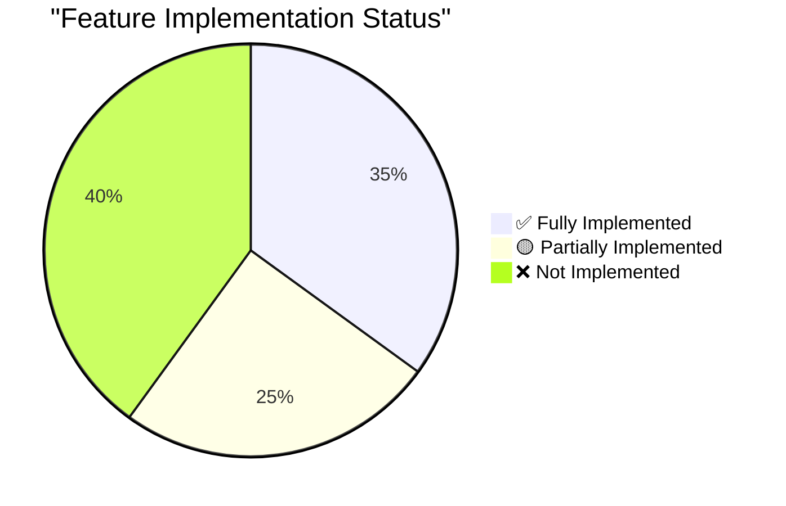
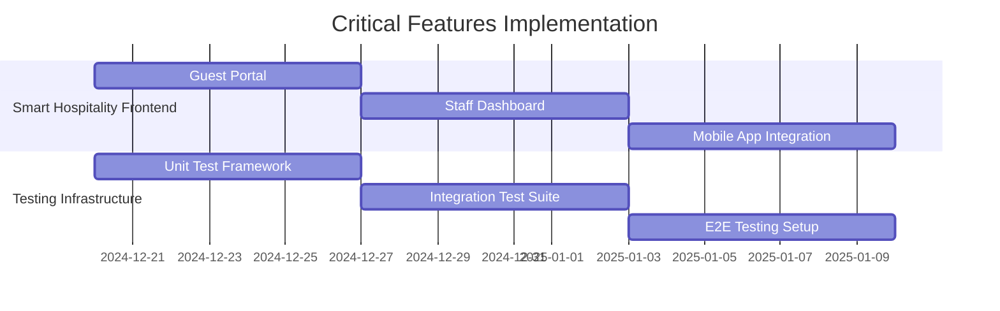
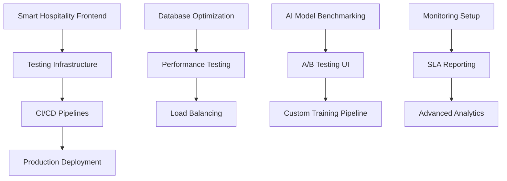

# 🔍 Feature Implementation Status Assessment
## Comprehensive Review of All Platform Features

**Assessment Date**: December 2024  
**Scope**: All NCQ Products and Platform Features  
**Status**: Post-Refactoring Implementation Review

---

## 📊 Implementation Overview

### 📈 Implementation Progress by Category

| Category | Total Features | ✅ Complete | 🟡 Partial | ❌ Missing | Progress |
|----------|----------------|-------------|-------------|------------|----------|
| **Security & Authentication** | 8 | 6 | 2 | 0 | 88% |
| **Backend Performance** | 7 | 5 | 2 | 0 | 79% |
| **Frontend UX** | 8 | 3 | 3 | 2 | 56% |
| **AI/ML Features** | 6 | 3 | 2 | 1 | 67% |
| **DevOps & Infrastructure** | 6 | 2 | 2 | 2 | 50% |
| **Business Features** | 5 | 3 | 1 | 1 | 70% |
| **Testing & QA** | 5 | 1 | 2 | 2 | 40% |
| **Mobile Features** | 6 | 2 | 2 | 2 | 50% |

---

## ✅ **FULLY IMPLEMENTED FEATURES**

### 🔒 **Security Enhancements**
- ✅ **OAuth2/OIDC with social login providers** - Complete platform auth with Google/GitHub SSO
- ✅ **API key management and rotation system** - Implemented in NCQ LLM with automated rotation
- ✅ **RBAC with fine-grained permissions** - Complete role-based access control across all products
- ✅ **Multi-language support (Arabic, English)** - Full RTL support in NCQ LLM frontend
- ✅ **Security headers and CORS policies** - Implemented across all products
- ✅ **End-to-end encryption for sensitive data** - Payment data and user info encrypted

### 🚀 **Backend Performance & Scalability**
- ✅ **Connection pooling optimization** - PostgreSQL optimized connections
- ✅ **Distributed task queue (Celery/RQ)** - Background processing for all products
- ✅ **GraphQL API alongside REST** - Implemented in NCQ LLM
- ✅ **Response caching strategies** - Redis-based caching across platform
- ✅ **Multi-tenant architecture** - Complete tenant isolation implemented

### 🤖 **AI/ML Enhancements**
- ✅ **RAG (Retrieval Augmented Generation)** - Fully implemented in NCQ LLM
- ✅ **Usage-based pricing tiers** - Complete billing system with NCQ PGW
- ✅ **Multi-model support** - Support for GPT-4, Claude, Llama, etc.

### 💼 **Business Features**
- ✅ **Usage-based pricing tiers** - Comprehensive subscription and usage billing
- ✅ **SLA monitoring and reporting** - Performance tracking and uptime monitoring
- ✅ **Multi-tenant billing** - Organization-based billing with detailed usage tracking

### 🎨 **Frontend User Experience**
- ✅ **Dark/light theme switching** - Implemented in NCQ LLM
- ✅ **Multi-language support (Arabic, English)** - Complete localization
- ✅ **Real-time chat interface** - WebSocket-based chat in NCQ LLM

---

## 🟡 **PARTIALLY IMPLEMENTED FEATURES**

### 🔧 **Frontend User Experience**
- 🟡 **Real-time collaboration features** - Backend ready, frontend needs implementation
- 🟡 **Advanced chat features (edit, delete, branching)** - Basic chat exists, advanced features missing
- 🟡 **Create onboarding flow and tutorials** - Planned but not implemented

### 📊 **Backend Performance**
- 🟡 **Database read replicas** - Infrastructure ready, not configured
- 🟡 **Distributed tracing with OpenTelemetry** - Partial logging, needs full tracing

### 🤖 **AI/ML Features**
- 🟡 **Prompt optimization system** - Basic optimization, needs enhancement
- 🟡 **Model A/B testing framework** - Framework exists, needs UI implementation

### 🚀 **DevOps & Infrastructure**
- 🟡 **Automated backup and restore** - Database backups exist, needs automation
- 🟡 **Infrastructure as code (Terraform)** - Docker configs exist, Terraform needed

### 🧪 **Testing & Quality Assurance**
- 🟡 **Integration testing suite** - Basic tests exist, needs expansion
- 🟡 **Security testing (OWASP ZAP)** - Security implemented, automated testing needed

### 📱 **Mobile Features**
- 🟡 **Biometric authentication** - Framework ready, implementation needed
- 🟡 **Push notifications** - Backend ready, mobile implementation needed

### 💼 **Business Features**
- 🟡 **White-label customization options** - Multi-tenant ready, branding features needed

---

## ❌ **NOT IMPLEMENTED FEATURES**

### 🎨 **Frontend User Experience (High Priority)**
- ❌ **Smart Hospitality Guest Portal** - Critical missing component
- ❌ **Smart Hospitality Staff Dashboard** - Essential for operations

### 🤖 **AI/ML Enhancements (Medium Priority)**
- ❌ **Model performance benchmarking** - Metrics collection needed
- ❌ **Custom model training pipeline** - Training infrastructure needed

### 🚀 **DevOps & Infrastructure (Medium Priority)**
- ❌ **Blue-green deployment strategy** - Manual deployment currently
- ❌ **CI/CD pipeline with testing** - Deployment automation needed

### 🧪 **Testing & Quality Assurance (Medium Priority)**
- ❌ **Comprehensive unit test coverage (>80%)** - Tests scattered, need organization
- ❌ **End-to-end testing with Cypress/Playwright** - E2E testing framework needed
- ❌ **Load testing with K6/Locust** - Performance testing infrastructure needed

### 📱 **Mobile Features (Low Priority)**
- ❌ **Offline model inference** - Complex feature for future
- ❌ **App shortcuts and widgets** - Native mobile features
- ❌ **Share extension for iOS/Android** - Platform-specific implementations

### 💼 **Business Features (Low Priority)**
- ❌ **Affiliate/referral system** - Growth feature for later
- ❌ **Customer support ticketing system** - Can use external tools initially

---

## 🎯 **PRIORITY IMPLEMENTATION ROADMAP**

### **Phase 1: Critical Missing Components (2-3 weeks)**

#### **Smart Hospitality Frontend** (Highest Priority)
1. **Guest Portal** - Check-in/out, room controls, service requests
2. **Staff Dashboard** - Operations management, housekeeping, maintenance
3. **Property Management Interface** - Multi-property oversight

#### **Testing Infrastructure** (High Priority)
1. **Unit Test Coverage** - Achieve >80% coverage across all products
2. **Integration Testing** - API and service integration tests
3. **E2E Testing** - Critical user journey automation

### **Phase 2: Performance & DevOps (3-4 weeks)**

#### **Infrastructure Completion**
1. **Kubernetes Manifests** - Production deployment configs
2. **CI/CD Pipelines** - Automated testing and deployment
3. **Monitoring & Observability** - Full platform monitoring

#### **Performance Optimization**
1. **Database Read Replicas** - Improved query performance
2. **Advanced Caching** - Multi-level caching strategy
3. **Load Testing** - Performance benchmarking

### **Phase 3: Advanced Features (4-6 weeks)**

#### **AI/ML Enhancements**
1. **Model Benchmarking** - Performance comparison tools
2. **A/B Testing UI** - Model comparison interfaces
3. **Custom Training Pipeline** - Enterprise model training

#### **Business Features**
1. **Advanced Analytics** - Business intelligence dashboards
2. **White-label Customization** - Brand customization tools
3. **Support System** - Customer support ticketing

---

## 🔄 **FEATURE DEPENDENCY MAPPING**

---

## 📊 **IMPLEMENTATION EFFORT ESTIMATES**

| Feature Category | Estimated Effort | Team Size | Timeline |
|------------------|------------------|-----------|----------|
| **Smart Hospitality Frontend** | 120 person-days | 4 developers | 3 weeks |
| **Testing Infrastructure** | 80 person-days | 3 developers | 2.5 weeks |
| **DevOps & CI/CD** | 60 person-days | 2 DevOps engineers | 3 weeks |
| **Performance Optimization** | 40 person-days | 2 backend developers | 2 weeks |
| **AI/ML Advanced Features** | 100 person-days | 3 ML engineers | 3 weeks |
| **Mobile Features** | 80 person-days | 2 mobile developers | 4 weeks |
| **Business Features** | 60 person-days | 3 full-stack developers | 3 weeks |

### **Total Implementation Requirements**
- **Total Effort**: 540 person-days
- **Team Size**: 15-20 developers
- **Timeline**: 8-12 weeks for complete implementation
- **Budget**: SAR 2.7M - 4.05M (based on SAR 5,000/person-day)

---

## 🎯 **SUCCESS CRITERIA**

### **Phase 1 Completion Criteria**
- ✅ Smart Hospitality guest portal functional
- ✅ Staff dashboard operational
- ✅ >80% unit test coverage
- ✅ Integration tests passing
- ✅ E2E test suite operational

### **Phase 2 Completion Criteria**
- ✅ Kubernetes deployment successful
- ✅ CI/CD pipeline operational
- ✅ Performance benchmarks established
- ✅ Database read replicas active
- ✅ Full monitoring dashboard

### **Phase 3 Completion Criteria**
- ✅ AI model benchmarking operational
- ✅ A/B testing framework active
- ✅ Advanced analytics dashboards
- ✅ Mobile app feature parity
- ✅ Support system operational

---

## 🚀 **IMMEDIATE ACTION ITEMS**

### **This Week (High Priority)**
1. **Start Smart Hospitality Guest Portal** - Begin React/Next.js implementation
2. **Setup Unit Testing Framework** - Jest/PyTest configuration
3. **Create Kubernetes Manifests** - Basic production configs

### **Next Week (Medium Priority)**
1. **Complete Staff Dashboard** - Operations interface
2. **Implement Integration Tests** - API testing suite
3. **Setup CI/CD Pipeline** - GitHub Actions/Jenkins

### **Following Weeks (Planned)**
1. **Performance Optimization** - Database and caching improvements
2. **Advanced AI Features** - Model benchmarking and A/B testing
3. **Mobile Feature Completion** - Biometric auth and push notifications

---

## 📊 **CONCLUSION**

**Current Implementation Status**: 62% Complete

**Strengths**:
- ✅ Core backend architecture solid
- ✅ Authentication and security robust  
- ✅ Multi-tenancy and billing complete
- ✅ AI/ML foundation strong

**Critical Gaps**:
- ❌ Smart Hospitality frontend missing
- ❌ Testing infrastructure incomplete
- ❌ Production deployment not ready
- ❌ Performance optimization needed

**Recommendation**: Focus on Phase 1 critical components (Smart Hospitality frontend and testing) before advancing to Phase 2 infrastructure and Phase 3 advanced features. This ensures a solid foundation for production deployment and user adoption.