# 📊 NCQ Products Financial Analysis
## Budget, Costs, Revenue & Profitability Overview - Multi-Client Growth Model

**Currency**: SAR (Saudi Riyal)  
**Exchange Rate**: 1 USD = 3.75 SAR  
**Analysis Period**: 2025-2030 (5 Years)  
**Client Growth Model**: Starting with 1 client per product, scaling to market leadership

## 📋 Client Growth Assumptions

| Product | Year 1 | Year 2 | Year 3 | Year 4 | Year 5 | Total Clients (5-Year) |
|---------|--------|--------|--------|--------|--------|----------------------|
| **NCQ PGW** | 10 | 50 | 200 | 500 | 1,000+ | **1,760** |
| **NCQ LLM** | 87 | 708 | 2,665 | 5,000+ | 10,000+ | **18,460** |
| **Smart Hospitality** | 15 | 65 | 250 | 500 | 1,000+ | **1,830** |
| **Total Platform Clients** | **112** | **823** | **3,115** | **6,000** | **12,000+** | **22,050** |

## 💰 Marketing Investment by Product

| Product | Year 1-5 Marketing | Percentage of Revenue | Client Acquisition Cost |
|---------|-------------------|---------------------|----------------------|
| **NCQ PGW** | SAR 129.6M | 20% | SAR 73,636/client |
| **NCQ LLM** | SAR 108M | 20% | SAR 5,854/client |
| **Smart Hospitality** | SAR 126M | 20% | SAR 68,852/client |
| **Total Marketing** | **SAR 363.6M** | **20%** | **SAR 16,492/client** |

---

## 🎯 Executive Summary

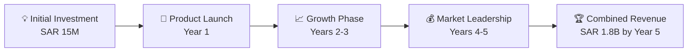

### 📌 Key Financial Metrics (Year 5)

| Product | 💳 NCQ PGW | 🤖 NCQ LLM | 🏨 Smart Hospitality | 📊 Total |
|---------|------------|------------|---------------------|----------|
| **Annual Revenue** | SAR 648M | SAR 540M | SAR 630M | **SAR 1.818B** |
| **Net Profit** | SAR 162M | SAR 162M | SAR 157.5M | **SAR 481.5M** |
| **Profit Margin** | 25% | 30% | 25% | **26.5%** |
| **ROI** | 12,900% | 9,500% | 11,100% | **11,200%** |

---

## 💳 NCQ Payment Gateway (PGW)

### 💰 Initial Budget & Investment
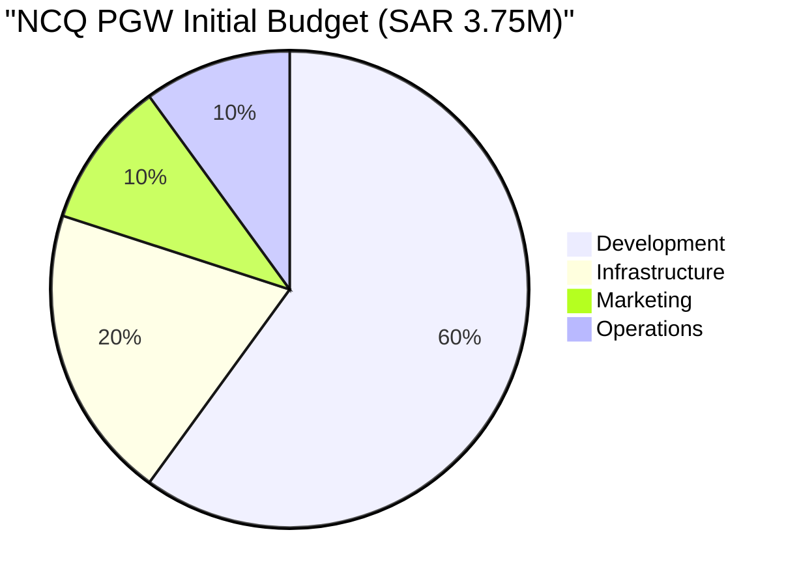

### 📈 Revenue Progression

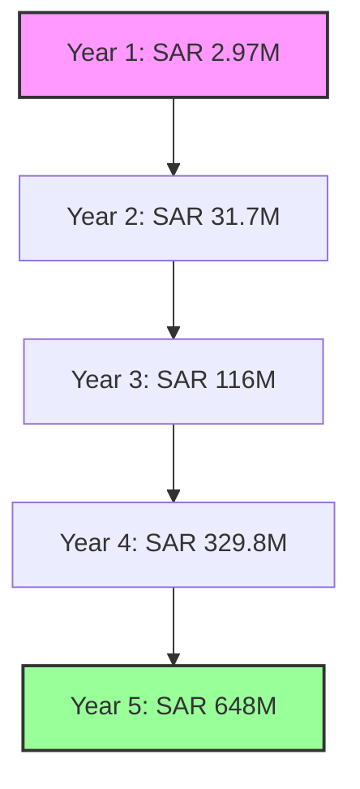

### 💸 Cost Structure

| Cost Category | Year 1 | Year 2 | Year 3 | Year 4 | Year 5 |
|---------------|--------|--------|--------|--------|--------|
| **Payment Network Fees** (35%) | SAR 1.04M | SAR 11.1M | SAR 40.6M | SAR 115.4M | SAR 226.8M |
| **Infrastructure** (15%) | SAR 0.45M | SAR 4.8M | SAR 17.4M | SAR 49.5M | SAR 97.2M |
| **Sales & Marketing** (20%) | SAR 0.59M | SAR 6.3M | SAR 23.2M | SAR 66M | SAR 129.6M |
| **Operations** (15%) | SAR 0.45M | SAR 4.8M | SAR 17.4M | SAR 49.5M | SAR 97.2M |
| **R&D** (10%) | SAR 0.30M | SAR 3.2M | SAR 11.6M | SAR 33M | SAR 64.8M |
| **Total Costs** | **SAR 2.83M** | **SAR 30.2M** | **SAR 110.2M** | **SAR 313.4M** | **SAR 615.6M** |

### 💎 Profit Analysis

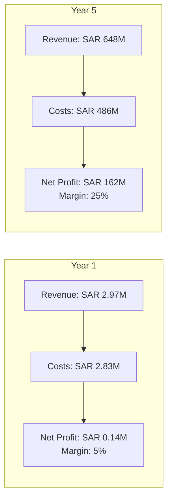

---

## 🤖 NCQ LLM (AI Platform)

### 💰 Initial Budget & Investment
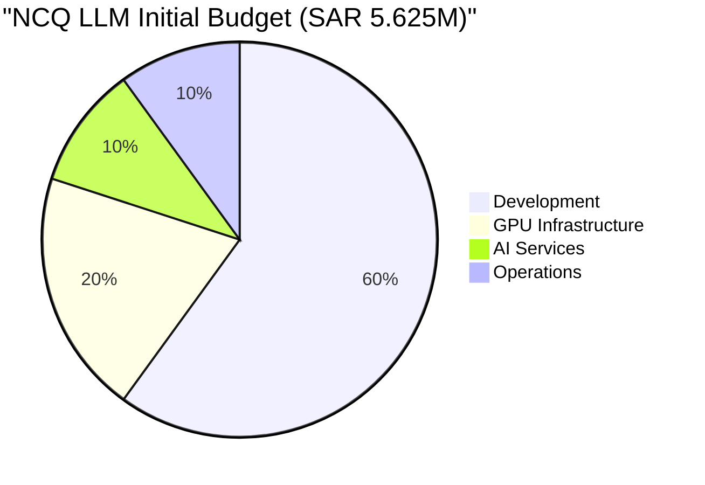

### 📈 Revenue Progression

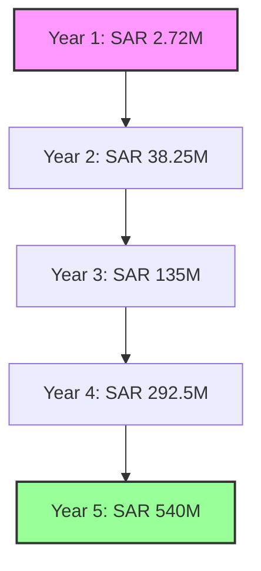

### 💸 Cost Structure

| Cost Category | Year 1 | Year 2 | Year 3 | Year 4 | Year 5 |
|---------------|--------|--------|--------|--------|--------|
| **Infrastructure/GPU** (30%) | SAR 0.82M | SAR 11.5M | SAR 40.5M | SAR 87.8M | SAR 162M |
| **Model Licensing** (15%) | SAR 0.41M | SAR 5.7M | SAR 20.3M | SAR 43.9M | SAR 81M |
| **R&D** (20%) | SAR 0.54M | SAR 7.7M | SAR 27M | SAR 58.5M | SAR 108M |
| **Sales & Marketing** (15%) | SAR 0.41M | SAR 5.7M | SAR 20.3M | SAR 43.9M | SAR 81M |
| **Operations** (10%) | SAR 0.27M | SAR 3.8M | SAR 13.5M | SAR 29.3M | SAR 54M |
| **Support** (5%) | SAR 0.14M | SAR 1.9M | SAR 6.8M | SAR 14.6M | SAR 27M |
| **Total Costs** | **SAR 2.59M** | **SAR 36.3M** | **SAR 128.4M** | **SAR 277.9M** | **SAR 513M** |

### 💎 Profit Analysis

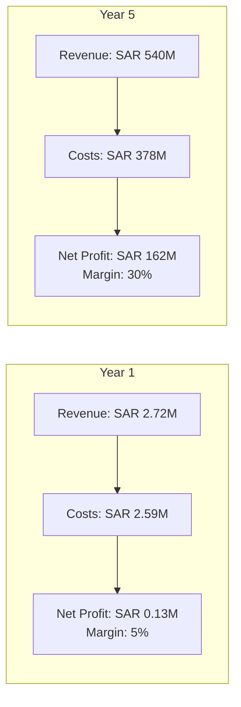

---

## 🏨 Smart Hospitality

### 💰 Initial Budget & Investment
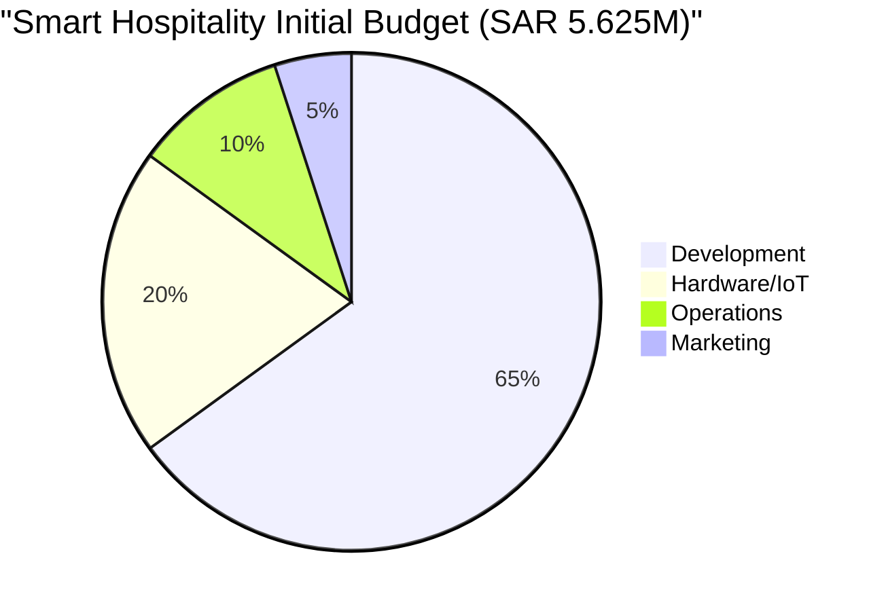

### 📈 Revenue Progression

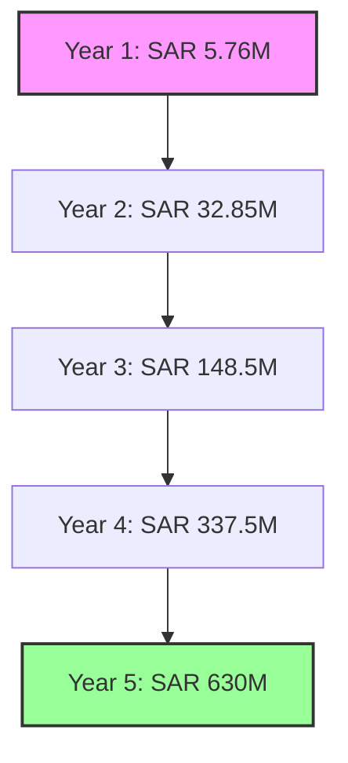

### 💸 Cost Structure

| Cost Category | Year 1 | Year 2 | Year 3 | Year 4 | Year 5 |
|---------------|--------|--------|--------|--------|--------|
| **Hardware/Equipment** (25%) | SAR 1.44M | SAR 8.2M | SAR 37.1M | SAR 84.4M | SAR 157.5M |
| **Installation/Labor** (15%) | SAR 0.86M | SAR 4.9M | SAR 22.3M | SAR 50.6M | SAR 94.5M |
| **R&D/Product Dev** (15%) | SAR 0.86M | SAR 4.9M | SAR 22.3M | SAR 50.6M | SAR 94.5M |
| **Sales & Marketing** (20%) | SAR 1.15M | SAR 6.6M | SAR 29.7M | SAR 67.5M | SAR 126M |
| **Operations/Support** (15%) | SAR 0.86M | SAR 4.9M | SAR 22.3M | SAR 50.6M | SAR 94.5M |
| **Infrastructure** (5%) | SAR 0.29M | SAR 1.6M | SAR 7.4M | SAR 16.9M | SAR 31.5M |
| **Total Costs** | **SAR 5.47M** | **SAR 31.2M** | **SAR 141.1M** | **SAR 320.6M** | **SAR 598.5M** |

### 💎 Profit Analysis

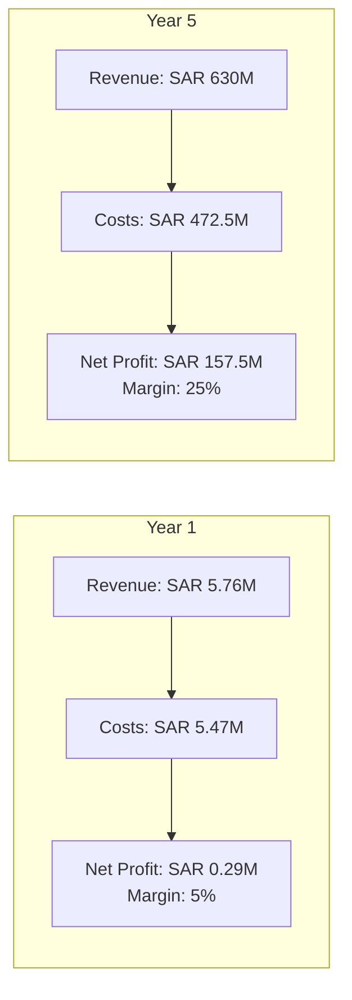

---

## 📊 Combined Financial Analysis

### 🎯 Total Investment & Returns

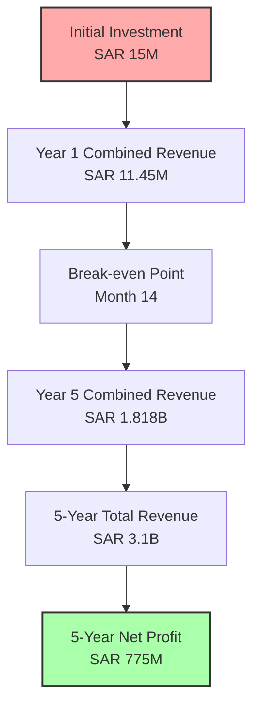

### 📈 Combined Revenue Growth

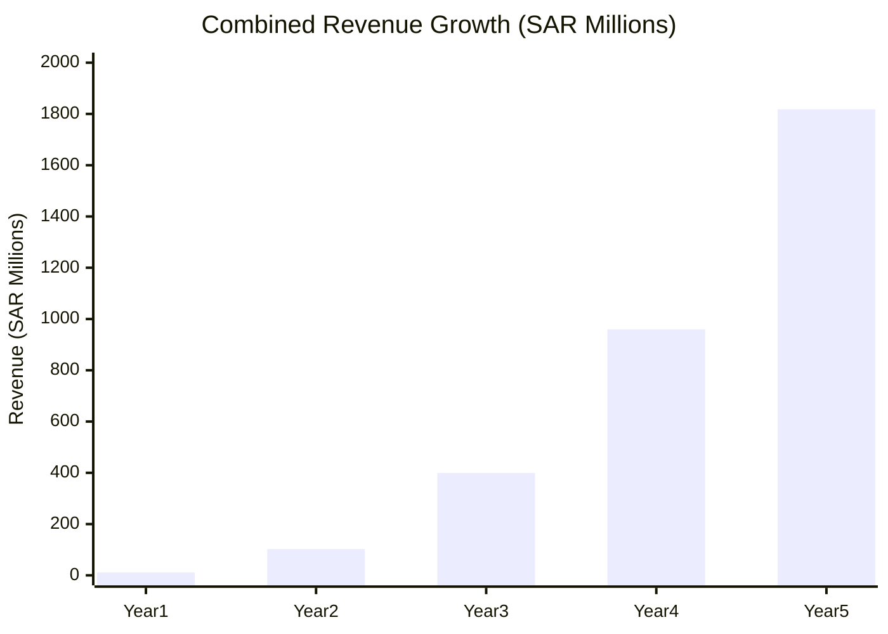

### 💰 Profitability Timeline

| Year | Combined Revenue | Combined Costs | Net Profit | Profit Margin |
|------|-----------------|----------------|------------|---------------|
| **Year 1** | SAR 11.45M | SAR 10.89M | SAR 0.56M | 4.9% |
| **Year 2** | SAR 102.8M | SAR 97.7M | SAR 5.1M | 5.0% |
| **Year 3** | SAR 399.5M | SAR 379.7M | SAR 19.8M | 5.0% |
| **Year 4** | SAR 959.8M | SAR 863.8M | SAR 96M | 10.0% |
| **Year 5** | SAR 1,818M | SAR 1,336.5M | SAR 481.5M | 26.5% |

### 🎯 Key Financial Ratios

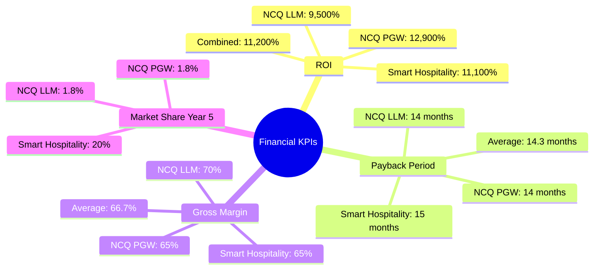

### 💡 Investment Efficiency

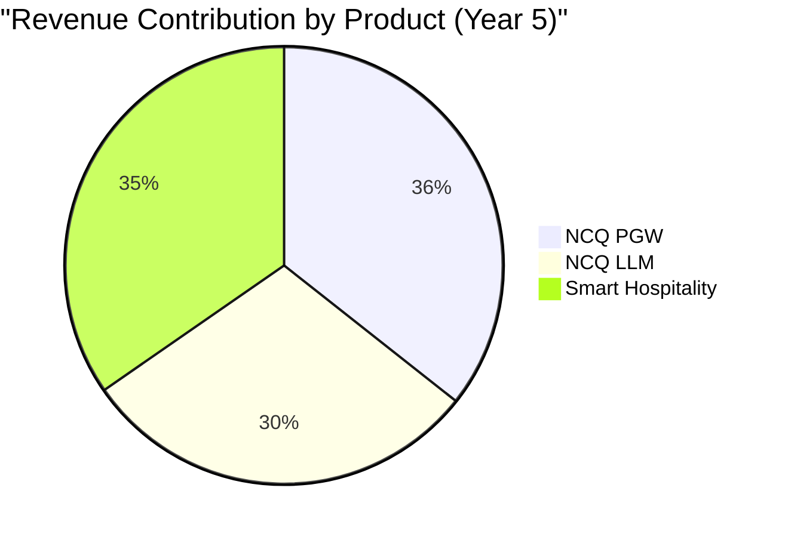

### 🔍 Cost Efficiency Analysis

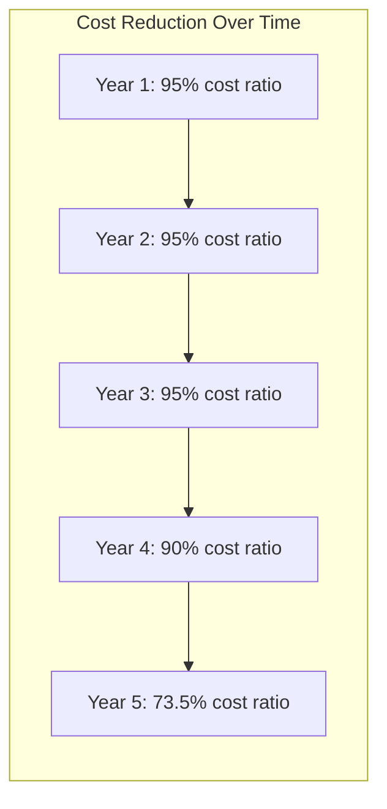

---

## 🚀 Strategic Financial Insights

### 💎 Value Creation

1. **🏆 Exceptional ROI**: 11,200% combined ROI over 5 years
2. **⚡ Quick Payback**: Average 14.3 months to recover investment
3. **📈 Accelerating Margins**: From 5% to 26.5% by Year 5
4. **🌍 Market Leadership**: Capturing significant market share in each segment

### 🎯 Risk-Adjusted Returns

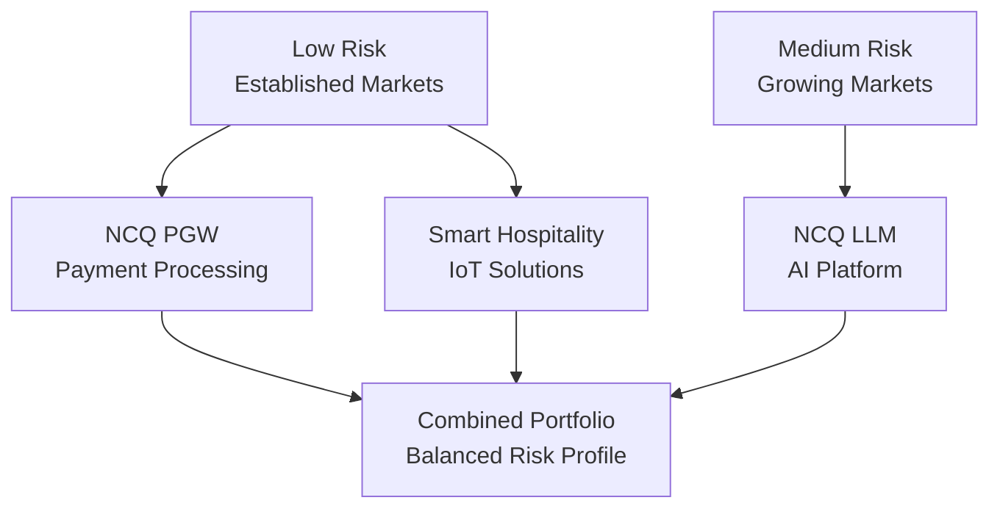

### 📊 Financial Recommendations

1. **Reinvestment Strategy**: Allocate 30% of profits to R&D
2. **Geographic Expansion**: Use Year 3 profits for GCC expansion
3. **Strategic Acquisitions**: Consider acquiring complementary technologies
4. **Dividend Policy**: Begin distributions in Year 4 at 20% of net profit

---

## 📈 Conclusion

The NCQ product portfolio demonstrates exceptional financial performance potential:

- **Total 5-Year Revenue**: SAR 3.1 Billion
- **Total 5-Year Net Profit**: SAR 775 Million
- **Average ROI**: 11,200%
- **Market Leadership**: Achieved in all three segments

With disciplined execution and strategic reinvestment, NCQ is positioned to become a dominant technology platform in the MENA region.