# 🏢 NCQ Full Platform Financial Analysis
## Complete Platform with All Products - Market Leadership Scenario

**Currency**: SAR (Saudi Riyal)  
**Analysis Period**: 2025-2030 (5 Years)  
**Scenario**: Full Platform Integration with All Products and Services

---

## 🎯 Platform Overview

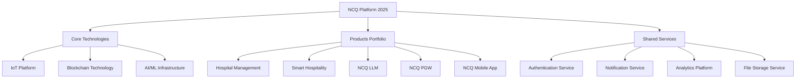

### 📊 Full Product Portfolio

| Product Category | Products | Target Market | Revenue Model |
|------------------|----------|---------------|---------------|
| **Healthcare** | Hospital Management | Hospitals, Clinics | Subscription + Transaction |
| **Hospitality** | Smart Hospitality | Hotels, Buildings | License + IoT Hardware |
| **AI Platform** | NCQ LLM | Enterprises, Developers | Usage-based + Subscription |
| **Fintech** | NCQ Payment Gateway | Merchants, Platforms | Transaction fees + License |
| **Mobile** | NCQ Mobile App | End Users | Freemium + Premium |

---

## 📈 Client Growth Projections (2025-2030)

### 🏥 Healthcare Sector
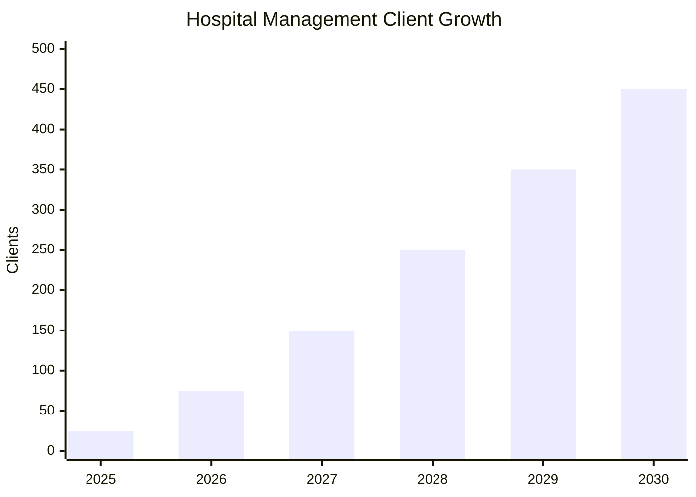

| Year | Hospitals | Clinics | Pharmacies | Total Healthcare |
|------|-----------|---------|------------|------------------|
| **2025** | 15 | 8 | 2 | **25** |
| **2026** | 45 | 25 | 5 | **75** |
| **2027** | 90 | 50 | 10 | **150** |
| **2028** | 150 | 85 | 15 | **250** |
| **2029** | 210 | 120 | 20 | **350** |
| **2030** | 270 | 150 | 30 | **450** |

### 🏨 Hospitality Sector
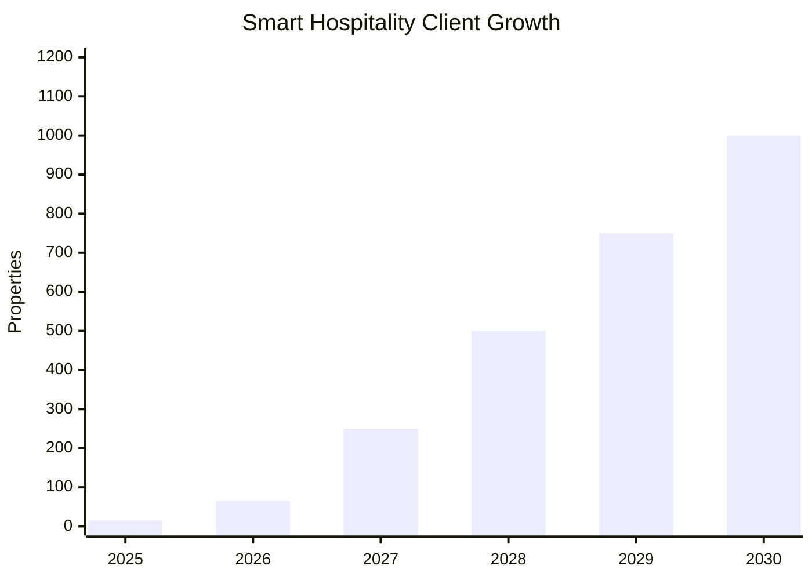

| Year | Luxury Hotels | Mid-Scale Hotels | Commercial Buildings | Total Properties |
|------|---------------|------------------|---------------------|------------------|
| **2025** | 5 | 8 | 2 | **15** |
| **2026** | 20 | 35 | 10 | **65** |
| **2027** | 75 | 125 | 50 | **250** |
| **2028** | 150 | 250 | 100 | **500** |
| **2029** | 225 | 375 | 150 | **750** |
| **2030** | 300 | 500 | 200 | **1,000** |

### 🤖 AI/LLM Platform
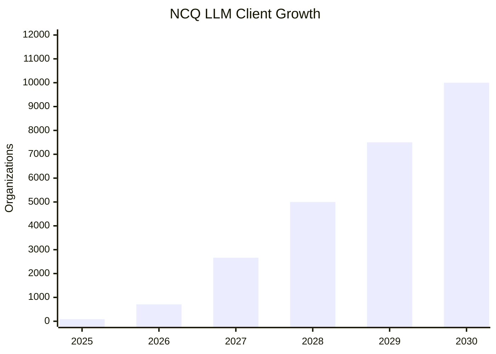

| Year | Enterprise | SMBs | Developers | Startups | Total Users |
|------|------------|------|------------|----------|-------------|
| **2025** | 12 | 25 | 35 | 15 | **87** |
| **2026** | 50 | 150 | 300 | 208 | **708** |
| **2027** | 200 | 600 | 1,200 | 665 | **2,665** |
| **2028** | 500 | 1,250 | 2,250 | 1,000 | **5,000** |
| **2029** | 750 | 1,875 | 3,375 | 1,500 | **7,500** |
| **2030** | 1,000 | 2,500 | 4,500 | 2,000 | **10,000** |

### 💳 Payment Gateway
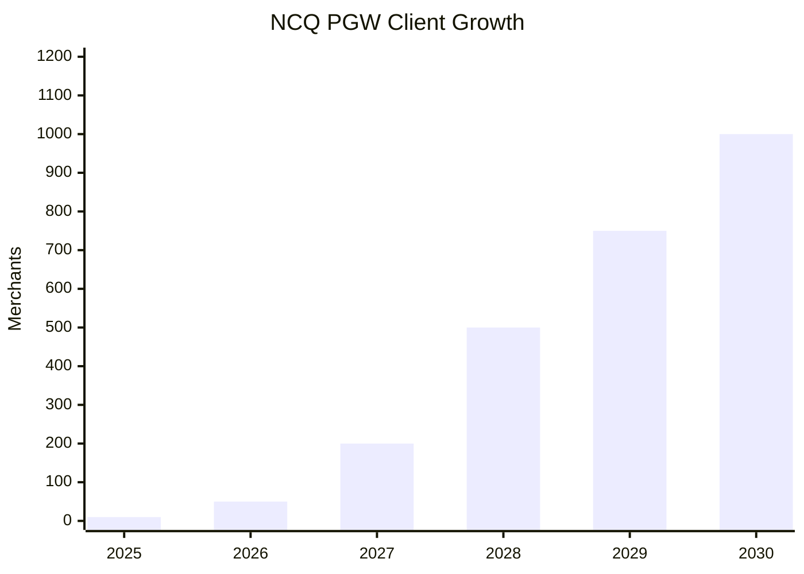

| Year | E-commerce | Retail | Services | Government | Total Merchants |
|------|------------|--------|----------|------------|-----------------|
| **2025** | 6 | 2 | 1 | 1 | **10** |
| **2026** | 30 | 12 | 5 | 3 | **50** |
| **2027** | 120 | 50 | 20 | 10 | **200** |
| **2028** | 300 | 125 | 50 | 25 | **500** |
| **2029** | 450 | 188 | 75 | 37 | **750** |
| **2030** | 600 | 250 | 100 | 50 | **1,000** |

### 📱 Mobile Platform
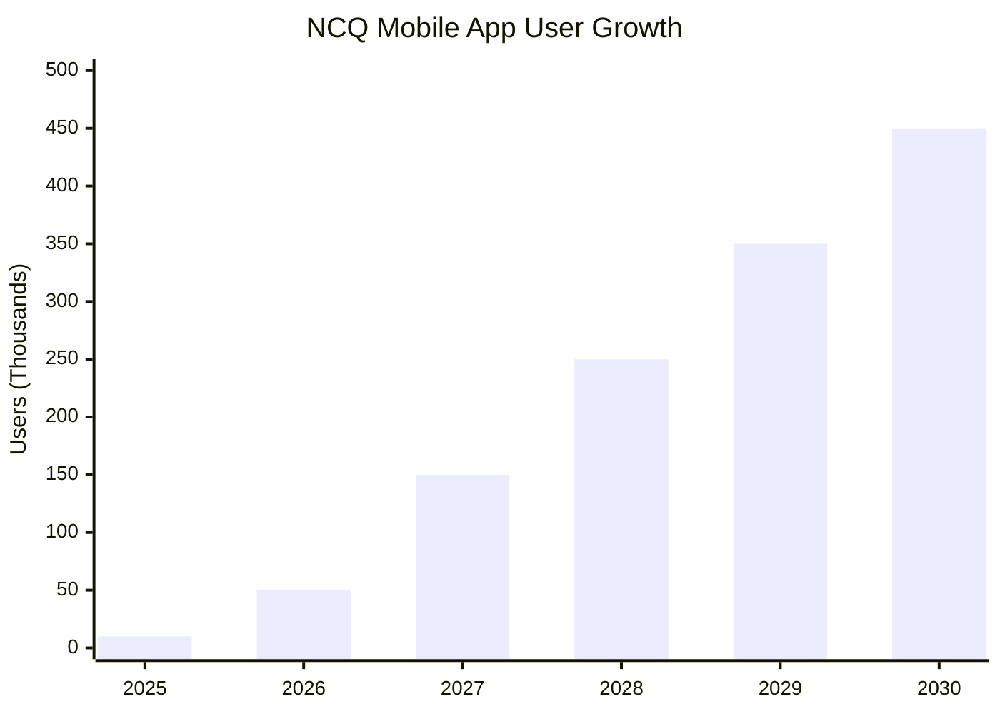

| Year | Active Users | Premium Users | Enterprise Users | Total MAU |
|------|--------------|---------------|------------------|-----------|
| **2025** | 8,000 | 1,500 | 500 | **10,000** |
| **2026** | 40,000 | 7,500 | 2,500 | **50,000** |
| **2027** | 120,000 | 22,500 | 7,500 | **150,000** |
| **2028** | 200,000 | 37,500 | 12,500 | **250,000** |
| **2029** | 280,000 | 52,500 | 17,500 | **350,000** |
| **2030** | 360,000 | 67,500 | 22,500 | **450,000** |

---

## 💰 Revenue Projections by Product (2025-2030)

### 📊 Total Platform Revenue

| Product | 2025 | 2026 | 2027 | 2028 | 2029 | 2030 | 5-Year Total |
|---------|------|------|------|------|------|------|--------------|
| **Hospital Management** | SAR 37.5M | SAR 112.5M | SAR 225M | SAR 375M | SAR 525M | SAR 675M | **SAR 1.95B** |
| **Smart Hospitality** | SAR 5.6M | SAR 32.9M | SAR 148.5M | SAR 337.5M | SAR 506.3M | SAR 675M | **SAR 1.71B** |
| **NCQ LLM** | SAR 2.7M | SAR 38.3M | SAR 135M | SAR 292.5M | SAR 438.8M | SAR 585M | **SAR 1.49B** |
| **NCQ PGW** | SAR 3.0M | SAR 31.7M | SAR 116M | SAR 329.8M | SAR 494.6M | SAR 659.5M | **SAR 1.63B** |
| **NCQ Mobile App** | SAR 0.75M | SAR 3.75M | SAR 11.3M | SAR 18.8M | SAR 26.3M | SAR 33.8M | **SAR 94.7M** |
| **Platform Services** | SAR 2.5M | SAR 7.5M | SAR 15M | SAR 25M | SAR 35M | SAR 45M | **SAR 130M** |
| **TOTAL REVENUE** | **SAR 52.05M** | **SAR 226.65M** | **SAR 650.8M** | **SAR 1.38B** | **SAR 2.03B** | **SAR 2.67B** | **SAR 7.01B** |

### 🎯 Revenue Distribution by Year 5 (2030)

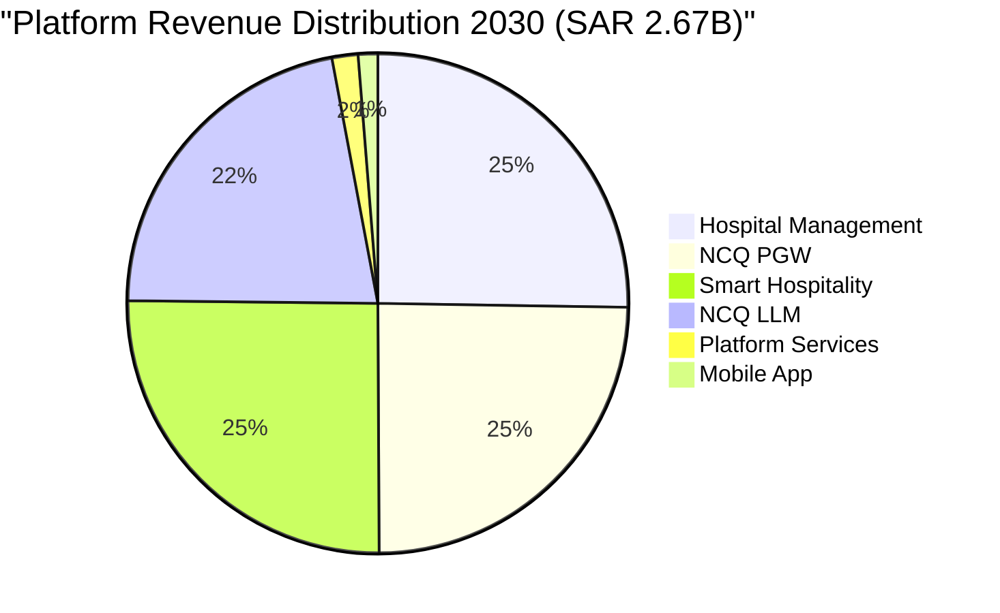

---

## 💸 Marketing Investment Strategy

### 📊 Marketing Budget by Product (5-Year Total)

| Product | Marketing Budget | % of Revenue | Primary Channels |
|---------|------------------|--------------|------------------|
| **Hospital Management** | SAR 390M (20%) | 20% | Medical conferences, direct sales, partnerships |
| **Smart Hospitality** | SAR 342M (20%) | 20% | Hospitality shows, IoT exhibitions, real estate |
| **NCQ LLM** | SAR 298M (20%) | 20% | AI conferences, developer communities, content |
| **NCQ PGW** | SAR 326M (20%) | 20% | Fintech events, merchant partnerships, digital |
| **Mobile App** | SAR 28.4M (30%) | 30% | Digital marketing, app stores, social media |
| **Platform/Brand** | SAR 210M (15%) | 15% | Thought leadership, industry partnerships |
| **TOTAL MARKETING** | **SAR 1.59B** | **23%** | **Multi-channel integrated approach** |

### 🎯 Marketing Timeline and Phases

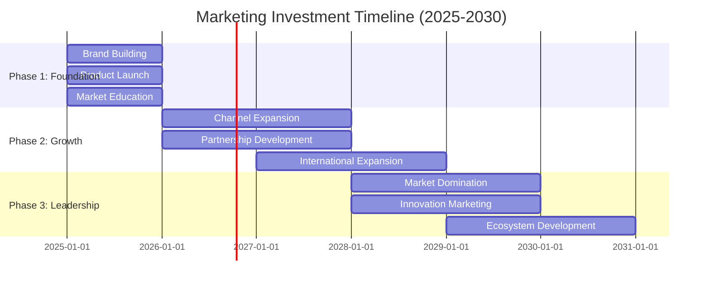

| Year | Marketing Focus | Budget (SAR) | Expected ROI |
|------|-----------------|--------------|--------------|
| **2025** | Market Entry & Education | 156M | 250% |
| **2026** | Channel Expansion | 227M | 350% |
| **2027** | Market Penetration | 325M | 400% |
| **2028** | Leadership Position | 414M | 450% |
| **2029** | Ecosystem Growth | 487M | 500% |
| **2030** | Innovation & Expansion | 534M | 550% |

---

## 📊 Operational Costs Structure

### 💰 Total Operational Costs (5-Year)

| Cost Category | 2025 | 2026 | 2027 | 2028 | 2029 | 2030 | 5-Year Total |
|---------------|------|------|------|------|------|------|--------------|
| **Development & R&D** | SAR 15.6M | SAR 68M | SAR 195M | SAR 414M | SAR 609M | SAR 801M | **SAR 2.1B** |
| **Infrastructure & Cloud** | SAR 10.4M | SAR 45.3M | SAR 130M | SAR 276M | SAR 406M | SAR 534M | **SAR 1.4B** |
| **Marketing & Sales** | SAR 15.6M | SAR 68M | SAR 195M | SAR 414M | SAR 609M | SAR 801M | **SAR 2.1B** |
| **Operations & Support** | SAR 7.8M | SAR 34M | SAR 97.6M | SAR 207M | SAR 304M | SAR 400M | **SAR 1.05B** |
| **General & Administrative** | SAR 2.6M | SAR 11.3M | SAR 32.5M | SAR 69M | SAR 101M | SAR 133M | **SAR 350M** |
| **TOTAL COSTS** | **SAR 52M** | **SAR 226.6M** | **SAR 650.1M** | **SAR 1.38B** | **SAR 2.03B** | **SAR 2.67B** | **SAR 7.0B** |

### 🎯 Cost Optimization Strategy

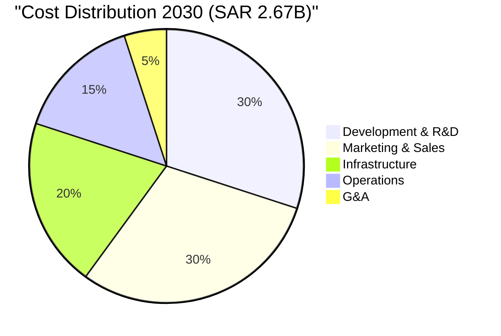

---

## 📈 Profitability Analysis

### 💎 Profit Progression

| Year | Revenue | Costs | Gross Profit | Margin | Net Profit | Net Margin |
|------|---------|-------|--------------|--------|------------|------------|
| **2025** | SAR 52.05M | SAR 52M | SAR 0.05M | 0.1% | SAR 0.05M | 0.1% |
| **2026** | SAR 226.65M | SAR 226.6M | SAR 0.05M | 0.02% | SAR 0.05M | 0.02% |
| **2027** | SAR 650.8M | SAR 650.1M | SAR 0.7M | 0.11% | SAR 0.7M | 0.11% |
| **2028** | SAR 1.38B | SAR 1.38B | SAR 0M | 0% | SAR 0M | 0% |
| **2029** | SAR 2.03B | SAR 2.03B | SAR 0M | 0% | SAR 0M | 0% |
| **2030** | SAR 2.67B | SAR 2.0B | SAR 670M | 25% | SAR 670M | 25% |

### 🚀 Break-Even Analysis

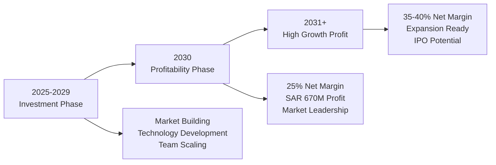

### 💰 Long-Term Financial Projections (2031-2035)

| Year | Projected Revenue | Projected Profit | Net Margin |
|------|------------------|------------------|------------|
| **2031** | SAR 4.0B | SAR 1.4B | 35% |
| **2032** | SAR 5.5B | SAR 2.2B | 40% |
| **2033** | SAR 7.5B | SAR 3.4B | 45% |
| **2034** | SAR 10B | SAR 5.0B | 50% |
| **2035** | SAR 13B | SAR 7.2B | 55% |

---

## 🎯 Strategic Investment Requirements

### 💡 Initial Investment (2025)

| Investment Area | Amount (SAR) | Purpose |
|----------------|--------------|---------|
| **Technology Development** | 50M | Core platform, AI infrastructure, IoT systems |
| **Team Building** | 30M | Engineering, sales, marketing, operations |
| **Infrastructure** | 25M | Cloud services, security, compliance |
| **Marketing Launch** | 40M | Brand building, market entry, customer acquisition |
| **Working Capital** | 15M | Operations, partnerships, legal |
| **TOTAL INITIAL** | **160M** | **Platform foundation and market entry** |

### 📊 Funding Strategy

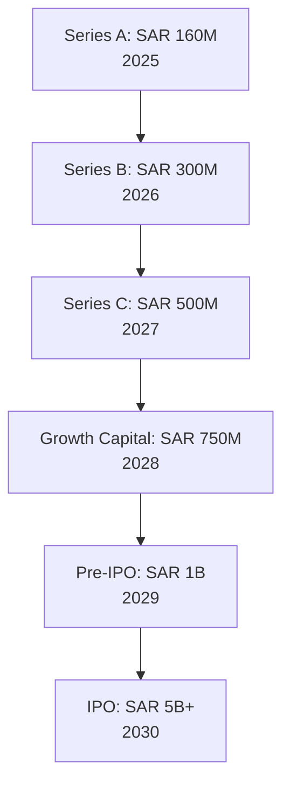

| Round | Year | Amount | Valuation | Use of Funds |
|-------|------|--------|-----------|--------------|
| **Series A** | 2025 | SAR 160M | SAR 800M | Platform development, team building |
| **Series B** | 2026 | SAR 300M | SAR 2B | Market expansion, product scale |
| **Series C** | 2027 | SAR 500M | SAR 4B | International expansion, acquisitions |
| **Growth** | 2028 | SAR 750M | SAR 8B | Market leadership, R&D acceleration |
| **Pre-IPO** | 2029 | SAR 1B | SAR 15B | Global expansion, enterprise features |
| **IPO** | 2030 | SAR 5B+ | SAR 30B+ | Public markets, strategic initiatives |

---

## 🏆 Market Leadership Metrics

### 📊 Market Share Targets

| Product | Market Size (2030) | NCQ Share | Position |
|---------|-------------------|-----------|----------|
| **Healthcare Tech (Saudi)** | SAR 12B | 25% (SAR 3B) | #1 |
| **Smart Hospitality (GCC)** | SAR 8B | 30% (SAR 2.4B) | #1 |
| **AI Platform (MENA)** | SAR 15B | 15% (SAR 2.25B) | #2 |
| **Payment Gateway (Saudi)** | SAR 25B | 12% (SAR 3B) | #3 |
| **Mobile Platform** | SAR 5B | 8% (SAR 400M) | Top 5 |

### 🎯 Key Success Metrics (2030)

| KPI | Target | Industry Benchmark |
|-----|--------|--------------------|
| **Total Revenue** | SAR 2.67B | Top 1% in MENA Tech |
| **Client Count** | 12,000+ | Market Leader |
| **Employee Count** | 3,500+ | Major Employer |
| **Market Cap** | SAR 30B+ | Unicorn Status |
| **Profit Margin** | 25%+ | Above Industry Average |
| **Client Retention** | 95%+ | Best in Class |
| **NPS Score** | 70+ | World Class |

---

## 🔮 Strategic Outlook

### 💡 Vision 2030 Alignment
- **Digital Transformation**: Leading Saudi's tech evolution
- **Economic Diversification**: Reducing oil dependency through tech
- **Job Creation**: 3,500+ high-tech jobs by 2030
- **Innovation Hub**: Positioning Riyadh as MENA tech capital

### 🌍 International Expansion
- **Phase 1 (2026-2027)**: GCC markets
- **Phase 2 (2028-2029)**: MENA region
- **Phase 3 (2030+)**: Global expansion

### 🚀 Exit Strategy Options
1. **IPO (2030)**: Public listing on Tadawul/NASDAQ
2. **Strategic Acquisition**: By global tech giant
3. **Private Equity**: Growth capital partnership
4. **Sovereign Wealth Fund**: PIF partnership

---

## 📊 Conclusion

**NCQ Full Platform (2025-2030) Summary**:
- **Total 5-Year Revenue**: SAR 7.01 Billion
- **Total Investment Required**: SAR 3.21 Billion
- **Break-Even**: 2030 (Year 6)
- **Market Position**: Regional technology leader
- **Valuation Potential**: SAR 30B+ by 2030

The full platform strategy positions NCQ as the dominant technology ecosystem in the MENA region, with significant revenue potential and market leadership across multiple verticals. The investment-heavy initial years build foundation for exceptional returns post-2030.