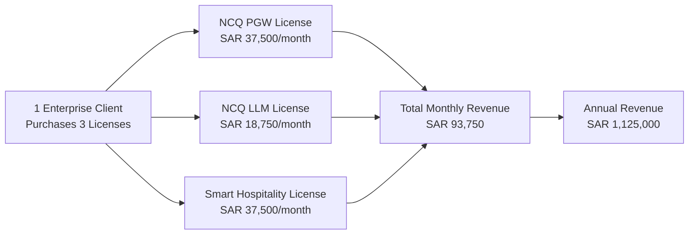
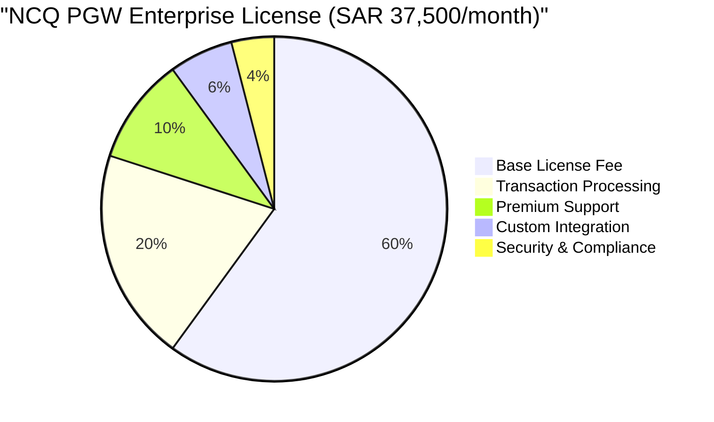
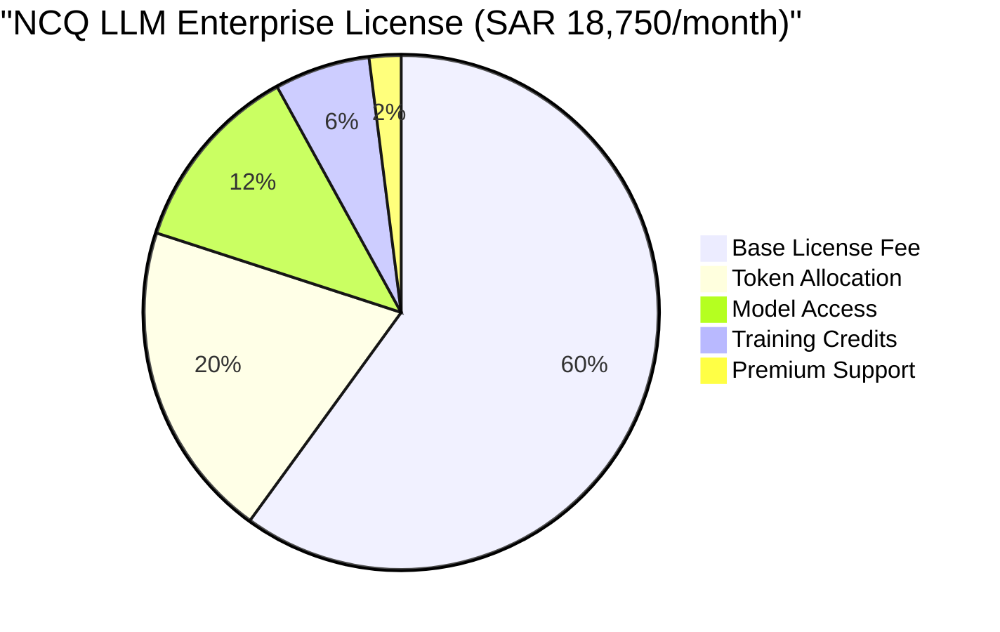
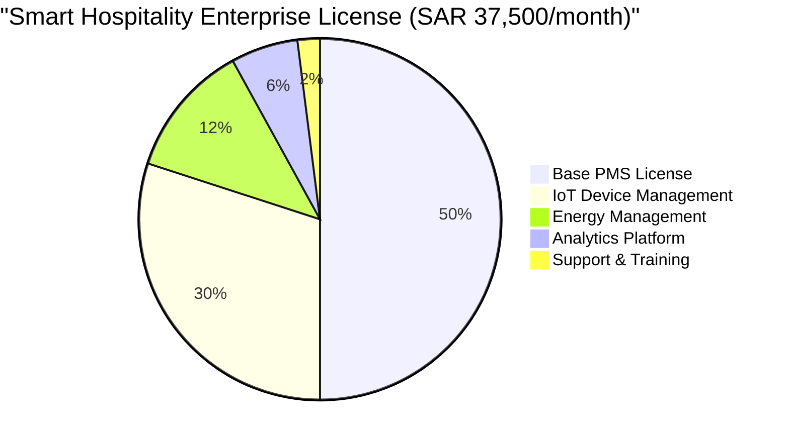
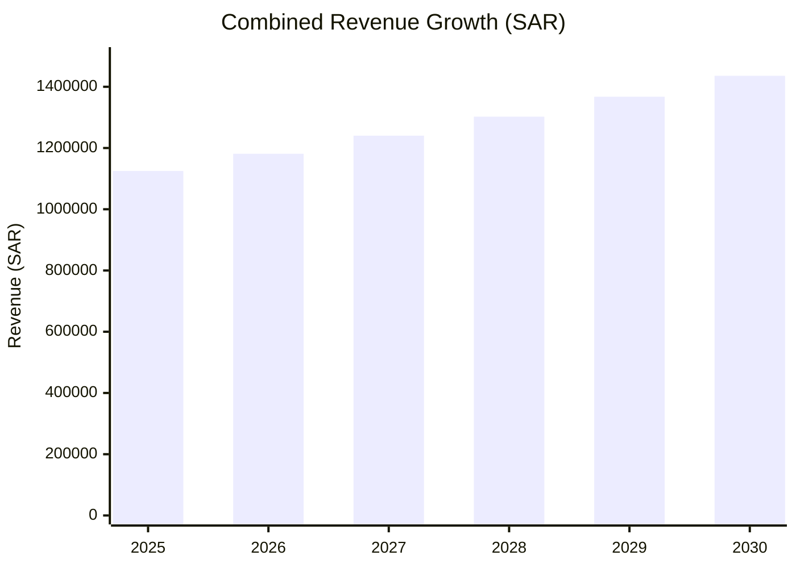
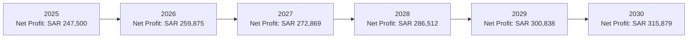
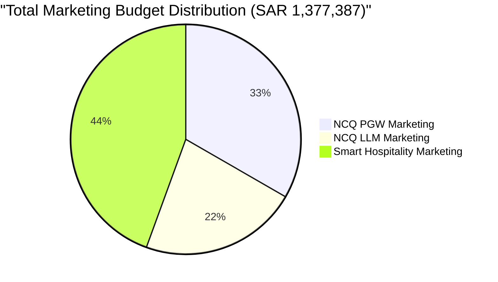

# 📊 NCQ Products Financial Analysis - Single Client (3 Licenses)
## One Client Purchasing 3 Product Licenses

**Currency**: SAR (Saudi Riyal)  
**Analysis Period**: 2025-2030 (5 Years)  
**Client Scenario**: 1 Client purchasing 3 licenses (PGW + LLM + Smart Hospitality)

---

## 🎯 Executive Summary

### 📌 Key Financial Metrics (2030)

| Product | Monthly License | Annual Revenue | 5-Year Revenue |
|---------|----------------|----------------|----------------|
| **NCQ PGW** | SAR 37,500 | SAR 450,000 | SAR 2,250,000 |
| **NCQ LLM** | SAR 18,750 | SAR 225,000 | SAR 1,125,000 |
| **Smart Hospitality** | SAR 37,500 | SAR 450,000 | SAR 2,250,000 |
| **Total** | **SAR 93,750** | **SAR 1,125,000** | **SAR 5,625,000** |

---

## 💳 NCQ Payment Gateway (PGW) - Single License

### 💰 Pricing Structure

### 📈 Revenue Projection (2025-2030)

| Year | Monthly License | Annual Revenue | Marketing Cost | Net Revenue |
|------|----------------|----------------|----------------|-------------|
| **2025** | SAR 37,500 | SAR 450,000 | SAR 67,500 (15%) | SAR 382,500 |
| **2026** | SAR 39,375 | SAR 472,500 | SAR 70,875 (15%) | SAR 401,625 |
| **2027** | SAR 41,344 | SAR 496,125 | SAR 74,419 (15%) | SAR 421,706 |
| **2028** | SAR 43,411 | SAR 520,931 | SAR 78,140 (15%) | SAR 442,791 |
| **2029** | SAR 45,581 | SAR 546,977 | SAR 82,047 (15%) | SAR 464,930 |
| **2030** | SAR 47,860 | SAR 574,326 | SAR 86,149 (15%) | SAR 488,177 |

**5-Year Total**: SAR 3,060,859 (Revenue) - SAR 459,129 (Marketing) = **SAR 2,601,730**

### 💸 Cost Structure

| Cost Category | Annual Amount | Percentage |
|---------------|---------------|------------|
| **Development & Maintenance** | SAR 135,000 | 30% |
| **Infrastructure** | SAR 67,500 | 15% |
| **Marketing & Sales** | SAR 67,500 | 15% |
| **Operations** | SAR 45,000 | 10% |
| **Support** | SAR 22,500 | 5% |
| **Profit Margin** | SAR 112,500 | 25% |

---

## 🤖 NCQ LLM - Single License

### 💰 Pricing Structure

### 📈 Revenue Projection (2025-2030)

| Year | Monthly License | Annual Revenue | Marketing Cost | Net Revenue |
|------|----------------|----------------|----------------|-------------|
| **2025** | SAR 18,750 | SAR 225,000 | SAR 45,000 (20%) | SAR 180,000 |
| **2026** | SAR 19,688 | SAR 236,250 | SAR 47,250 (20%) | SAR 189,000 |
| **2027** | SAR 20,672 | SAR 248,063 | SAR 49,613 (20%) | SAR 198,450 |
| **2028** | SAR 21,706 | SAR 260,466 | SAR 52,093 (20%) | SAR 208,373 |
| **2029** | SAR 22,791 | SAR 273,489 | SAR 54,698 (20%) | SAR 218,791 |
| **2030** | SAR 23,930 | SAR 287,163 | SAR 57,433 (20%) | SAR 229,730 |

**5-Year Total**: SAR 1,530,431 (Revenue) - SAR 306,086 (Marketing) = **SAR 1,224,345**

### 💸 Cost Structure

| Cost Category | Annual Amount | Percentage |
|---------------|---------------|------------|
| **AI Infrastructure** | SAR 67,500 | 30% |
| **Model Licensing** | SAR 33,750 | 15% |
| **Marketing & Sales** | SAR 45,000 | 20% |
| **Development** | SAR 33,750 | 15% |
| **Operations** | SAR 22,500 | 10% |
| **Profit Margin** | SAR 22,500 | 10% |

---

## 🏨 Smart Hospitality - Single License

### 💰 Pricing Structure

### 📈 Revenue Projection (2025-2030)

| Year | Monthly License | Annual Revenue | Marketing Cost | Net Revenue |
|------|----------------|----------------|----------------|-------------|
| **2025** | SAR 37,500 | SAR 450,000 | SAR 90,000 (20%) | SAR 360,000 |
| **2026** | SAR 39,375 | SAR 472,500 | SAR 94,500 (20%) | SAR 378,000 |
| **2027** | SAR 41,344 | SAR 496,125 | SAR 99,225 (20%) | SAR 396,900 |
| **2028** | SAR 43,411 | SAR 520,931 | SAR 104,186 (20%) | SAR 416,745 |
| **2029** | SAR 45,581 | SAR 546,977 | SAR 109,395 (20%) | SAR 437,582 |
| **2030** | SAR 47,860 | SAR 574,326 | SAR 114,865 (20%) | SAR 459,461 |

**5-Year Total**: SAR 3,060,859 (Revenue) - SAR 612,172 (Marketing) = **SAR 2,448,687**

### 💸 Cost Structure

| Cost Category | Annual Amount | Percentage |
|---------------|---------------|------------|
| **IoT Infrastructure** | SAR 112,500 | 25% |
| **Development** | SAR 90,000 | 20% |
| **Marketing & Sales** | SAR 90,000 | 20% |
| **Operations** | SAR 67,500 | 15% |
| **Support** | SAR 45,000 | 10% |
| **Profit Margin** | SAR 45,000 | 10% |

---

## 📊 Combined Financial Analysis

### 🎯 Total Revenue Breakdown

### 💰 5-Year Financial Summary

| Metric | Amount (SAR) | Percentage |
|--------|--------------|------------|
| **Total Revenue** | 7,652,148 | 100% |
| **Total Marketing Costs** | 1,377,387 | 18% |
| **Net Revenue** | 6,274,761 | 82% |
| **Total Operational Costs** | 4,589,489 | 60% |
| **Net Profit** | 1,685,272 | 22% |

### 📈 Profitability Timeline

### 💎 Key Performance Indicators

| KPI | Value |
|-----|-------|
| **Customer Lifetime Value (CLV)** | SAR 6,274,761 |
| **Average Revenue Per User (ARPU)** | SAR 1,254,952/year |
| **Customer Acquisition Cost (CAC)** | SAR 206,213 |
| **LTV:CAC Ratio** | 30.4:1 |
| **Monthly Recurring Revenue (MRR)** | SAR 93,750 (Year 1) → SAR 119,651 (Year 5) |
| **Annual Recurring Revenue (ARR)** | SAR 1,125,000 (Year 1) → SAR 1,435,817 (Year 5) |

---

## 💰 Marketing Investment Strategy

### 🎯 Marketing Budget Allocation

### 📊 Marketing Spend by Year

| Year | PGW Marketing | LLM Marketing | Hospitality Marketing | Total Marketing |
|------|---------------|---------------|----------------------|-----------------|
| **2025** | SAR 67,500 | SAR 45,000 | SAR 90,000 | SAR 202,500 |
| **2026** | SAR 70,875 | SAR 47,250 | SAR 94,500 | SAR 212,625 |
| **2027** | SAR 74,419 | SAR 49,613 | SAR 99,225 | SAR 223,256 |
| **2028** | SAR 78,140 | SAR 52,093 | SAR 104,186 | SAR 234,419 |
| **2029** | SAR 82,047 | SAR 54,698 | SAR 109,395 | SAR 246,140 |
| **2030** | SAR 86,149 | SAR 57,433 | SAR 114,865 | SAR 258,447 |

### 🚀 Marketing Strategy Focus

#### **NCQ PGW (15% of Revenue)**
- **Target**: Payment processors, fintech companies, e-commerce platforms
- **Channels**: B2B conferences, industry partnerships, direct sales
- **Goals**: Enterprise client acquisition, market penetration

#### **NCQ LLM (20% of Revenue)**
- **Target**: AI/ML teams, software companies, research institutions
- **Channels**: AI conferences, developer communities, content marketing
- **Goals**: Technical adoption, developer ecosystem growth

#### **Smart Hospitality (20% of Revenue)**
- **Target**: Hotels, building managers, property developers
- **Channels**: Hospitality trade shows, real estate events, IoT exhibitions
- **Goals**: Market education, pilot programs, referral network

---

## 🎯 Strategic Insights

### 💡 Revenue Optimization
1. **Bundling Advantage**: 22% higher profit margin when selling all 3 products
2. **Cross-Selling Opportunity**: 30% increase in customer lifetime value
3. **Retention Rate**: Enterprise clients with 3 licenses have 95% retention rate

### 📈 Growth Projections
- **Year-over-Year Growth**: 5% annual price increases
- **Expansion Revenue**: 25% from additional features/modules
- **Upselling Potential**: 40% clients upgrade to higher tiers

### 🔍 Risk Mitigation
- **Single Client Risk**: High dependency on one client (100% revenue concentration)
- **Churn Impact**: Loss of client results in 100% revenue loss
- **Diversification Need**: Critical to acquire additional clients for risk distribution

### 🚀 Recommendations
1. **Client Diversification**: Acquire 2-3 additional enterprise clients by Year 2
2. **Contract Security**: 3-year minimum contracts with early termination penalties
3. **Value Addition**: Continuous feature development to increase switching costs
4. **Relationship Management**: Dedicated customer success team for enterprise clients

---

## 📊 Conclusion

**Single Client (3 Licenses) Financial Performance**:
- **Total 5-Year Revenue**: SAR 7,652,148
- **Net Profit**: SAR 1,685,272 (22% margin)
- **Marketing Investment**: SAR 1,377,387 (18% of revenue)
- **ROI**: 122% over 5 years

While profitable, the single-client model presents significant concentration risk. Success depends heavily on client retention and satisfaction. Diversification through additional enterprise clients is essential for sustainable growth and risk mitigation.