# 🔧 NCQ Products Refactoring Process
## Detailed Implementation Guide with Visual Roadmap

**Duration**: 8 weeks total  
**Team Size**: 9 developers  
**Budget**: SAR 1.125M ($300K)

---

## 🎯 Refactoring Overview

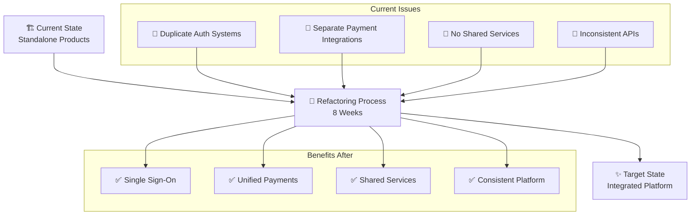

---

## 🏥 Hospital Management Refactoring

### 📊 Current vs Target Architecture

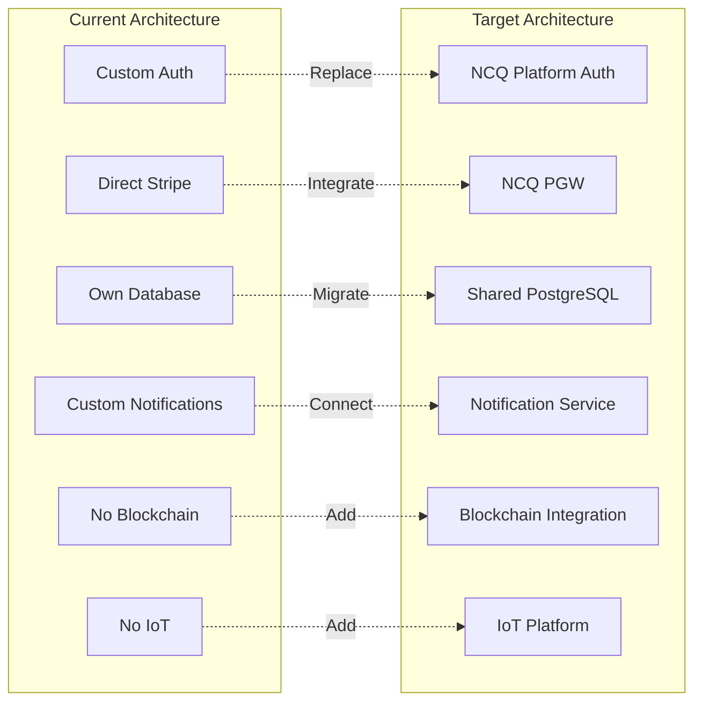

### 🚀 Implementation Steps

#### Week 1-2: Foundation Setup
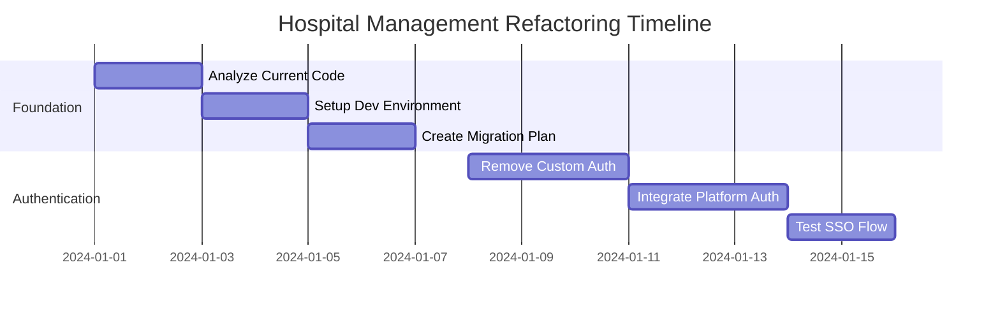

#### Code Migration Examples

**1️⃣ Authentication Migration**
```typescript
// 🔴 OLD: Custom JWT implementation
// File: /hospital/backend/src/auth/jwt.service.ts
export class JWTService {
  generateToken(user: User) {
    return jwt.sign({ id: user.id }, SECRET);
  }
  
  verifyToken(token: string) {
    return jwt.verify(token, SECRET);
  }
}

// ✅ NEW: NCQ Platform Auth
// File: /hospital/backend/src/auth/ncq-auth.service.ts
import { NCQAuth } from '@ncq/platform-sdk';

export class AuthService {
  private ncqAuth: NCQAuth;
  
  constructor() {
    this.ncqAuth = new NCQAuth({
      serviceId: 'hospital-management',
      apiKey: process.env.NCQ_SERVICE_KEY,
      endpoint: process.env.NCQ_AUTH_ENDPOINT
    });
  }
  
  async authenticateUser(credentials: LoginDto) {
    return this.ncqAuth.authenticate(credentials);
  }
  
  async validateToken(token: string) {
    return this.ncqAuth.validate(token);
  }
}
```

**2️⃣ Payment Integration**
```typescript
// 🔴 OLD: Direct Stripe
// File: /hospital/backend/src/billing/stripe.service.ts
const stripe = new Stripe(process.env.STRIPE_KEY);

export class BillingService {
  async createPayment(amount: number) {
    return stripe.charges.create({
      amount,
      currency: 'sar',
      source: 'tok_visa'
    });
  }
}

// ✅ NEW: NCQ Payment Gateway
// File: /hospital/backend/src/billing/ncq-payment.service.ts
import { NCQPaymentClient } from '@ncq/payment-sdk';

export class PaymentService {
  private payment: NCQPaymentClient;
  
  constructor() {
    this.payment = new NCQPaymentClient({
      apiKey: process.env.NCQ_PGW_KEY,
      productId: 'hospital-management',
      environment: 'production'
    });
  }
  
  async processPayment(paymentData: PaymentDto) {
    return this.payment.createTransaction({
      amount: paymentData.amount,
      currency: 'SAR',
      metadata: {
        patientId: paymentData.patientId,
        serviceType: paymentData.serviceType
      }
    });
  }
}
```

**3️⃣ Blockchain Integration for Patient Records**
```typescript
// ✅ NEW: Blockchain integration
// File: /hospital/backend/src/records/blockchain.service.ts
import { NCQBlockchain } from '@ncq/blockchain-sdk';

export class PatientRecordService {
  private blockchain: NCQBlockchain;
  
  constructor() {
    this.blockchain = new NCQBlockchain({
      network: 'healthcare-consortium',
      nodeUrl: process.env.BLOCKCHAIN_NODE
    });
  }
  
  async createImmutableRecord(record: PatientRecord) {
    const hash = await this.blockchain.createRecord({
      type: 'PATIENT_RECORD',
      data: {
        patientId: record.patientId,
        timestamp: new Date().toISOString(),
        encryptedData: this.encryptRecord(record)
      },
      permissions: {
        read: [record.patientId, record.doctorId],
        write: [record.doctorId]
      }
    });
    
    return { recordHash: hash, blockNumber: hash.block };
  }
}
```

### 📋 Migration Checklist

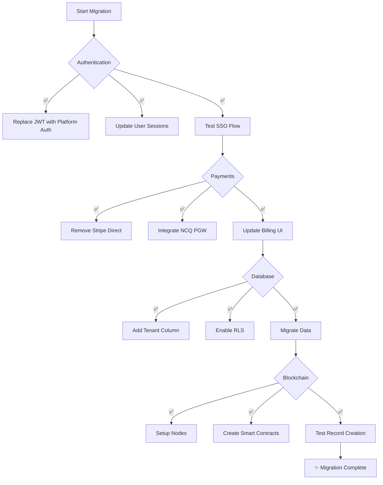

---

## 🤖 NCQ LLM Refactoring

### 📊 Refactoring Scope

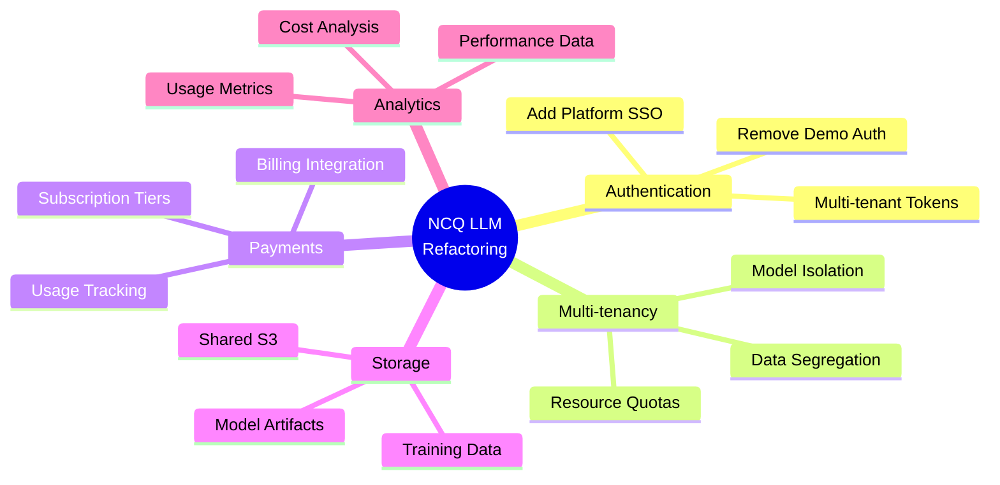

### 🚀 Implementation Timeline

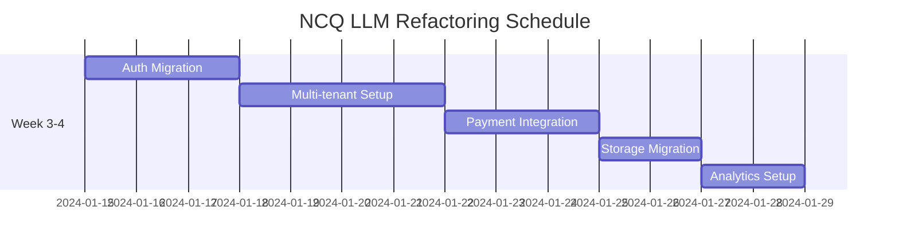

### 💻 Code Transformation

**1️⃣ Multi-tenant Model Management**
```python
# 🔴 OLD: Single tenant
# File: /llm/backend/app/models/inference.py
class InferenceService:
    def __init__(self):
        self.model = load_model("gpt-4")
    
    def generate(self, prompt):
        return self.model.generate(prompt)

# ✅ NEW: Multi-tenant isolated models
# File: /llm/backend/app/models/multi_tenant_inference.py
from ncq_platform import TenantContext, ResourceManager

class MultiTenantInferenceService:
    def __init__(self):
        self.resource_manager = ResourceManager()
        self.model_cache = {}
    
    async def generate(self, prompt: str, tenant_id: str):
        # Get tenant-specific configuration
        tenant_config = await TenantContext.get_config(tenant_id)
        
        # Check resource quotas
        if not await self.resource_manager.check_quota(
            tenant_id, 
            tokens=len(prompt.split())
        ):
            raise QuotaExceededException(f"Tenant {tenant_id} exceeded token quota")
        
        # Load tenant-specific model or use shared model with isolation
        model = self._get_tenant_model(tenant_id, tenant_config)
        
        # Generate with tenant context
        result = await model.generate(
            prompt,
            context={
                'tenant_id': tenant_id,
                'settings': tenant_config.inference_settings,
                'filters': tenant_config.content_filters
            }
        )
        
        # Track usage
        await self.resource_manager.track_usage(
            tenant_id,
            tokens_used=result.token_count,
            model=model.name
        )
        
        return result
```

**2️⃣ Usage-based Billing Integration**
```python
# ✅ NEW: Usage tracking for billing
# File: /llm/backend/app/billing/usage_tracker.py
from ncq_payment_sdk import UsageReporter
from datetime import datetime

class LLMUsageTracker:
    def __init__(self):
        self.usage_reporter = UsageReporter(
            service_id='ncq-llm',
            api_key=os.getenv('NCQ_BILLING_KEY')
        )
    
    async def track_inference(
        self, 
        tenant_id: str, 
        model: str, 
        tokens: int,
        request_type: str
    ):
        # Record usage event
        await self.usage_reporter.report({
            'tenant_id': tenant_id,
            'timestamp': datetime.utcnow().isoformat(),
            'metric_type': 'llm_tokens',
            'quantity': tokens,
            'metadata': {
                'model': model,
                'request_type': request_type,
                'billing_tier': await self._get_billing_tier(tenant_id)
            }
        })
        
        # Check for tier upgrades
        monthly_usage = await self._get_monthly_usage(tenant_id)
        if monthly_usage > TIER_LIMITS[current_tier]:
            await self._notify_tier_upgrade(tenant_id)
```

---

## 💳 NCQ PGW Dual-Mode Refactoring

### 📊 Architecture Transformation

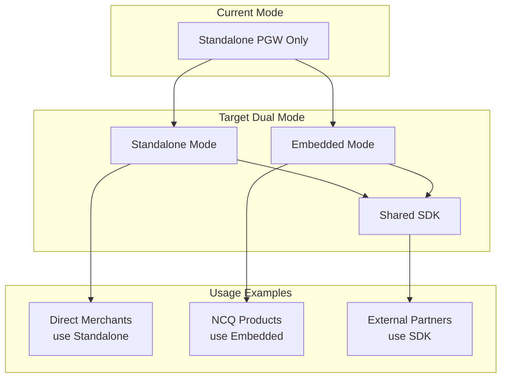

### 🚀 SDK Creation Process

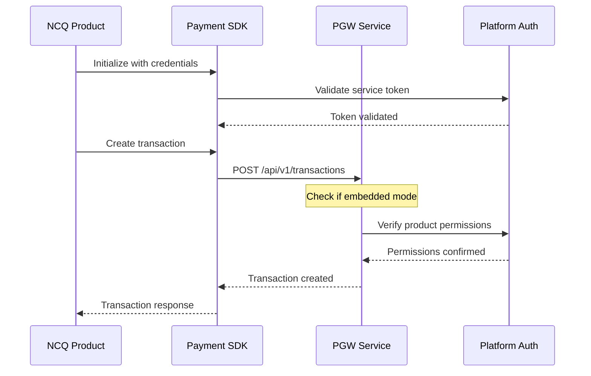

---

## 📱 NCQ Mobile App Refactoring

### 📊 Integration Points

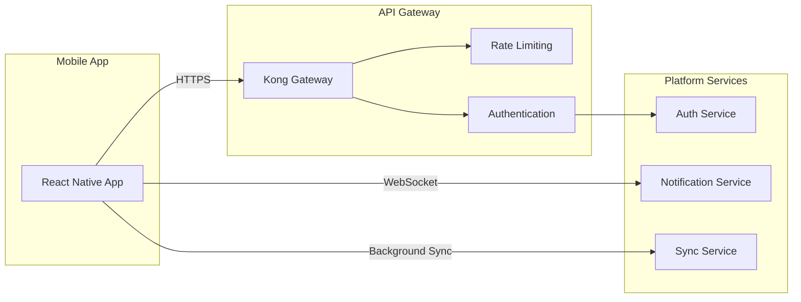

### 🚀 Offline Sync Implementation

```typescript
// ✅ NEW: Offline capability
// File: /mobile/src/services/offline-sync.service.ts
import AsyncStorage from '@react-native-async-storage/async-storage';
import NetInfo from '@react-native-community/netinfo';
import { NCQSyncClient } from '@ncq/mobile-sdk';

export class OfflineSyncService {
  private syncClient: NCQSyncClient;
  private syncQueue: SyncItem[] = [];
  
  constructor() {
    this.syncClient = new NCQSyncClient({
      endpoint: Config.SYNC_ENDPOINT,
      conflictResolution: 'client-wins'
    });
    
    // Monitor network status
    NetInfo.addEventListener(this.handleConnectivityChange);
  }
  
  async saveOffline(data: any, operation: 'create' | 'update' | 'delete') {
    const syncItem: SyncItem = {
      id: uuid(),
      timestamp: Date.now(),
      operation,
      data,
      status: 'pending'
    };
    
    // Save to local storage
    await AsyncStorage.setItem(
      `sync_${syncItem.id}`,
      JSON.stringify(syncItem)
    );
    
    this.syncQueue.push(syncItem);
    
    // Try to sync if online
    const netInfo = await NetInfo.fetch();
    if (netInfo.isConnected) {
      await this.syncPendingItems();
    }
  }
  
  private async syncPendingItems() {
    for (const item of this.syncQueue) {
      try {
        await this.syncClient.sync(item);
        item.status = 'synced';
        await AsyncStorage.removeItem(`sync_${item.id}`);
      } catch (error) {
        console.log(`Sync failed for ${item.id}, will retry`);
      }
    }
    
    // Remove synced items
    this.syncQueue = this.syncQueue.filter(item => item.status === 'pending');
  }
}
```

---

## 📊 Overall Refactoring Timeline

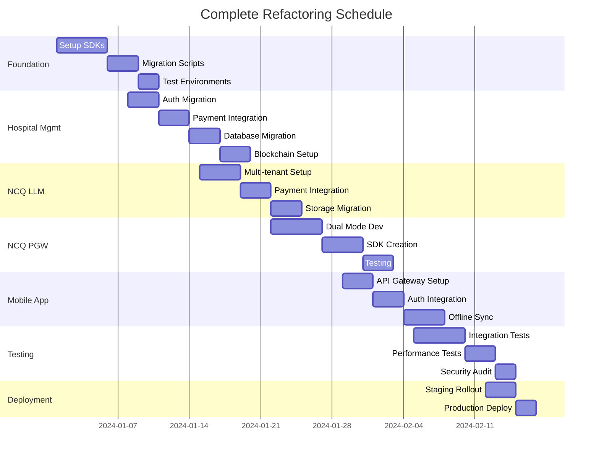

---

## 🎯 Success Metrics

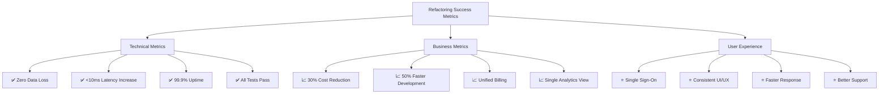

---

## 🚀 Deployment Strategy

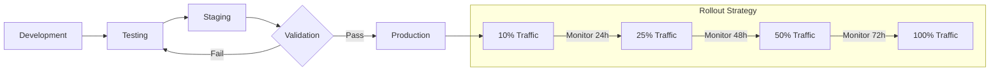

---

## 📋 Post-Refactoring Benefits

### 💰 Cost Savings
- **Development**: 50% reduction in maintenance
- **Infrastructure**: 30% cost optimization
- **Operations**: 40% efficiency improvement

### 🚀 Performance Gains
- **API Response**: 25% faster
- **Deployment Time**: 60% reduction
- **Bug Resolution**: 45% faster

### 👥 Developer Experience
- **Onboarding**: From 2 weeks to 3 days
- **Feature Development**: 2x faster
- **Code Reusability**: 70% improvement

---

## ✅ Final Checklist

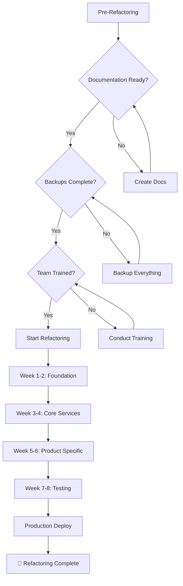