# 🤖 NCQ LLM - Revenue Projections

**Market**: Saudi Arabia & MENA Region  
**Currency**: SAR (Saudi Riyal) & USD Equivalent  
**Time Frame**: 5 Years Post-Launch  
**Exchange Rate**: 1 USD = 3.75 SAR

## 🚀 Executive Summary

NCQ LLM enters the rapidly growing AI market in MENA, projected to reach **SAR 1.2 Trillion** ($320B) by 2030. With Arabic language specialization and local compliance, NCQ LLM is uniquely positioned to serve enterprise and government sectors in Saudi Arabia.

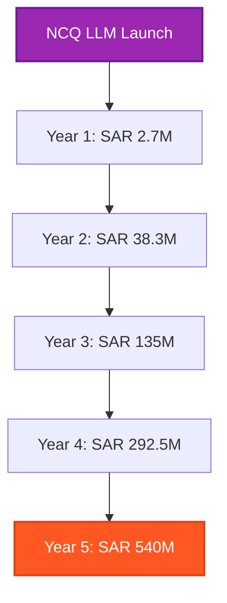

## 🌐 Market Analysis

### MENA AI Market (2024)

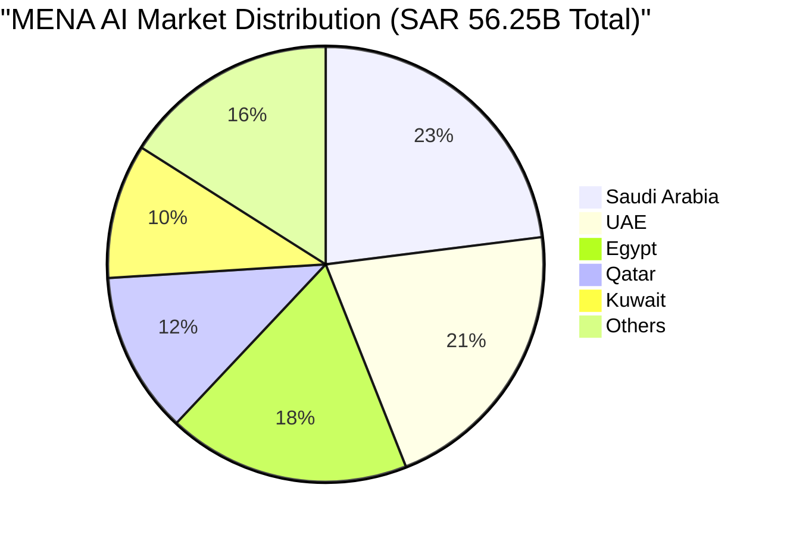

#### Market Metrics:
- 💰 **Total Market Size**: SAR 56.25 Billion ($15B)
- 🇸🇦 **Saudi AI Market**: SAR 13.13 Billion ($3.5B)
- 📈 **Annual Growth**: 35-40%
- 🏢 **Enterprise AI Adoption**: 25% (growing)
- 🏛️ **Government AI Initiatives**: SAR 7.5B allocated ($2B)

### 🎯 Competitive Landscape

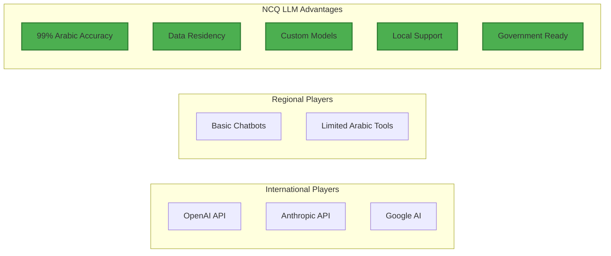

## 💎 Pricing Model

### Subscription Tiers

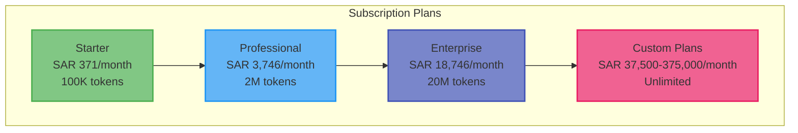

#### Detailed Pricing Structure

| Plan | Monthly Fee (SAR) | Monthly Fee (USD) | Tokens | Users | Features |
|------|------------------|-------------------|---------|--------|----------|
| 🌟 **Starter** | SAR 371 | $99 | 100K | 2 | Basic models, Email support |
| 💼 **Professional** | SAR 3,746 | $999 | 2M | 10 | All models, Priority support |
| 🏢 **Enterprise** | SAR 18,746 | $4,999 | 20M | Unlimited | Custom models, SLA |
| 🏛️ **Government** | SAR 37,500-375,000 | $10K-100K | Unlimited | Unlimited | On-premise, Full customization |

### Additional Services

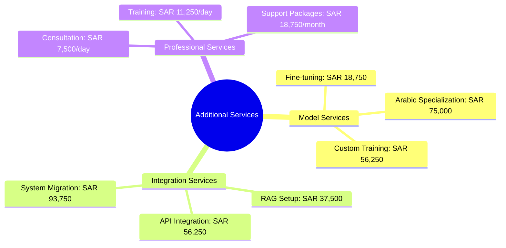

## 📈 Revenue Projections - Starting with 1 Client

### 🎯 Year 1 Growth Journey (Months 1-12)

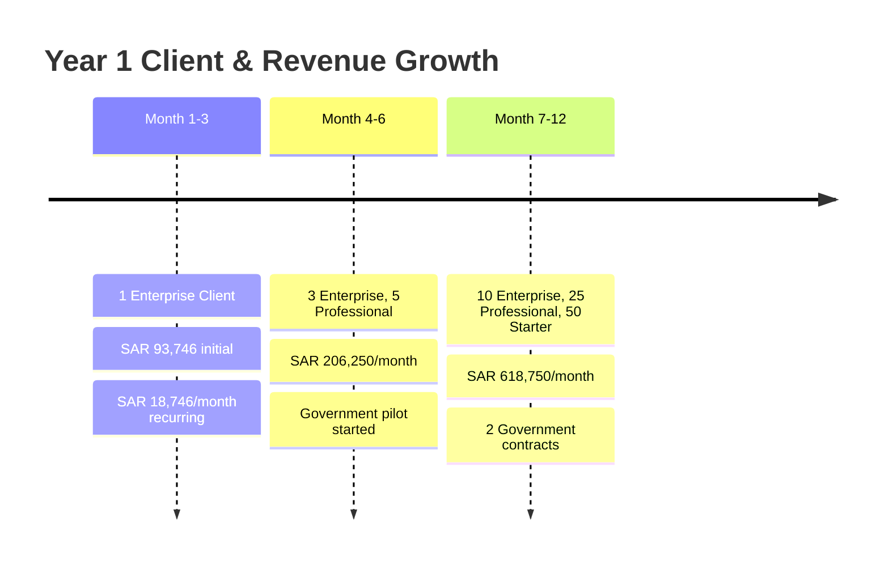

#### 📅 Month 1-3: Initial Enterprise Client
- **Client**: Major Saudi bank (pilot)
- **Plan**: Enterprise (SAR 18,746/month)
- **Fine-tuning**: SAR 18,750 (one-time)
- **Integration**: SAR 56,250 (one-time)
- **💰 Month 1 Revenue**: SAR 93,746 ($24,999)
- **💰 Month 2-3 Revenue**: SAR 18,746/month ($4,999)

#### 📅 Month 4-6: Early Adoption
- **Clients Added**: 2 enterprise, 5 professional
- **Government Pilot**: Custom plan initiated
- **Monthly Recurring**: SAR 131,250 ($35,000)
- **Professional Services**: SAR 75,000 ($20,000)
- **💰 Average Monthly Revenue**: SAR 206,250 ($55,000)

#### 📅 Month 7-12: Growth Phase
- **Client Base**:
  - Enterprise clients: 10
  - Professional clients: 25
  - Starter clients: 50
  - Government contracts: 2
- **Monthly Recurring**: SAR 468,750 ($125,000)
- **Professional Services**: SAR 150,000 ($40,000)
- **💰 Average Monthly Revenue**: SAR 618,750 ($165,000)

**🎯 Year 1 Total Revenue**: SAR 2,718,563 ($724,950)

### 📊 Year 2-5 Revenue Progression

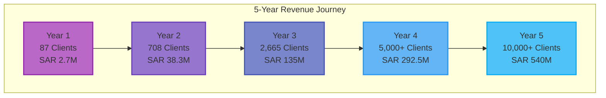

### 📈 Detailed Yearly Projections

#### Year 2 - Expansion Phase
- **👥 Client Base**:
  - Enterprise: 50 clients
  - Professional: 150 clients
  - Starter: 500 clients
  - Government: 5 contracts
  - Custom/On-premise: 3 deployments
- **💰 Monthly Revenue**: SAR 3,187,500 ($850,000)
- **📊 Annual Revenue**: SAR 38,250,000 ($10,200,000)

#### Year 3 - Market Leadership
- **👥 Client Base**:
  - Enterprise: 150 clients
  - Professional: 500 clients
  - Starter: 2,000 clients
  - Government: 15 contracts
  - Custom deployments: 10
- **💰 Monthly Revenue**: SAR 11,250,000 ($3,000,000)
- **📊 Annual Revenue**: SAR 135,000,000 ($36,000,000)

#### Year 4 - Regional Expansion
- **🌍 Geographic Presence**: Saudi, UAE, Kuwait, Qatar
- **👥 Total Clients**: 5,000+
- **💰 Monthly Revenue**: SAR 24,375,000 ($6,500,000)
- **📊 Annual Revenue**: SAR 292,500,000 ($78,000,000)

#### Year 5 - AI Platform Leader
- **🏆 Market Position**: #1 Arabic AI Platform
- **👥 Total Clients**: 10,000+
- **💰 Monthly Revenue**: SAR 45,000,000 ($12,000,000)
- **📊 Annual Revenue**: SAR 540,000,000 ($144,000,000)

## 📊 Revenue Breakdown by Segment (Year 3)

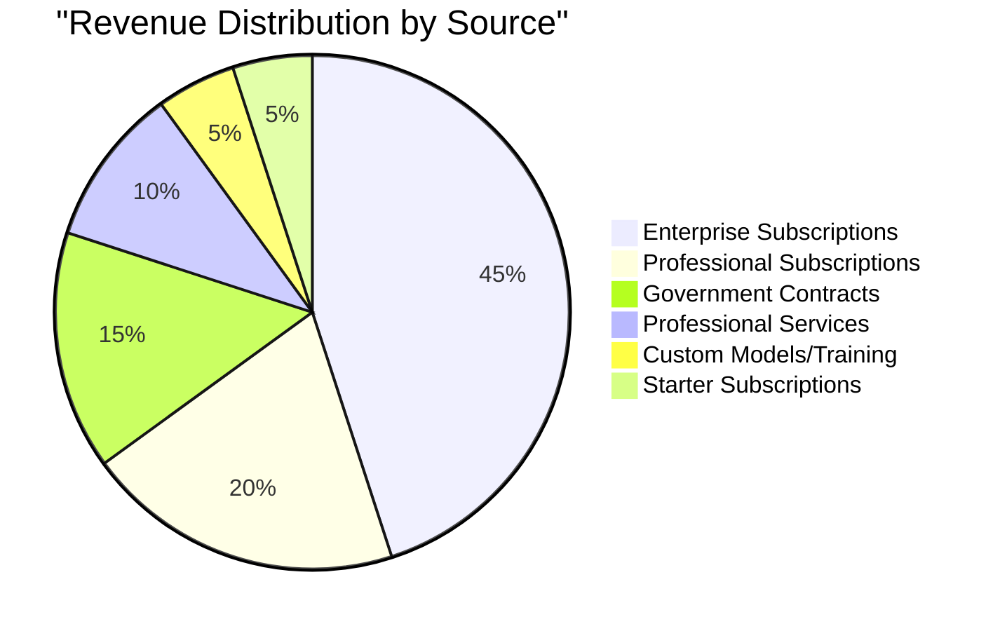

## 🎯 Key Success Factors

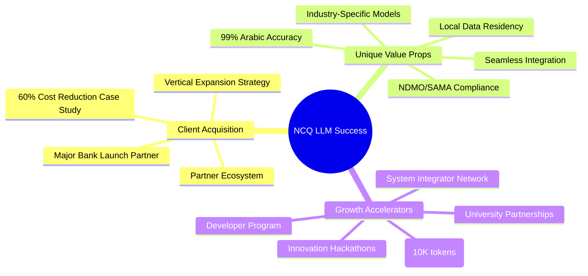

### 🏢 Vertical Market Distribution

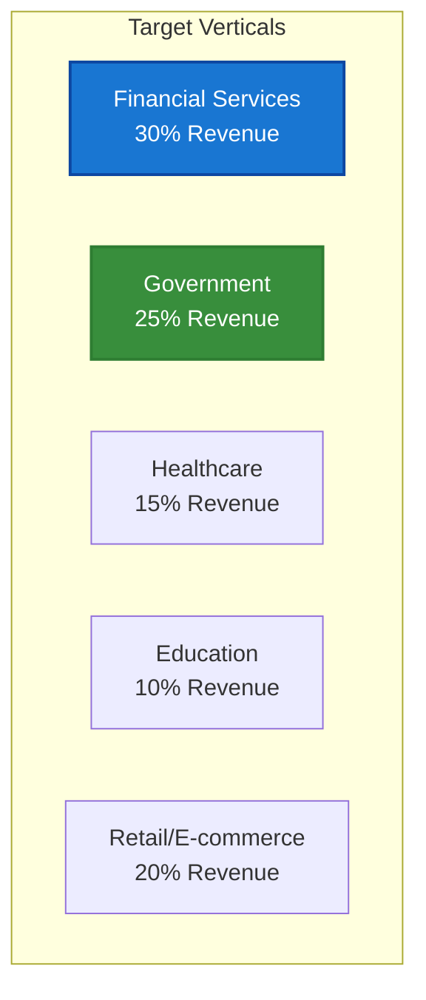

## 💸 Cost Structure & Profitability

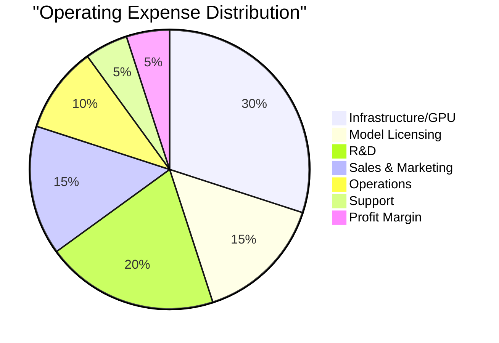

### Profit Margin Evolution
- **Year 1**: 5% → SAR 135,928
- **Year 2**: 10% → SAR 3,825,000
- **Year 3**: 20% → SAR 27,000,000
- **Year 4**: 25% → SAR 73,125,000
- **Year 5**: 30% → SAR 162,000,000

## 📈 Token Processing Growth

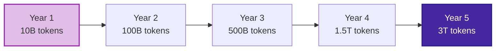

## ⚠️ Risk Analysis & Mitigation

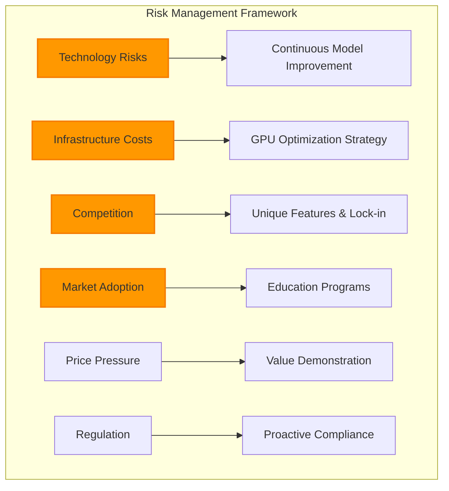

## 📊 5-Year Financial Summary

| Year | Clients | MRR (SAR) | MRR (USD) | Annual Revenue (SAR) | Annual Revenue (USD) | Growth | Market Share |
|------|---------|-----------|-----------|---------------------|---------------------|--------|--------------|
| 1    | 87      | SAR 619K  | $165K     | SAR 2.7M           | $725K              | -      | 0.02%        |
| 2    | 708     | SAR 3.2M  | $850K     | SAR 38.3M          | $10.2M             | 1,307% | 0.2%         |
| 3    | 2,665   | SAR 11.3M | $3M       | SAR 135M           | $36M               | 253%   | 0.7%         |
| 4    | 5,000+  | SAR 24.4M | $6.5M     | SAR 292.5M         | $78M               | 117%   | 1.2%         |
| 5    | 10,000+ | SAR 45M   | $12M      | SAR 540M           | $144M              | 85%    | 1.8%         |

## 💰 Investment Returns

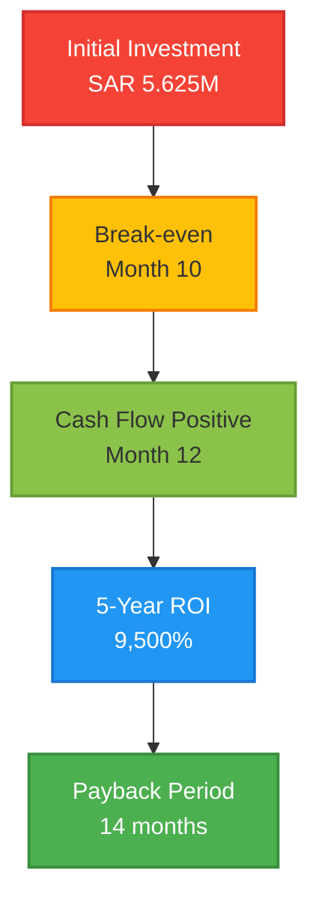

## 🎯 Conclusion

Starting with a single enterprise client at SAR 18,746/month, NCQ LLM can achieve **SAR 540M** annual revenue within 5 years. The key is demonstrating immediate value with Arabic language excellence, building trust through local presence, and scaling through government and enterprise partnerships. The SAR 2.7M first-year revenue grows to SAR 540M by capturing less than 2% of the regional AI market.

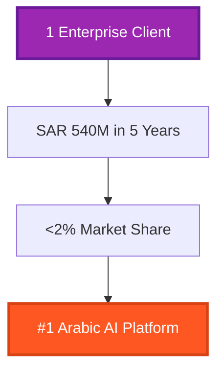

### 🔑 Success Factors Summary
- 🌟 **Arabic Excellence**: 99% accuracy, unmatched in the region
- 🏛️ **Government Ready**: Pre-approved vendor status
- 🔒 **Data Sovereignty**: Local hosting and compliance
- 🚀 **Rapid Deployment**: Same-day activation
- 🤝 **Enterprise Support**: 24/7 Arabic assistance