# 💳 NCQ Payment Gateway (PGW) - Revenue Projections

**Market**: Saudi Arabia & GCC Region  
**Currency**: SAR (Saudi Riyal) & USD Equivalent  
**Time Frame**: 5 Years Post-Launch  
**Exchange Rate**: 1 USD = 3.75 SAR

## 📊 Executive Summary

NCQ PGW targets the rapidly growing digital payments market in Saudi Arabia, aligned with Vision 2030's cashless society goals. With the market expected to reach **SAR 562.5B** ($150B) in transaction volume by 2025, NCQ PGW is positioned to capture significant market share.

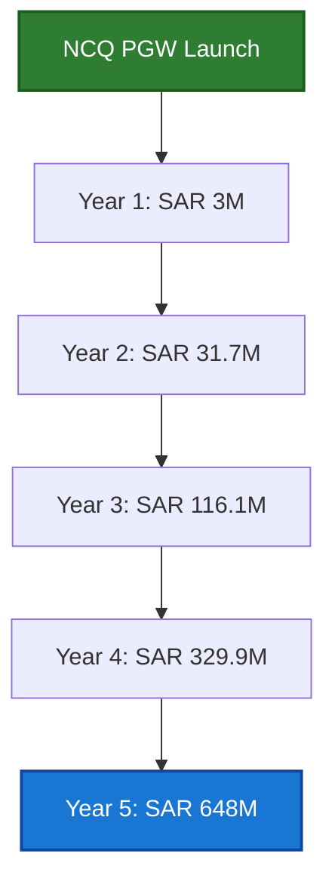

## 🌍 Market Analysis

### Saudi Digital Payments Market (2024)

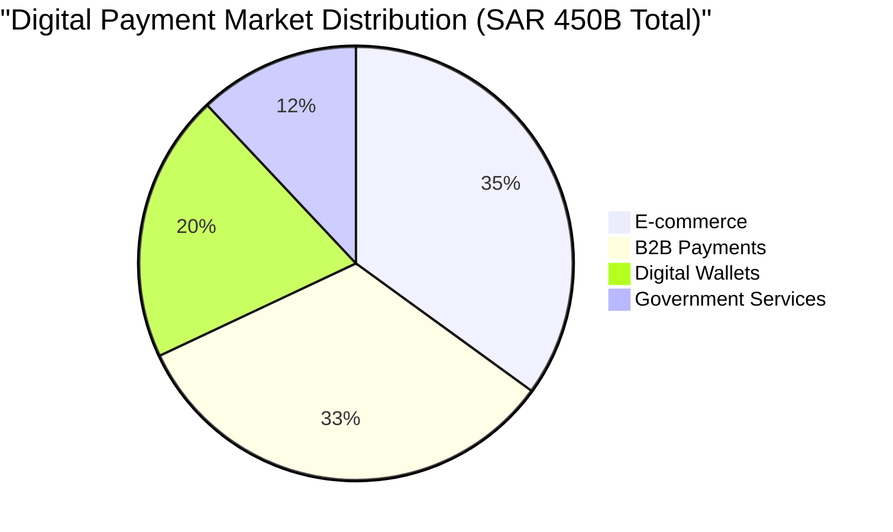

#### Key Market Metrics:
- 💰 **Total Transaction Volume**: SAR 450 Billion ($120B)
- 📈 **Online Transactions**: 70% YoY growth
- 📱 **Digital Wallet Adoption**: 60% of population
- 🛒 **E-commerce Growth**: 35% annually
- 🏢 **B2B Payments**: SAR 150 Billion ($40B)

### 🎯 Competition Landscape

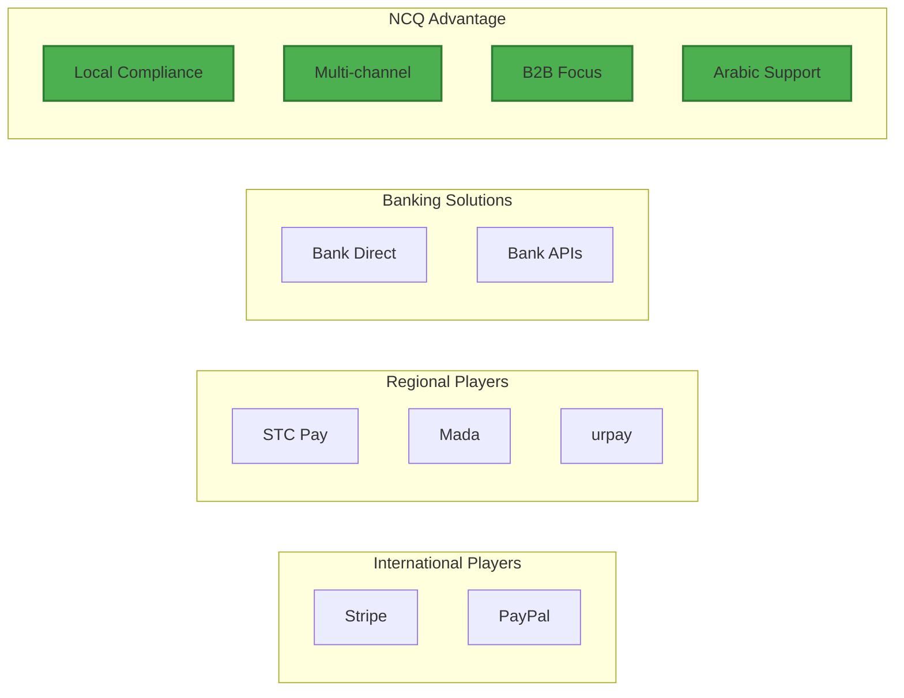

## 💵 Pricing Model

### Transaction Fees Structure

| Service Type | Rate | SAR Equivalent |
|-------------|------|----------------|
| 🛍️ **Standard Rate** | 2.9% + $0.30 | 2.9% + SAR 1.13 |
| 🏢 **Enterprise Rate** | 2.5% + $0.25 | 2.5% + SAR 0.94 |
| 💼 **B2B Rate** | 1.5% flat | 1.5% flat |
| 🏛️ **Government Rate** | 1.2% flat | 1.2% flat |

### Additional Services Pricing

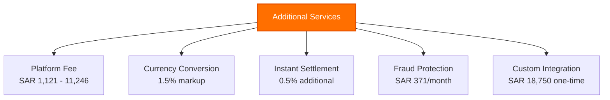

## 📈 Revenue Projections - Starting with 1 Client

### 🚀 Year 1 Growth Journey (Months 1-12)

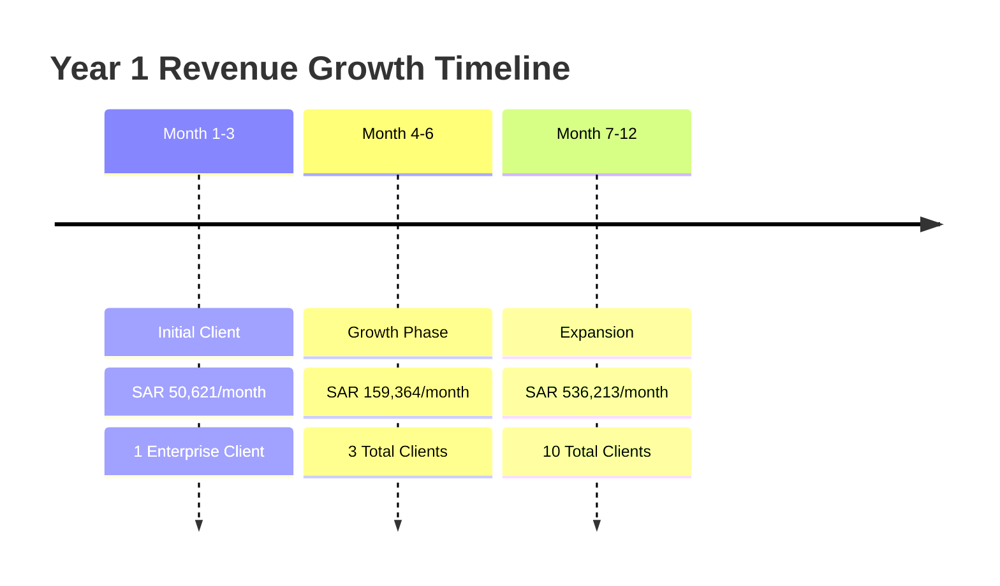

#### 📅 Month 1-3: Initial Enterprise Client
- **Client Profile**: Mid-size e-commerce platform
- **Monthly Transaction Volume**: SAR 1,875,000 ($500,000)
- **Transaction Revenue**: SAR 46,875/month
- **Platform Fee**: SAR 3,746/month
- **💰 Monthly Revenue**: SAR 50,621 ($13,499)

#### 📅 Month 4-6: Growth Phase
- **Active Clients**: 3 enterprise clients
- **Total Transaction Volume**: SAR 5,625,000/month
- **Transaction Revenue**: SAR 140,625/month
- **Platform Fees**: SAR 11,239/month
- **Additional Services**: SAR 7,500/month
- **💰 Monthly Revenue**: SAR 159,364 ($42,497)

#### 📅 Month 7-12: Expansion
- **Total Clients**: 10 (mix of enterprise and SMB)
- **Transaction Volume**: SAR 18,750,000/month
- **Transaction Revenue**: SAR 468,750/month
- **Platform Fees**: SAR 37,463/month
- **Additional Services**: SAR 30,000/month
- **💰 Monthly Revenue**: SAR 536,213 ($142,990)

**🎯 Year 1 Total Revenue**: SAR 2,973,525 ($792,940)

### 📊 Year 2-5 Revenue Progression

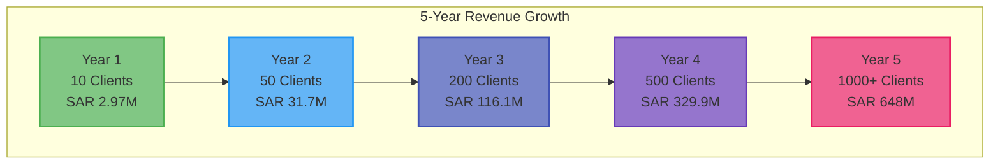

### 📈 Detailed Yearly Projections

#### Year 2 - Scaling Phase
- **👥 Clients**: 50 active merchants
- **💳 Monthly Transaction Volume**: SAR 93.75M ($25M)
- **💰 Monthly Revenue**: SAR 2,643,563 ($704,950)
- **📊 Annual Revenue**: SAR 31,722,750 ($8,459,400)

#### Year 3 - Market Penetration
- **👥 Clients**: 200 active merchants
- **💳 Monthly Transaction Volume**: SAR 375M ($100M)
- **💰 Monthly Revenue**: SAR 9,674,250 ($2,579,800)
- **📊 Annual Revenue**: SAR 116,091,000 ($30,957,600)

#### Year 4 - Market Leader
- **👥 Clients**: 500 active merchants
- **💳 Monthly Transaction Volume**: SAR 1.125B ($300M)
- **💰 Monthly Revenue**: SAR 27,487,500 ($7,330,000)
- **📊 Annual Revenue**: SAR 329,850,000 ($87,960,000)

#### Year 5 - Regional Expansion
- **👥 Clients**: 1000+ merchants across GCC
- **💳 Monthly Transaction Volume**: SAR 2.25B ($600M)
- **💰 Monthly Revenue**: SAR 54,000,000 ($14,400,000)
- **📊 Annual Revenue**: SAR 648,000,000 ($172,800,000)

## 🎯 Key Success Factors

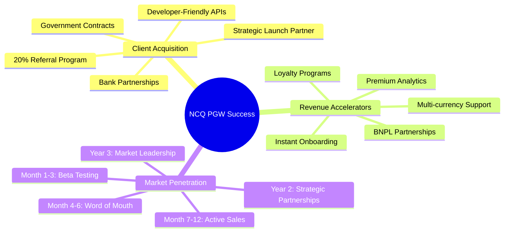

## 💸 Cost Structure & Profitability

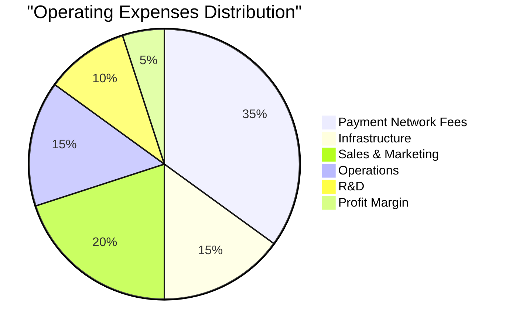

### Profit Margin Evolution
- **Year 1**: 5% → SAR 148,676
- **Year 2**: 10% → SAR 3,172,275
- **Year 3**: 15% → SAR 17,413,650
- **Year 4**: 20% → SAR 65,970,000
- **Year 5**: 25% → SAR 162,000,000

## 📊 Break-even Analysis

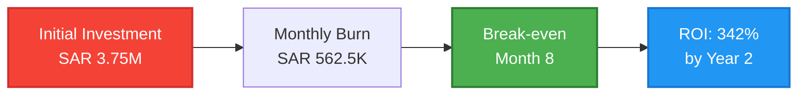

## ⚠️ Risk Factors & Mitigation

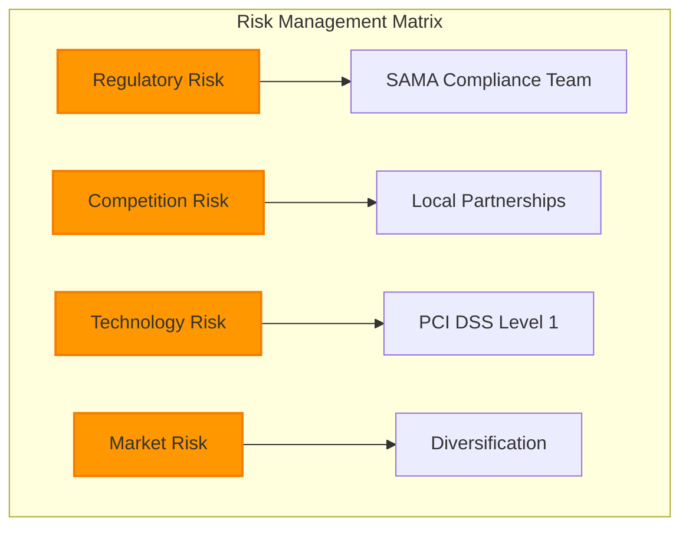

## 📈 5-Year Financial Summary

| Year | Clients | Monthly Volume | Annual Revenue (SAR) | Annual Revenue (USD) | Growth |
|------|---------|----------------|---------------------|---------------------|--------|
| 1    | 10      | SAR 18.75M     | SAR 2.97M          | $792K               | -      |
| 2    | 50      | SAR 93.75M     | SAR 31.7M          | $8.5M               | 966%   |
| 3    | 200     | SAR 375M       | SAR 116.1M         | $31M                | 266%   |
| 4    | 500     | SAR 1.125B     | SAR 329.9M         | $88M                | 184%   |
| 5    | 1000+   | SAR 2.25B      | SAR 648M           | $173M               | 97%    |

## 🎯 Conclusion

Starting with just 1 enterprise client processing SAR 1.875M/month, NCQ PGW can achieve **SAR 648M** annual revenue within 5 years by capturing just 2-3% of the Saudi digital payments market. The key success factors are:

- 🏆 Superior technology infrastructure
- 🌍 Local market expertise and support
- 📈 Aggressive but sustainable growth strategy
- 🤝 Strategic partnerships with banks and government
- 🛡️ Robust security and compliance framework

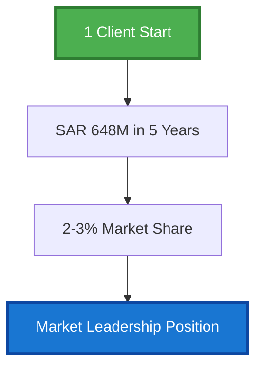