# 🏨 Smart Hospitality - Revenue Projections

**Market**: Saudi Arabia & GCC Region  
**Currency**: SAR (Saudi Riyal) & USD Equivalent  
**Time Frame**: 5 Years Post-Launch  
**Exchange Rate**: 1 USD = 3.75 SAR

## 🌟 Executive Summary

Smart Hospitality leverages IoT technology to transform hotels and commercial buildings into intelligent, efficient spaces. With Saudi Arabia's **SAR 1.875 Trillion** ($500B) NEOM project and Vision 2030's smart city initiatives, the market for smart building solutions is experiencing unprecedented growth.

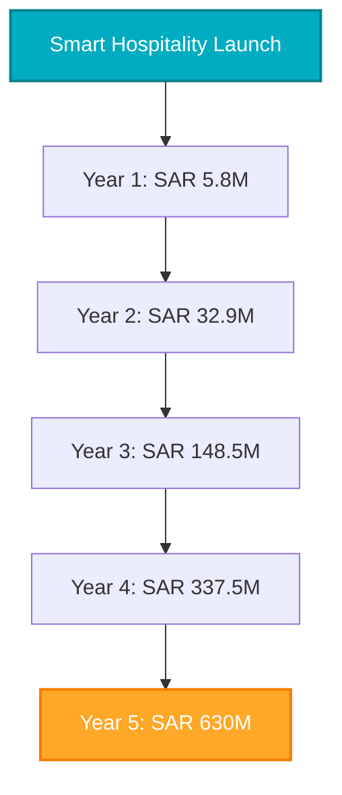

## 🏙️ Market Analysis

### Saudi Smart Building Market (2024)

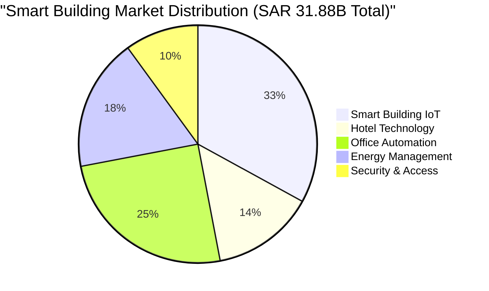

#### Market Metrics:
- 💰 **Total Market Size**: SAR 31.88 Billion ($8.5B)
- 🏨 **Hotel Technology Market**: SAR 4.5 Billion ($1.2B)
- 🔌 **Smart Building IoT**: SAR 10.5 Billion ($2.8B)
- 📈 **Annual Growth**: 28% CAGR
- 🏛️ **Government Investment**: SAR 187.5B allocated for smart cities ($50B)

### 🎯 Target Segments

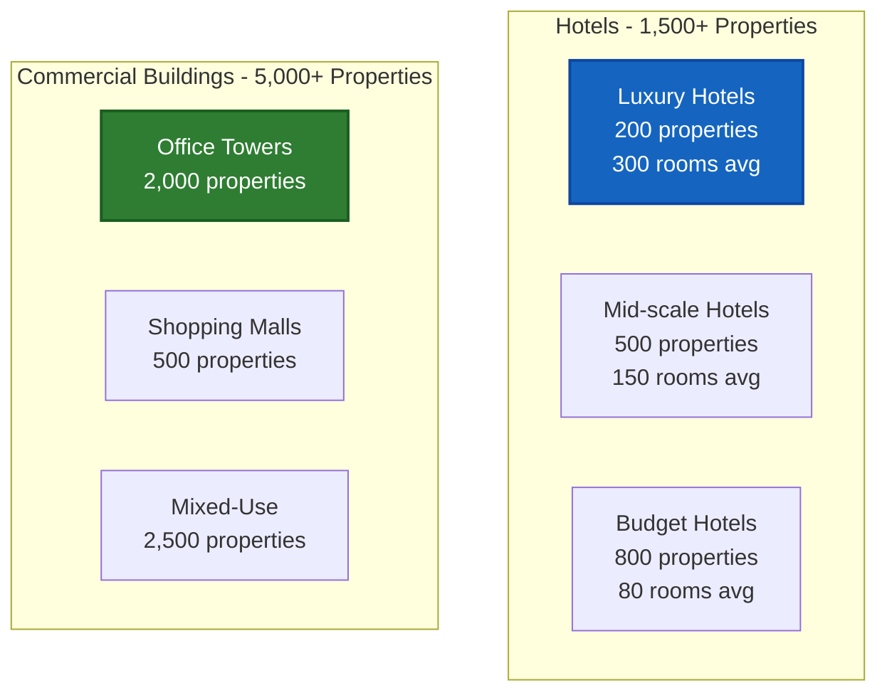

### 🏆 Competitive Advantage

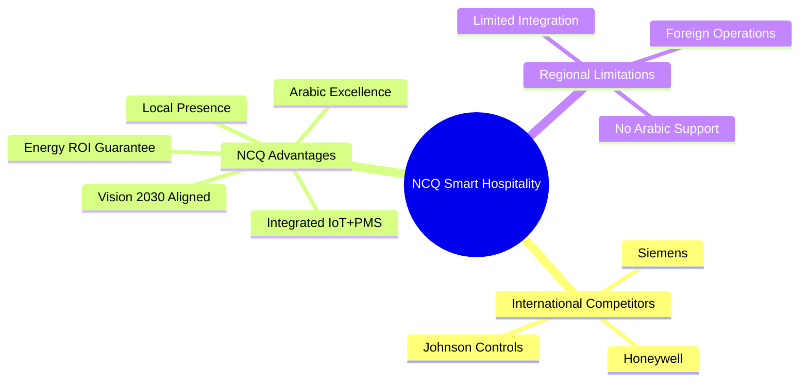

## 💎 Pricing Model

### Hotel Solutions Packages

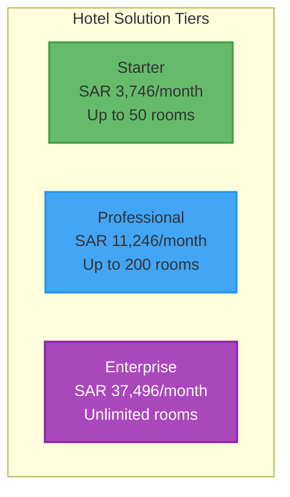

#### Detailed Hotel Pricing

| Package | Monthly Fee (SAR) | Monthly Fee (USD) | Rooms | Features |
|---------|------------------|-------------------|--------|----------|
| 🌟 **Starter** | SAR 3,746 | $999 | Up to 50 | Basic IoT, Energy monitoring, Guest app |
| 💼 **Professional** | SAR 11,246 | $2,999 | Up to 200 | Full sensors, Automation, Predictive maintenance |
| 🏢 **Enterprise** | SAR 37,496 | $9,999 | Unlimited | AI optimization, Custom integration, Multi-property |

### Commercial Building Solutions

| Package | Monthly Fee (SAR) | Monthly Fee (USD) | Coverage | Features |
|---------|------------------|-------------------|----------|----------|
| 🏢 **Small Building** | SAR 7,496 | $1,999 | Up to 50K sq ft | Basic automation, Tenant portal |
| 🏙️ **Medium Building** | SAR 18,746 | $4,999 | Up to 200K sq ft | Full automation, Analytics |
| 🌆 **Large Complex** | SAR 56,246 | $14,999 | Unlimited | Multi-building, AI optimization |

### Additional Revenue Streams

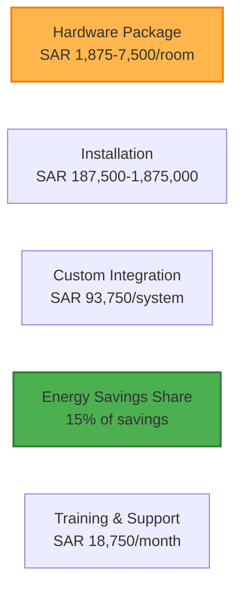

## 📈 Revenue Projections - Starting with 1 Client

### 🚀 Year 1 Growth Journey (Months 1-12)

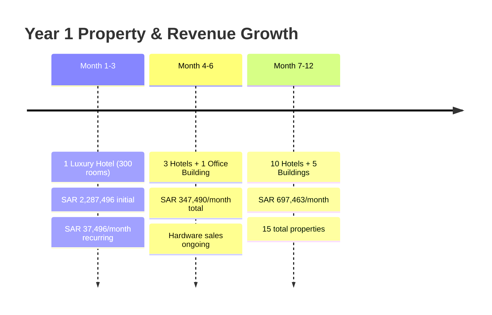

#### 📅 Month 1-3: Pilot Deployment
- **Client**: 5-star hotel in Riyadh (300 rooms)
- **Package**: Enterprise (SAR 37,496/month)
- **Hardware**: SAR 1,687,500 (one-time)
- **Installation**: SAR 562,500 (one-time)
- **💰 Month 1 Revenue**: SAR 2,287,496 ($609,999)
- **💰 Month 2-3 Revenue**: SAR 37,496/month

#### 📅 Month 4-6: Early Adoption
- **New Clients**: 2 hotels + 1 office building
- **Hardware Sales**: SAR 750,000
- **Monthly Recurring**: SAR 97,489
- **Hardware/Services**: SAR 250,001/month average
- **💰 Average Monthly Revenue**: SAR 347,490 ($92,664)

#### 📅 Month 7-12: Growth Phase
- **Client Portfolio**:
  - Hotels: 10 total (3 Enterprise, 5 Professional, 2 Starter)
  - Buildings: 5 total (1 Large, 3 Medium, 1 Small)
- **Monthly Recurring**: SAR 322,463
- **Hardware/Services**: SAR 375,000/month
- **💰 Average Monthly Revenue**: SAR 697,463 ($185,990)

**🎯 Year 1 Total Revenue**: SAR 5,763,375 ($1,536,900)

### 📊 Year 2-5 Revenue Progression

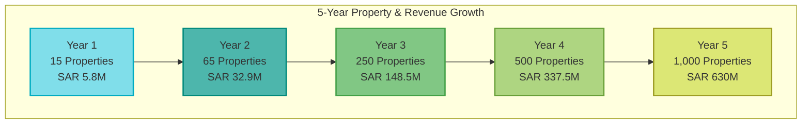

### 📈 Detailed Yearly Projections

#### Year 2 - Market Expansion
- **👥 Client Base**:
  - Hotels: 40 properties
  - Buildings: 25 properties
  - Total: 65 properties
- **💰 Monthly Revenue**: SAR 2,737,500 ($730,000)
- **📊 Annual Revenue**: SAR 32,850,000 ($8,760,000)

#### Year 3 - Market Leadership
- **👥 Client Base**:
  - Hotels: 150 properties
  - Buildings: 100 properties
  - Government contracts: 5
- **💰 Monthly Revenue**: SAR 12,375,000 ($3,300,000)
- **📊 Annual Revenue**: SAR 148,500,000 ($39,600,000)

#### Year 4 - Regional Expansion
- **🌍 Geographic Presence**: Saudi Arabia, UAE, Qatar, Kuwait
- **👥 Total Properties**: 500+
- **💰 Monthly Revenue**: SAR 28,125,000 ($7,500,000)
- **📊 Annual Revenue**: SAR 337,500,000 ($90,000,000)

#### Year 5 - Platform Dominance
- **🏆 Market Position**: #1 Smart Hospitality Platform in GCC
- **👥 Total Properties**: 1,000+
- **💰 Monthly Revenue**: SAR 52,500,000 ($14,000,000)
- **📊 Annual Revenue**: SAR 630,000,000 ($168,000,000)

## 📊 Revenue Breakdown by Segment (Year 3)

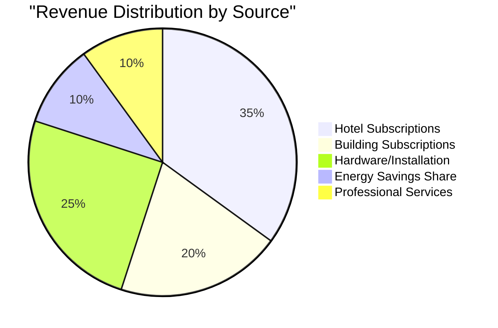

## 🎯 Key Success Factors

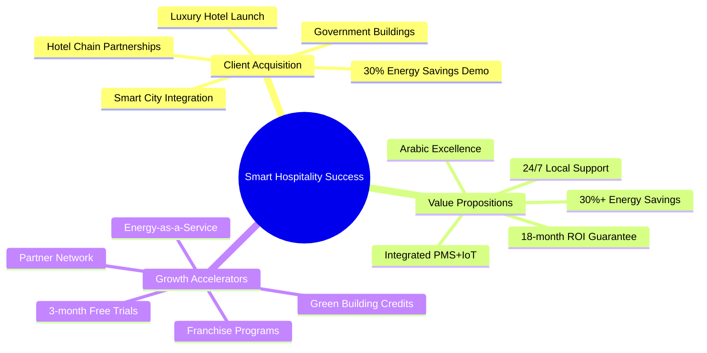

### 🏆 Results & ROI Showcase

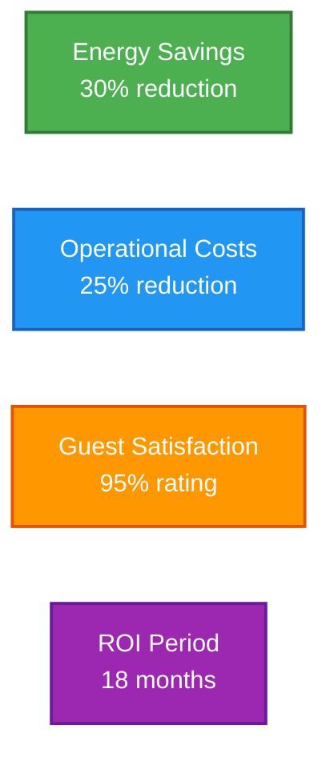

## 💸 Cost Structure & Profitability

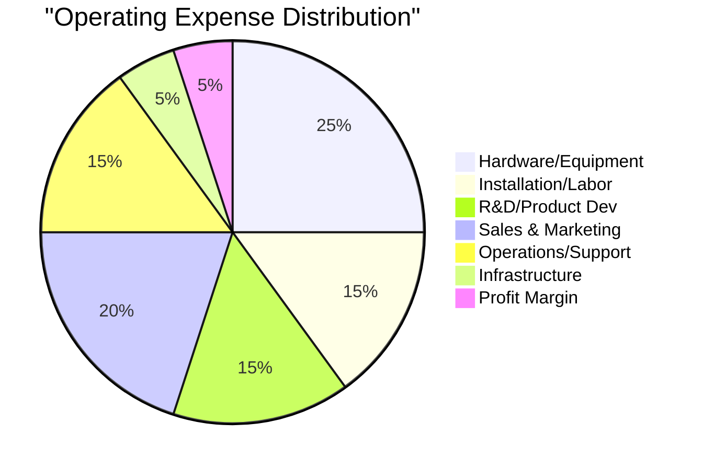

### Profit Margin Evolution
- **Year 1**: 5% → SAR 288,169
- **Year 2**: 10% → SAR 3,285,000
- **Year 3**: 15% → SAR 22,275,000
- **Year 4**: 20% → SAR 67,500,000
- **Year 5**: 25% → SAR 157,500,000

## 📈 Market Penetration Timeline

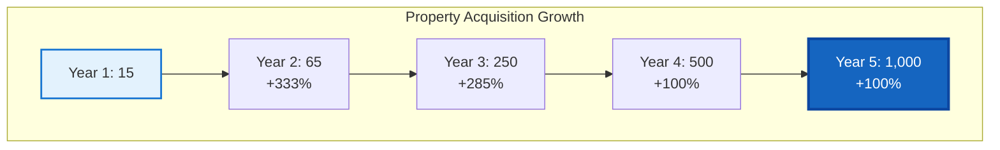

## 🔧 Technology Superiority

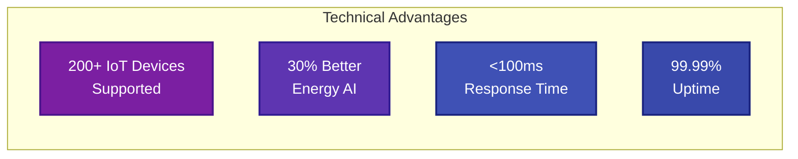

## ⚠️ Risk Analysis & Mitigation

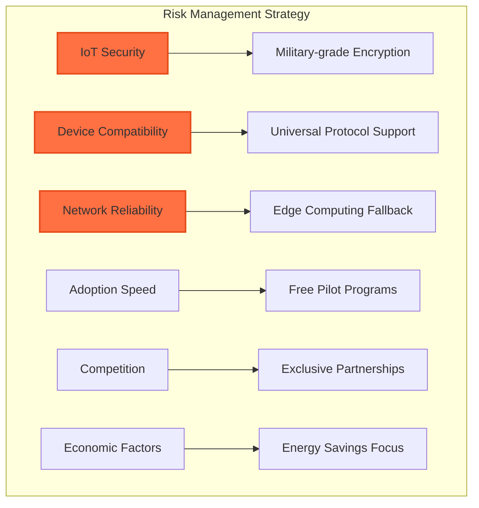

## 📊 5-Year Financial Summary

| Year | Properties | MRR (SAR) | MRR (USD) | Annual Revenue (SAR) | Annual Revenue (USD) | Growth | Market Share |
|------|------------|-----------|-----------|---------------------|---------------------|--------|--------------|
| 1    | 15         | SAR 698K  | $186K     | SAR 5.8M           | $1.5M              | -      | 0.3%         |
| 2    | 65         | SAR 2.7M  | $730K     | SAR 32.9M          | $8.8M              | 470%   | 1.3%         |
| 3    | 250        | SAR 12.4M | $3.3M     | SAR 148.5M         | $39.6M             | 352%   | 5%           |
| 4    | 500        | SAR 28.1M | $7.5M     | SAR 337.5M         | $90M               | 127%   | 10%          |
| 5    | 1,000      | SAR 52.5M | $14M      | SAR 630M           | $168M              | 87%    | 20%          |

## 💰 Unit Economics & Investment Returns

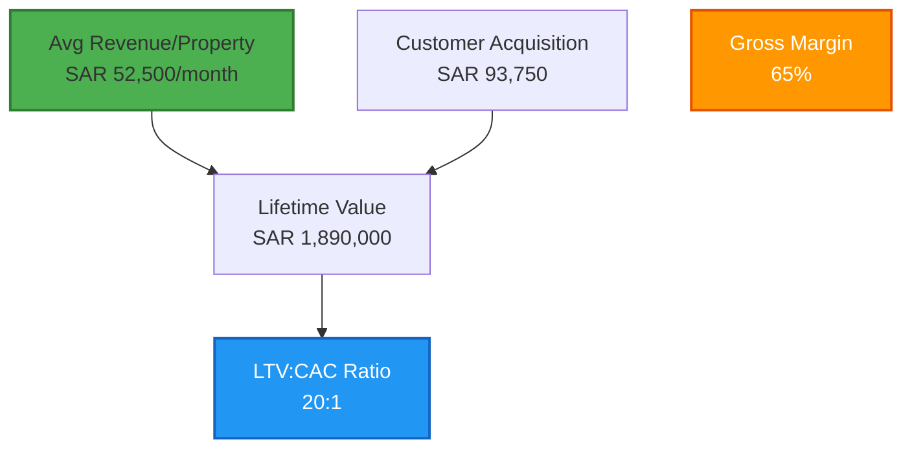

### Investment Metrics
- **Initial Investment**: SAR 5,625,000 ($1.5M)
- **Break-even**: Month 11
- **Cash Flow Positive**: Month 14
- **5-Year ROI**: 11,100%
- **Payback Period**: 15 months

## 🤝 Strategic Partnership Ecosystem

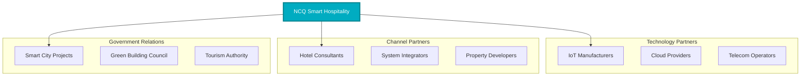

## 🎯 Conclusion

Starting with a single luxury hotel in Riyadh, Smart Hospitality can achieve **SAR 630M** annual revenue within 5 years by capturing 20% of the GCC smart building market. The key success factors are:

- 🏆 **Immediate ROI**: 30% energy savings guaranteed
- 🌟 **Superior Guest Experience**: 95% satisfaction rating
- 🔧 **Integrated Platform**: PMS + IoT unified solution
- 🌍 **Local Excellence**: Arabic support and cultural awareness
- 🤝 **Vision 2030 Alignment**: Supporting Saudi's smart city goals

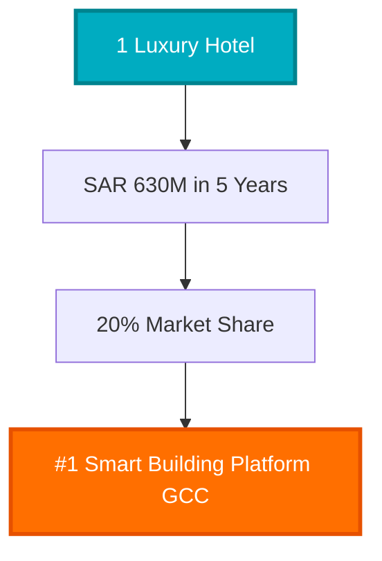